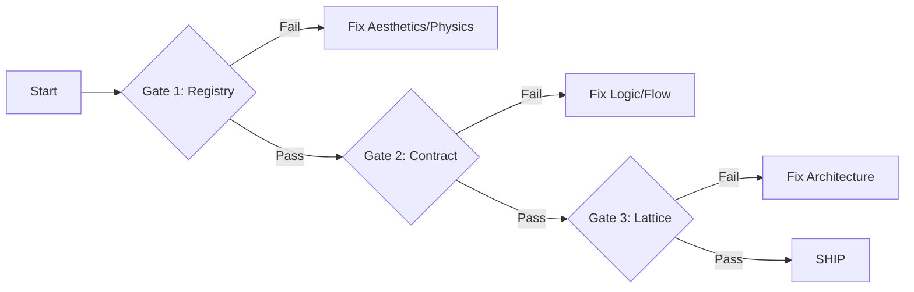

# Prism Verification & Ship Gate

**"No Lazy Works"** — Verify code against the 3-Spec System before shipping.

---

## 🚦 The 3-Stage Pipeline

To ship ANY feature in Prism, you must pass these three gates in order:

---

## Gate 1: The Assembly Check (Registry)

**Source of Truth**: [`docs/specs/ui_element_registry.md`](file:///home/cslh-frank/main_app/docs/specs/ui_element_registry.md)

Verify the "Lego Assembly" (Physics, Layers, IDs).

### Verification Steps
1.  **Z-Index / Layers**
    -   Check: Does the code use `PrismElevation` constants?
    -   Anti-Pattern: Hardcoded integers `zIndex(10f)` or implicit stacking.
    -   Command: `grep -r "zIndex" feature/path`
2.  **Component Constants**
    -   Check: Do UI element IDs match the Registry? (e.g., `[☰]`, `[📶]`)
    -   Check: Are dimensions/colors using Registry tokens?
3.  **States**
    -   Check: Does the Composable handle ALL states listed in the Registry?
    -   Example: If Registry says `idle`, `pressed`, `disabled` — code must handle all 3.

> 🔴 **STOP**: If visual physics/assembly fails, do not proceed to logic checks.

---

## Gate 2: The Flow Check (Contract)

**Source of Truth**: [`docs/specs/prism-ui-ux-contract.md`](file:///home/cslh-frank/main_app/docs/specs/prism-ui-ux-contract.md)

Verify the "User Journey" (Behavior, Logic, Intention).

### Verification Steps
1.  **Literal Step Trace**
    -   Pick a flow from the Contract (e.g., "User opens Scheduler").
    -   Trace: Does the code execute the EXACT steps in order?
    -   Discrepancy: "Contract says expand at 50px, Code expands at 100px" → **FAIL**.
2.  **Navigation Logic**
    -   Check: Do standard patterns (Back, Close, Confirm) follow the Contract?
3.  **Microcopy Validation**
    -   Check: Is the text identical to the Contract?
    -   Command: `grep -r "Exact Phrase" feature/path`

> 🔴 **STOP**: If logic/flow diverges from Contract, FIX THE CODE.

---

## Gate 3: The Lattice Check (Architecture)

**Source of Truth**: [`docs/specs/Prism-V1.md`](file:///home/cslh-frank/main_app/docs/specs/Prism-V1.md)

Verify the "Brain" (Separation of Concerns).

### Verification Steps
1.  **Domain Purity**
    -   Command: `grep -r "import android" feature/**/domain/`
    -   Result must be EMPTY.
2.  **Hilt Binding**
    -   Check: Does every Interface have a Module binding?
3.  **Test Fakes**
    -   Check: Do Fakes exist for all new interfaces?

---

## 🚢 Ship Inspection

If all 3 gates pass:

1.  **Run Frank Grading** (Optional but recommended)
    -   Command: `@[/frank-grading]`
    -   Assess: "Is this minimal? Is it clean?"

2.  **Commit Message**
    -   Format: `feat(module): [Description] (Aligned with Registry §X, Contract §Y)`

---

## Troubleshooting "Lazy Works"

**Q: "The Contract is slightly wrong/outdated. Can I just ship the 'better' code?"**
**A: NO.**
1.  Update the Contract FIRST.
2.  Get approval.
3.  THEN match the code to the new Contract.
**Never ship code that disagrees with the Spec.**

**Q: "I hardcoded the Z-index because it was faster."**
**A: REJECTED.**
-   Refactor to use `PrismElevation` immediately.
