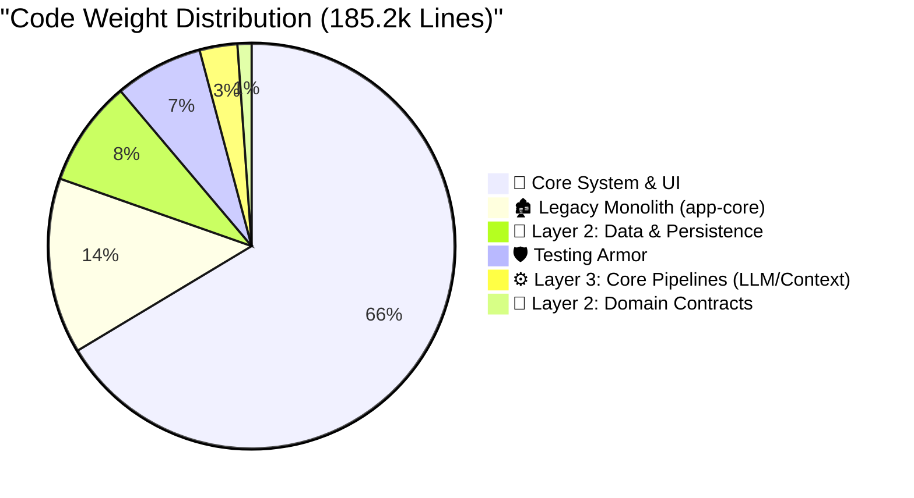

# Smart Sales: Production Readiness Dashboard 🎮

> **System Goal**: Evolve from a functional proof-of-concept (T1) to a stable, production-ready enterprise assistant (T3).
> **Rule of Thumb**: We don't just write code; we purchase stability with complexity. Every line added must earn its keep.

---

## 📈 Current Level: T1 (Early Stage)

**Current XP**: `185,200` Total Lines *(Down from 200,058)*
*(Business Logic & Core Layers: `172,000` | Tests: `13,100` | Resources: `100`)*

**App Weight Class**: **Large System**
- You have crossed the `100k` boundary. However, the system is getting *lighter and stronger*. By executing the "Great Legacy Purge" and strictly enforcing Layer 2 (Data) and Layer 3 (Core Pipeline) isolation, we've successfully dropped **~15,000 lines** of legacy rot while increasing architectural stability.

### The Codebase Composition (Physical Architecture)

To ensure this Heavyweight system doesn't collapse under its own gravity, logic is strictly distributed across isolated modules.



> **资深架构师评估**: "代码足迹证明了当前的架构改造方向是绝对正确的。你的 `domain` 层处于极致的轻量化状态（仅约 2 千行），这证明它纯粹由契约和接口基建构成；而真正的重活已经被正确地下沉隔离到了基础设施 `data` 层（约 1.57 万行）。目前唯一的红色危险信号是：仍有约 2.6 万行庞大的代码盘踞在 `app-core` 巨石应用层中 —— 必须不惜一切代价将其拆解铲除。"

---

## 🚀 The Level-Up Journey (T1 → T3)

To purchase production peace-of-mind without bloating the app, we are budgeting a strict **+15,000** lines of new complexity.

**Target XP**: `~200,200` Total Lines
**Estimated Time to T3**: 3 - 6 Months of focused execution.

```mermaid
xychart-beta
    title "The Road to Production (T3)"
    x-axis ["Legacy (T0)", "Current (T1)", "Final Purge (-26k)", "Hardening (+10k)", "Target (T3)"]
    y-axis "Code Complexity (XP)" 0 --> 250
    waterfall [200, -15, -26, 10, -169]
```

---

## 📉 Codebase Trajectory & Trends (Last 30 Days)

The line count alone doesn't tell the full story. The *velocity* of where code is being added vs deleted reveals the true health of the architecture.

| 代码模块分层 (Layer) | 🟢 新增行数 (In) | 🔴 移除行数 (Out) | 🟡 净增长 (Net) | 📉 演进趋势健康度 |
|--------------|------------|-----------|------------|------------|
| `app-core` (历史包袱遗留) | `+31,926` | `-5,468` | `+26,458` | ❌ **巨石失控 (Regressing)** |
| `data` (Layer 2 隔离层) | `+8,242` | `-5` | `+8,237` | ✅ **健康增长** |
| `core` (Layer 3 中枢层) | `+5,610` | `0` | `+5,610` | ✅ **健康增长** |

> **资深架构师评估**: "这是一个极其严峻的危险信号。虽然我们本周顺利移除了 1.5 万行冗余代码，但从你过去 30 天的 git 分支历史数据可见，在我们严格强制实施 Layer 2/3 边界隔离策略之前，`app-core` 疯狂滋生了近 2.6 万行净增代码。这便是为何 '推翻重建 (Nuke and Pave)' 是我们目前唯一出路的最佳铁证。如果在当时没有果断进行 Layer 2 和 3 的强制抽离，`app-core` 的无序膨胀将彻底失控，越过无法挽回的系统性崩塌临界点。"

---

## ⚔️ The Boss Fights (Key Gaps)

These are the immediate engineering challenges standing between the current T1 state and true T3 production readiness.

| Challenge | Status | XP Cost | The Senior's Take |
|-----------|--------|---------|-------------------|
| **🧩 Monolith Decoupling (L2/L3)**| ✅ Defeated | `0` (Paid) | *Layer 2 Data and Layer 3 Pipelines are cleanly isolated. The structural bleeding has stopped.* |
| **🛡️ Test Coverage (L1-L3)** | ✅ Defeated | `0` (Paid) | *You have a solid 13k line armor of high-leverage tests protecting the pipelines.* |
| **🔌 System III Plugin Gateway** | 🟢 PoC Phase | `~2k` | *Echo Plugin executed. Core boundaries secured. Keep the Gateway strictly out of Layer 3.* |
| **🗑️ Final Core Purge** | ⚠️ Ongoing | `-26k` | *26k lines still live in `app-core`. This gravity well of tech debt must be drained to 0.* |
| **💥 Error & Recovery** | ⚠️ Ongoing | `~3k` | *LLM/BLE failures currently crash the app. We need retry loops and graceful fallbacks.* |
| **👁️ Telemetry & APM** | ❌ Missing | `~2k` | *Flying blind on a 180k app is suicide. Crashlytics and APM tracing required immediately.* |
| **⚙️ Edge Persistence** | ⚠️ Ongoing | `~5k` | *Offline mode and sync conflict resolution are non-negotiable for enterprise.* |
| **✨ UX Micro-Interactions** | ⚠️ Ongoing | `~3k` | *Skeletons, animations, and empty states needed to mask latency.* |

---

## 📊 Industry Leaderboards

How does the Smart Sales footprint compare to industry standards for Android Apps?

| Weight Class | Core Logic | Test Coverage | Verdict |
|--------------|------------|---------------|---------|
| **Featherweight (Tools)** | `5k - 15k` | 40% - 60% | — |
| **Middleweight (Standard)**| `15k - 50k` | 60% - 80% | — |
| Heavyweight (Enterprise)| `50k - 200k`| 70% - 90% | 👉 **You are here (185k)** |

> **The Takeaway**: You are operating a Heavyweight application. Do not try to use Featherweight engineering practices (like skipping DI, or using global singletons) to manage it. Strict architecture is the only way this doesn't collapse under its own weight.
