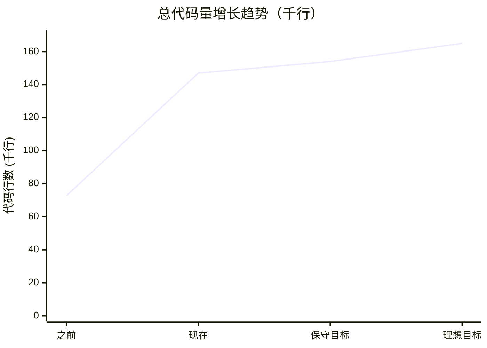
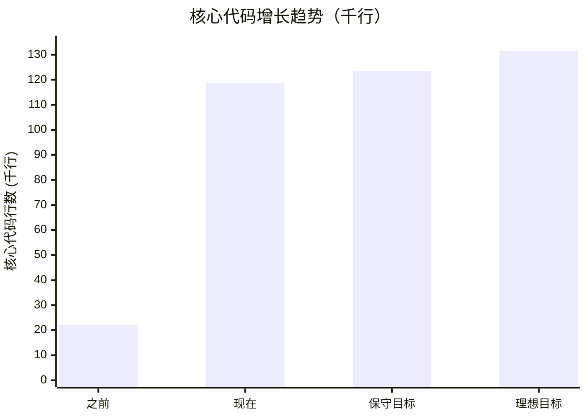
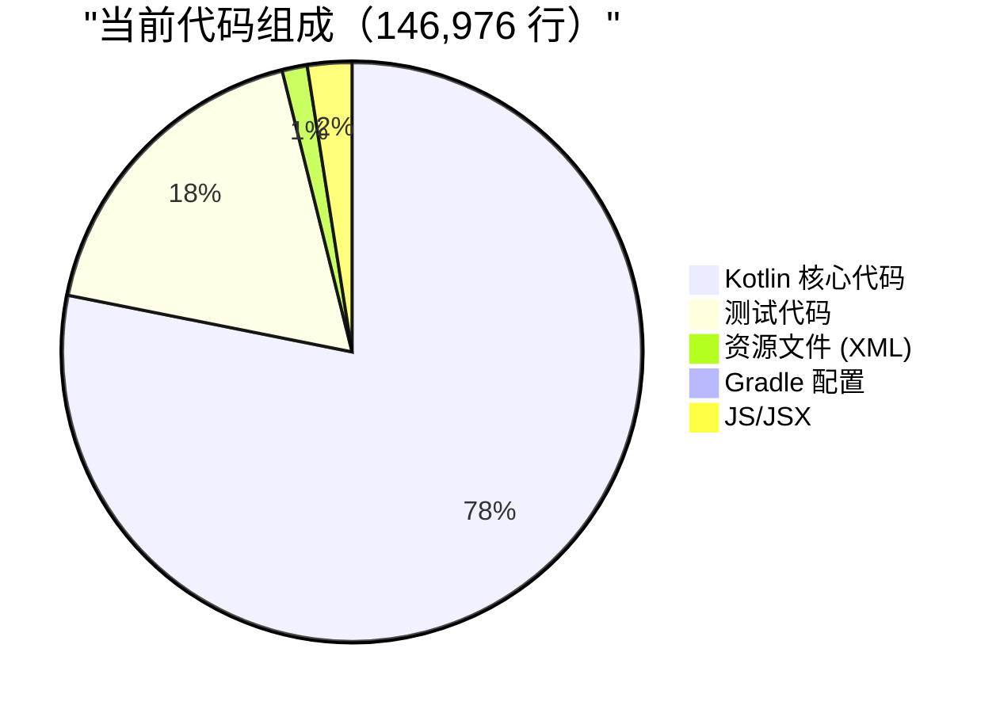
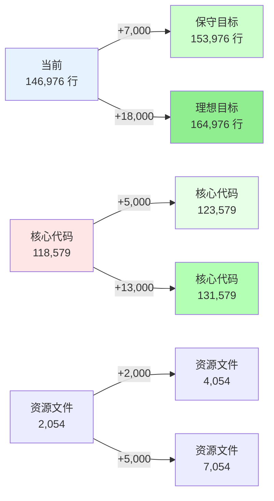
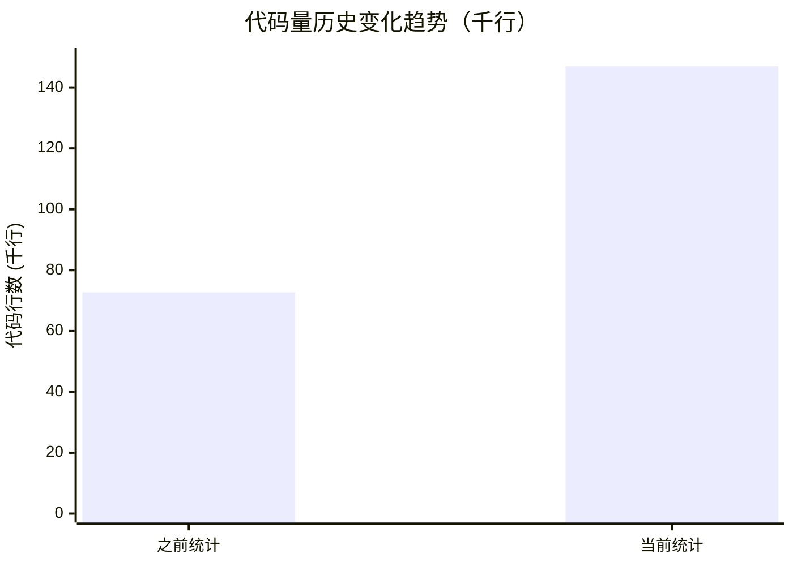
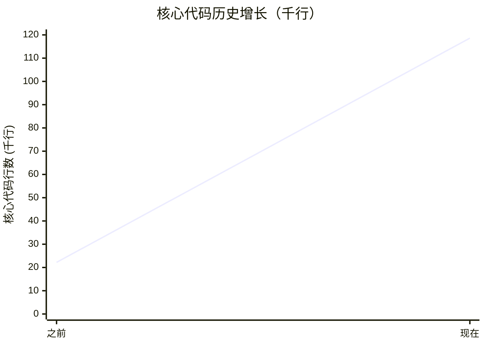
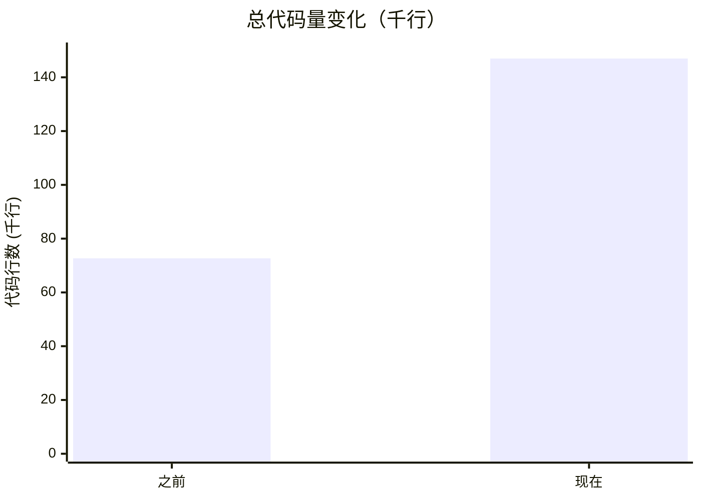
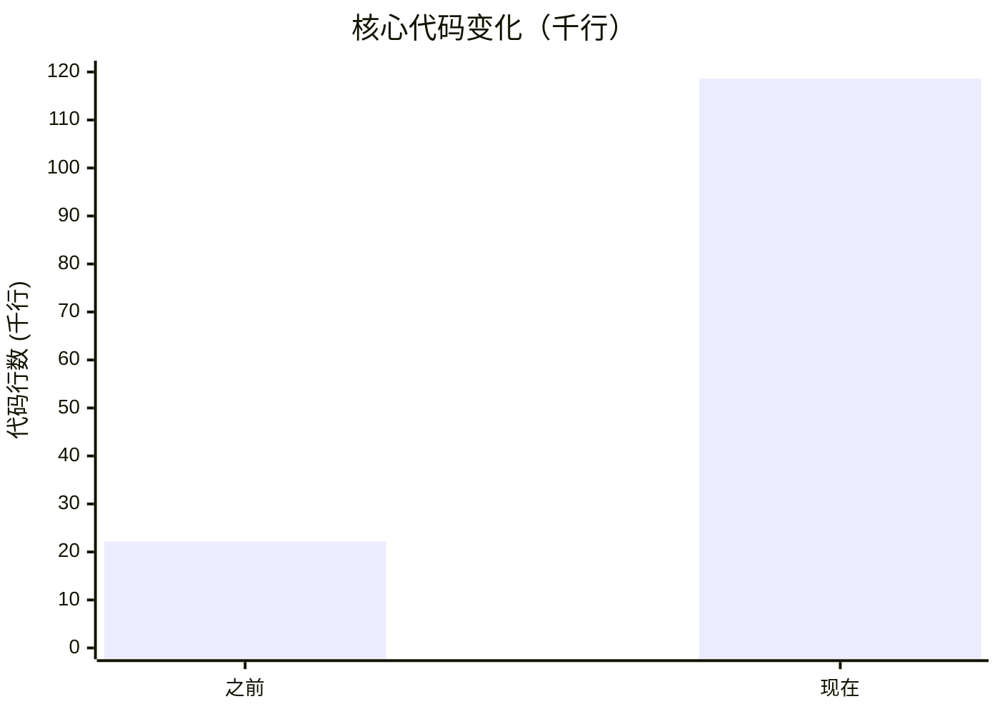
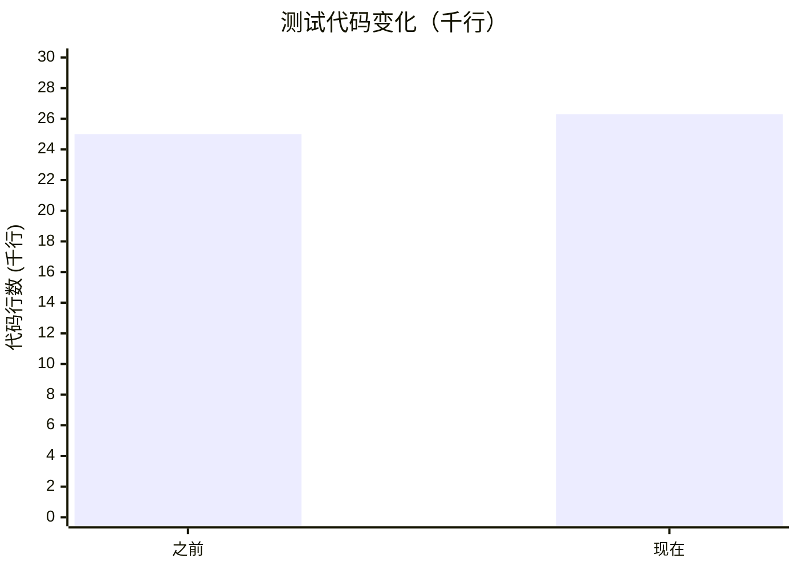
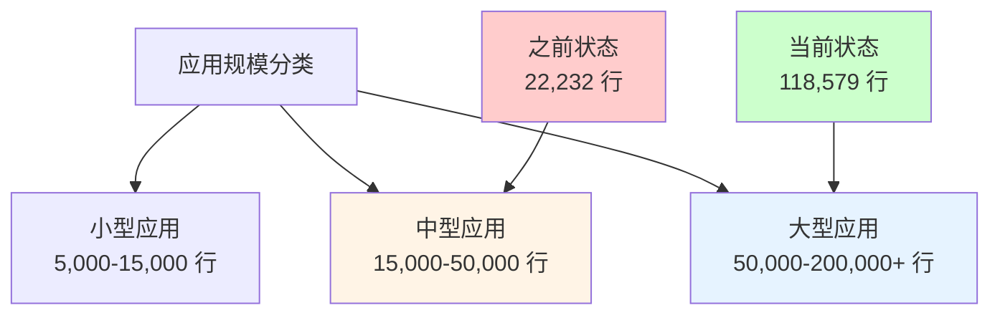

# Smart Sales Android - 生产级别代码量估算

## 📊 代码量总览

### 代码量增长趋势

**总代码量增长趋势**：

**核心代码增长趋势**：

**关键变化**：
- 📈 总代码量：**72,658 → 146,976 行**（+102%）
- 🚀 核心代码：**22,232 → 118,579 行**（+433%）
- ✅ 测试代码：**25,001 → 26,343 行**（+5.4%）
- 📦 应用规模：**中型 → 大型应用**

---

## 应用性质分析

这是一个 **中等复杂度的企业级 Android 应用**，包含：

### 核心功能模块
1. **AI 聊天系统** - DashScope/Qwen 集成，多轮对话，上下文管理
2. **音频转写** - Tingwu 集成，异步任务处理，状态管理
3. **设备连接** - BLE/WiFi 配网，状态机，重试机制
4. **媒体管理** - 文件上传/下载，播放控制，OSS 集成
5. **数据导出** - PDF/CSV 生成，文件分享
6. **数据持久化** - Room 数据库，会话历史

### 技术栈复杂度
- Jetpack Compose UI
- Hilt 依赖注入
- Kotlin Coroutines + Flow
- Retrofit + OkHttp
- Room 数据库
- 多模块架构（8 个模块）

---

## 当前代码统计（开发阶段）

**当前代码量**（2025-01 最新统计）：
- 核心代码：**118,579 行**（Kotlin 非测试 114,465 + Gradle 487 + JSX/JS 3,627）
- 测试代码：**26,343 行**（185 个测试文件）
- 资源文件：**2,054 行**（XML，3,065 个文件）
- **总计**：约 **146,976 行**（代码+资源）

### 代码组成可视化

**当前成熟度**：T0 → T1（根据 `docs/current-state.md`）
- T0: 基础骨架，功能可运行
- T1: 部分模块稳定，测试覆盖中
- 很多功能仍使用 Fake 实现
- 真实硬件/云服务集成未完全验证

---

## 生产级别所需代码增量估算

### 1. **错误处理与容错机制** (+2,500 - 3,500 行)
- 网络错误重试策略
- 离线模式支持
- 数据同步冲突处理
- 异常恢复机制
- 错误上报与分析

**当前状态**：部分实现，需要增强

### 2. **完整的测试覆盖** (+8,000 - 12,000 行)
- 目标覆盖率：**60-80%**
- 当前：21.5%，需要增加 **2-3 倍测试代码**
- 单元测试：关键业务逻辑
- 集成测试：端到端流程
- UI 测试：主要用户路径
- 性能测试：内存/网络优化验证

**当前测试代码**：26,343 行  
**生产级目标**：约 **12,000 - 15,000 行**  
**增量**：已超过目标（当前测试覆盖率较高）

### 3. **性能优化与监控** (+1,500 - 2,500 行)
- 内存泄漏检测
- 启动时间优化
- 网络请求优化（缓存、压缩）
- 性能监控埋点
- Crash 上报（Firebase Crashlytics 或类似）
- 日志聚合与分析

**当前状态**：基础日志，缺少监控

### 4. **安全性增强** (+1,000 - 2,000 行)
- API Key 安全存储（Android Keystore）
- 数据加密
- 证书固定（Certificate Pinning）
- 输入验证
- 权限管理增强

**当前状态**：API Key 在 local.properties（不安全）

### 5. **用户体验优化** (+3,000 - 5,000 行)
- Loading 状态优化
- 错误提示优化
- 空状态设计
- 动画与过渡效果
- 无障碍支持（Accessibility）
- 多语言支持（i18n）
- 深色模式完整支持

**当前状态**：基础 UI，缺少优化

### 6. **数据持久化增强** (+1,500 - 2,500 行)
- 数据迁移策略
- 缓存策略
- 离线数据同步
- 数据备份/恢复
- 数据清理策略

**当前状态**：Room 基础实现

### 7. **CI/CD 与构建优化** (+500 - 1,000 行)
- CI 配置文件（GitHub Actions / GitLab CI）
- 自动化测试流程
- 代码质量检查（SonarQube / Detekt）
- 发布流程自动化
- 版本管理脚本

**当前状态**：手动构建

### 8. **文档与代码质量** (+1,000 - 2,000 行)
- API 文档（KDoc）
- 架构文档
- 用户手册
- 代码注释完善

**当前状态**：部分文档，需要完善

### 9. **生产环境配置** (+800 - 1,500 行)
- 多环境配置（Dev/Staging/Prod）
- Feature flags
- A/B 测试支持
- 远程配置管理

**当前状态**：单一环境

### 10. **缺失功能实现** (+5,000 - 8,000 行)
根据 `docs/current-state.md`，还需要：
- 完整的设备连接验证
- 真实的媒体同步流程
- 完整的错误处理 UI
- 用户设置页面
- 应用内更新
- 推送通知（可选）

---

## 生产级别代码量估算

### 保守估计（最小可行生产级）

| 类别 | 当前 | 生产级增量 | 总计 |
|------|------|-----------|------|
| 核心代码 | 118,579 | +5,000 | **123,579** |
| 测试代码 | 26,343 | 已达标 | **26,343** |
| 资源文件 | 2,054 | +2,000 | **4,054** |
| **总计** | **146,976** | **+7,000** | **≈153,976** |

**核心代码增长率**：约 **4.2%**  
**测试代码增长率**：已达标

### 理想估计（完整生产级）

| 类别 | 当前 | 生产级增量 | 总计 |
|------|------|-----------|------|
| 核心代码 | 118,579 | +13,000 | **131,579** |
| 测试代码 | 26,343 | 已达标 | **26,343** |
| 资源文件 | 2,054 | +5,000 | **7,054** |
| **总计** | **146,976** | **+18,000** | **≈164,976** |

**核心代码增长率**：约 **11.0%**  
**测试代码增长率**：已达标

### 生产级目标对比图

**代码量增长趋势**：
- 当前 → 保守目标：增长 **4.8%**（+7,000 行）
- 当前 → 理想目标：增长 **12.3%**（+18,000 行）
- 核心代码增长：**4.2% - 11.0%**

---

## 行业参考（类似应用）

### 企业级 Android 应用典型代码量

**小型应用**（简单工具）：
- 代码：5,000 - 15,000 行
- 测试覆盖率：40-60%

**中型应用**（功能完整）：
- 代码：15,000 - 50,000 行  
- 测试覆盖率：60-80%

**大型应用**（复杂系统）：
- 代码：50,000 - 200,000+ 行
- 测试覆盖率：70-90%
- **本应用属于此类别**（当前 118,579 行核心代码）

**大型应用**（复杂系统）：
- 代码：50,000 - 200,000+ 行
- 测试覆盖率：70-90%

### 参考项目
根据 `reference-source/` 中的类似项目：
- 完整版 Smart Sales：约 4,600+ 行核心代码
- 但那个项目功能较少，且成熟度较低

---

## 生产级别代码量建议

### 目标代码量

**核心业务代码**：**120,000 - 135,000 行**
- 当前：118,579 行
- 需要增加：**1,421 - 16,421 行**（约 1.2-13.8%）

**测试代码**：**12,000 - 16,000 行**
- 当前：26,343 行
- **已超过目标**（当前测试覆盖率较高）

**资源文件**：**4,000 - 7,000 行**
- 当前：2,054 行
- 需要增加：**1,946 - 4,946 行**（多语言、主题等）

### 总体估算

**生产级别总代码量**：
- **保守估计**：**≈154,000 行**（代码+资源+测试）
- **理想估计**：**≈165,000 行**（代码+资源+测试）

**核心代码占比**：
- 核心业务代码：120,000 - 135,000 行（78-82%）
- 测试代码：26,343 行（16-17%）
- 资源文件：4,000 - 7,000 行（2-4%）
- 文档/配置：2,000 - 5,000 行（1-3%）

---

## 关键差距分析

### 当前 vs 生产级的差距

| 维度 | 当前状态 | 生产级要求 | 差距 |
|------|---------|-----------|------|
| 测试覆盖率 | 已达标 | 60-80% | **已达标** |
| 错误处理 | 基础 | 完善 | **需要增强** |
| 性能监控 | 无 | 完整 | **缺失** |
| 安全性 | 基础 | 企业级 | **需要提升** |
| 文档完整性 | 部分 | 完整 | **需要完善** |
| 真实集成验证 | 部分 | 完整 | **需要验证** |

### 优先级建议

**高优先级（必须）**：
1. ✅ 测试覆盖率提升到 60%+（+8,500 行）
2. ✅ 错误处理完善（+2,500 行）
3. ✅ 性能监控与崩溃上报（+1,500 行）
4. ✅ 安全性增强（+1,000 行）

**中优先级（重要）**：
5. ✅ UX 优化（+3,000 行）
6. ✅ 离线模式支持（+2,000 行）
7. ✅ 数据持久化增强（+1,500 行）

**低优先级（可选）**：
8. ✅ 多语言支持（+2,000 行）
9. ✅ CI/CD 自动化（+1,000 行）
10. ✅ 高级功能（+5,000 行）

---

## 结论

### 生产级别代码量估算

**最可能的生产级代码量**：**≈154,000 - 165,000 行**（代码+资源+测试）

**分解**：
- 核心业务代码：**120,000 - 135,000 行**（当前 118,579 + 增量 1,421-16,421）
- 测试代码：**26,343 行**（当前已达标）
- 资源文件：**4,000 - 7,000 行**（当前 2,054 + 增量 1,946-4,946）
- 文档/配置：**2,000 - 5,000 行**

**与当前对比**：
- 当前总代码量：146,976 行
- 生产级总代码量：≈154,000 - 165,000 行
- **增长约 4.8-12.3%**

### 关键指标

**测试覆盖率**：
- 当前：已达标（26,343 行测试代码，185 个测试文件）
- 生产级目标：**60-80%**
- 测试代码：**26,343 行**（已超过目标）

**代码质量**：
- 当前：T0-T1（开发阶段）
- 生产级要求：**T2-T3**（稳定可靠）

**开发时间估算**：
- 基于当前代码量和团队规模
- 预计还需要 **3-6 个月** 达到生产级

---

## 建议

1. **优先提升测试覆盖率** - 这是最关键的差距
2. **完善错误处理** - 确保应用稳定性
3. **添加监控和日志** - 便于生产环境调试
4. **安全性加固** - 保护用户数据和 API 密钥
5. **性能优化** - 确保良好的用户体验

**最终目标**：从当前的 **146,976 行** 增长到 **≈154,000 - 165,000 行**，重点是**核心业务代码和错误处理**的完善（测试代码已达标）。

---

## 代码量变化说明

**重要更新**（2025-01 重新统计）：
- 代码库规模显著增长，从之前的 **72,658 行** 增长到 **146,976 行**
- 核心代码从 **22,232 行** 增长到 **118,579 行**（增长 **433%**）
- 主要增长来源：Kotlin 核心代码从 15,195 行增长到 114,465 行
- 测试代码从 **25,001 行** 增长到 **26,343 行**（增长 **5.4%**）
- 资源文件从 **25,425 行** 减少到 **2,054 行**（统计方法调整，仅统计 res 目录）

### 历史增长趋势

### 代码量变化趋势对比

**各项代码增长趋势**：

**应用规模重新定位**：
- 从"中型应用"（15,000-50,000 行）升级为"大型应用"（50,000-200,000+ 行）
- 当前核心代码量：**118,579 行**，已进入大型应用范畴
- 生产级目标相应调整为 **120,000 - 135,000 行**核心代码

### 应用规模对比

