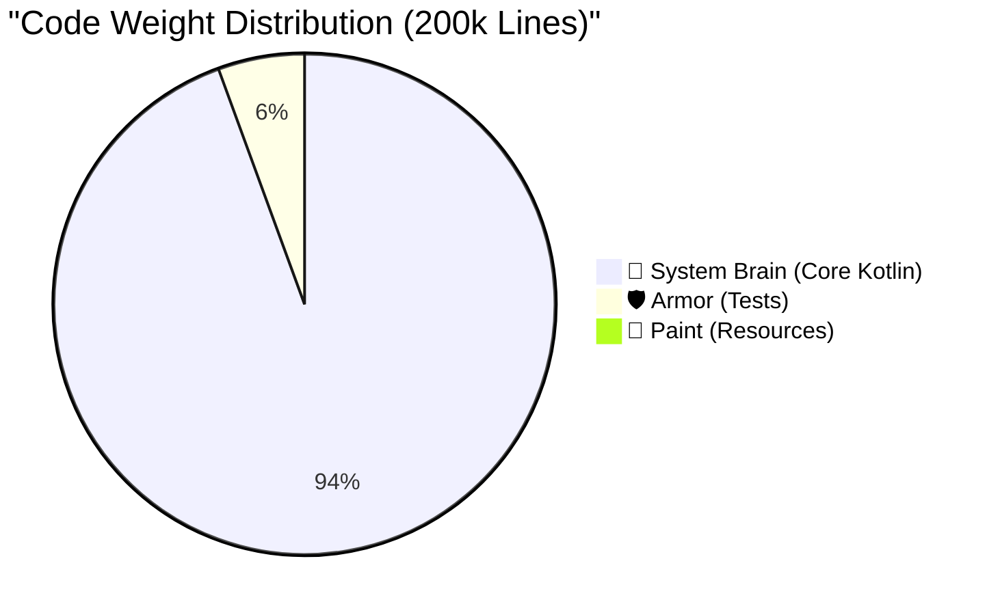

# Smart Sales: Production Readiness Dashboard 🎮

> **System Goal**: Evolve from a functional proof-of-concept (T1) to a stable, production-ready enterprise assistant (T3).
> **Rule of Thumb**: We don't just write code; we purchase stability with complexity. Every line added must earn its keep.

---

## 📈 Current Level: T1 (Early Stage)

**Current XP**: `200,058` Total Lines
*(Core: `188,821` | Tests: `11,150` | Resources: `87`)*

**App Weight Class**: **Large System**
- You have crossed the `100k` boundary. This is no longer a small utility app; it's a massive orchestration engine running an LLM pipeline, local data hubs, and hardware Bluetooth connectivity. The weight of this architecture means "quick hacks" will now cause cascading failures.

### The Codebase Composition



---

## 🚀 The Level-Up Journey (T1 → T3)

To purchase production peace-of-mind, we are budgeting **+38,000** lines of new complexity.

**Target XP**: `~238,000` Total Lines
**Estimated Time to T3**: 3 - 6 Months of focused execution.

```mermaid
xychart-beta
    title "The Road to Production (T3)"
    x-axis ["Current (T1)", "Refactoring (+15k)", "Hardening (+15k)", "Polish (+8k)", "Target (T3)"]
    y-axis "Code Complexity (XP)" 0 --> 250
    waterfall [200, 15, 15, 8, -238]
```

---

## ⚔️ The Boss Fights (Key Gaps)

These are the immediate engineering challenges standing between the current T1 state and true T3 production readiness.

| Challenge | Status | XP Cost | The Senior's Take |
|-----------|--------|---------|-------------------|
| **🛡️ Test Coverage (L1-L3)** | ✅ Defeated | `0` (Paid) | *The old Fake spaghetti is gone. You have a solid 11k line armor of high-leverage tests. Maintain this.* |
| **💥 Error & Recovery** | ⚠️ Ongoing | `~3k` | *If the LLM fails or BLE drops, the app currently crashes or hangs. We need retry loops and graceful fallbacks.* |
| **👁️ Telemetry & APM** | ❌ Missing | `~2k` | *Running a 200k line app blind is suicide. We need Crashlytics and performance tracing (APM) immediately.* |
| **🔒 Security & Crypto** | ⚠️ Ongoing | `~1.5k` | *API keys in `local.properties` is a prototype move. We need Android Keystore integration and encrypted DBs.* |
| **⚙️ Edge Persistence** | ⚠️ Ongoing | `~5k` | *Offline mode and sync conflict resolution are non-negotiable for an enterprise CRM.* |
| **✨ UX Micro-Interactions** | ⚠️ Ongoing | `~4k` | *Users hate waiting. We need skeleton screens, fluid animations, and empty states to mask pipeline latency.* |

---

## 📊 Industry Leaderboards

How does the Smart Sales footprint compare to industry standards for Android Apps?

| Weight Class | Core Logic | Test Coverage | Verdict |
|--------------|------------|---------------|---------|
| **Featherweight (Tools)** | `5k - 15k` | 40% - 60% | — |
| **Middleweight (Standard)**| `15k - 50k` | 60% - 80% | — |
| **Heavyweight (Enterprise)**| `50k - 200k`| 70% - 90% | 👉 **You are here (188k)** |

> **The Takeaway**: You are operating a Heavyweight application. Do not try to use Featherweight engineering practices (like skipping DI, or using global singletons) to manage it. Strict architecture is the only way this doesn't collapse under its own weight.
