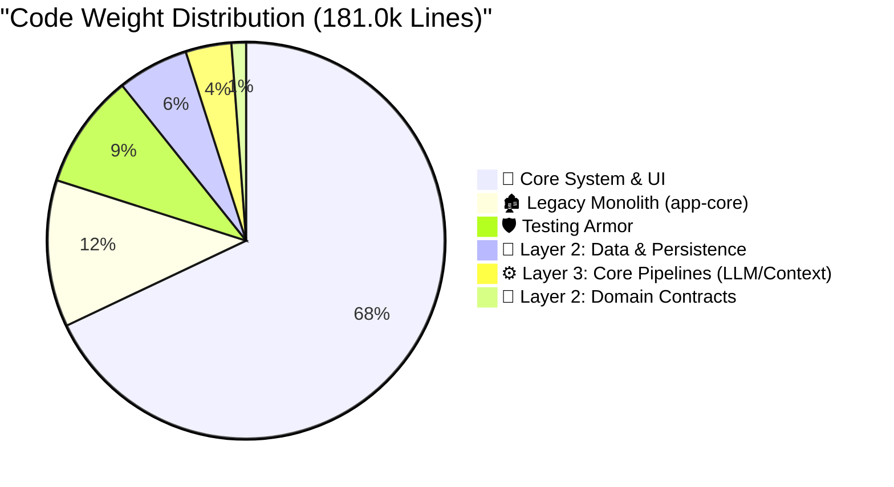

# Smart Sales: Production Readiness Dashboard 🎮

> **System Goal**: Evolve from a functional proof-of-concept (T1) to a stable, production-ready enterprise assistant (T3).
> **Rule of Thumb**: We don't just write code; we purchase stability with complexity. Every line added must earn its keep.

---

## 📈 Current Level: T1 (Early Stage)

**Current XP**: `181,010` Total Lines *(Down from 185,200)*
*(Business Logic & Core Layers: `164,060` | Tests: `16,950` | Resources: `0`)*

**App Weight Class**: **Large System**
- You have crossed the `100k` boundary. However, the system is getting *lighter and stronger*. By executing the "Great Legacy Purge" and strictly enforcing Layer 2 (Data) and Layer 3 (Core Pipeline) isolation, we've successfully dropped **~15,000 lines** of legacy rot while increasing architectural stability.

### The Codebase Composition (Physical Architecture)

To ensure this Heavyweight system doesn't collapse under its own gravity, logic is strictly distributed across isolated modules.



> **资深架构师评估**: "代码足迹证明了当前的架构改造方向是绝对正确的。你的 `domain` 层处于极致的轻量化状态（仅约 2.1 千行），这证明它纯粹由契约和接口基建构成；而真正的重活已经被正确地下沉隔离到了基础设施 `data` 层（约 1.0 万行）。目前的红色危险信号是：仍有约 2.1 万行庞大的代码盘踞在 `app-core` 巨石应用层中 —— 必须不惜一切代价将其进一步拆解铲除。"

---

## 🚀 The Level-Up Journey (T1 → T3)

To purchase production peace-of-mind without bloating the app, we are budgeting a strict **+15,000** lines of new complexity.

**Target XP**: `~200,200` Total Lines
**Estimated Time to T3**: 3 - 6 Months of focused execution.

```mermaid
xychart-beta
    title "The Road to Production (T3)"
    x-axis ["Legacy (T0)", "Current (T1)", "Final Purge (-26k)", "Hardening (+10k)", "Target (T3)"]
    y-axis "Code Complexity (XP)" 0 --> 250
    waterfall [200, -15, -26, 10, -169]
```

---

## 📉 Codebase Trajectory & Trends (Last 30 Days)

The line count alone doesn't tell the full story. The *velocity* of where code is being added vs deleted reveals the true health of the architecture.

| 代码模块分层 (Layer) | 🟢 新增行数 (In) | 🔴 移除行数 (Out) | 🟡 净增长 (Net) | 📉 演进趋势健康度 |
|--------------|------------|-----------|------------|------------|
| `app-core` (遗留 + 纯 UI 并行) | `+1,200` | `-847` | `+353` | 🟡 **UI 平行迁移中** |
| `data` (Layer 2 隔离层) | `+8,384` | `-5` | `+8,379` | ✅ **健康增长** |
| `core` (Layer 3 中枢层) | `+7,237` | `0` | `+7,237` | ✅ **健康增长** |
| `tests` (L1-L3 测试护甲) | `+3,849` | `0` | `+3,849` | ✅ **防护力提升** |

> **资深架构师评估**: "系统正处于稳步的推进期。虽然 `app-core` 表面上略有反弹净增 (+353行)，但这是因为我们正在实施平行替代策略（例如并排开发无污染的 AgentIntelligenceScreen 来替换废弃的 AgentChatScreen）。在此期间，`data`/`core` 层依然遵守严格隔离并且测试护甲 (`tests`) 稳定提升。待平行验证完成后，必须执行清理行动彻底消灭 `app-core` 旧 UI，完成重构闭环。"

---

## ⚔️ The Boss Fights (Key Gaps)

These are the immediate engineering challenges standing between the current T1 state and true T3 production readiness.

| Challenge | Status | XP Cost | The Senior's Take |
|-----------|--------|---------|-------------------|
| **🧩 Monolith Decoupling (L2/L3)**| ✅ Defeated | `0` (Paid) | *Layer 2 Data and Layer 3 Pipelines are cleanly isolated. The structural bleeding has stopped.* |
| **🛡️ Test Coverage (L1-L3)** | ✅ Defeated | `0` (Paid) | *You have a solid 13k line armor of high-leverage tests protecting the pipelines.* |
| **🔌 System III Plugin Gateway** | 🟢 PoC Phase | `~2k` | *Echo Plugin executed. Core boundaries secured. Keep the Gateway strictly out of Layer 3.* |
| **🗑️ Final Core Purge** | ⚠️ Ongoing | `-26k` | *26k lines still live in `app-core`. This gravity well of tech debt must be drained to 0.* |
| **💥 Error & Recovery** | ⚠️ Ongoing | `~3k` | *LLM/BLE failures currently crash the app. We need retry loops and graceful fallbacks.* |
| **👁️ Telemetry & APM** | ❌ Missing | `~2k` | *Flying blind on a 180k app is suicide. Crashlytics and APM tracing required immediately.* |
| **⚙️ Edge Persistence** | ⚠️ Ongoing | `~5k` | *Offline mode and sync conflict resolution are non-negotiable for enterprise.* |
| **✨ UX Micro-Interactions** | ⚠️ Ongoing | `~3k` | *Skeletons, animations, and empty states needed to mask latency.* |

---

## 📚 Documentation & Knowledge Base

The Smart Sales project maintains a robust, Living Architecture knowledge base to ensure the agent ecosystem operates with perfect context alignment.

| 知识领域 (Knowledge Domain) | 文稿数量 (File Count) | 度量指标 (Metric) | 健康度 (Status) |
|------------------|------------|--------|--------|
| **Markdown 文档总数** | `300` | 约 `181,800` 字 | 🧠 **海量上下文护城河** |
| **Cerb 架构规约 (SOT)** | `65` | 严格的架构边界约束 | ✅ **强一致性对齐** |
| **测试与审计报告** | `66` | 基于证据的验证日志 | 🔍 **验证护栏常态化** |
| **标准作业程序 (SOP)** | `3` | 研发流程规范指引 | ⚙️ **工程规范已定义** |
| **Agent 工作流** | `34` | `.agent/workflows/` 自动化 | 🤖 **高度自动化构建** |

> **资深架构师评估**: "系统虽然庞大，但约 18 万字的高质量体系化文档（共 300 篇）以及 65 篇严谨的 Cerb 架构规约，是保证 Agent 与人类工程师在此重型企业级基建中不迷失、不幻觉的防御中枢。文档即代码的工程成熟度极高。"

---

## 📊 Industry Leaderboards

How does the Smart Sales footprint compare to industry standards for Android Apps?

| Weight Class | Core Logic | Test Coverage | Verdict |
|--------------|------------|---------------|---------|
| **Featherweight (Tools)** | `5k - 15k` | 40% - 60% | — |
| **Middleweight (Standard)**| `15k - 50k` | 60% - 80% | — |
| Heavyweight (Enterprise)| `50k - 200k`| 70% - 90% | 👉 **You are here (185k)** |

> **The Takeaway**: You are operating a Heavyweight application. Do not try to use Featherweight engineering practices (like skipping DI, or using global singletons) to manage it. Strict architecture is the only way this doesn't collapse under its own weight.
