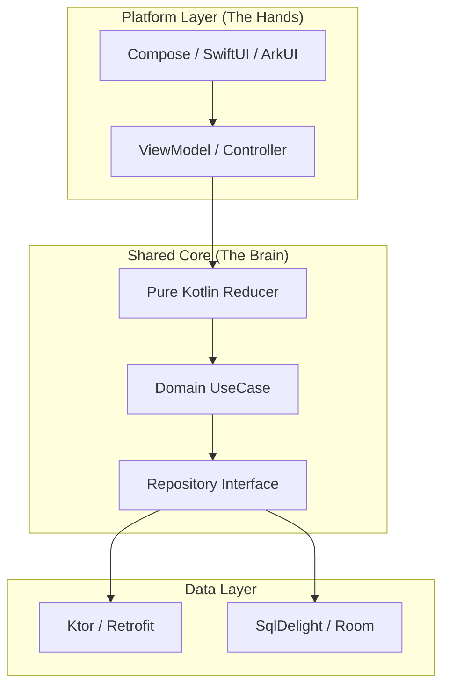

# Architecture Evolution Guide

> **Purpose**: North Star for Smart Sales architecture evolution  
> **Target**: Cross-Platform (Android/iOS/HarmonyOS) Ready  
> **Spec Alignment**: Orchestrator-V1.md (v1.2.0)  
> **Status**: Phase 3 (Feature Isolation + Portable Core)

---

## 1. Vision: "Hybrid Feature-Based + Portable Core"

We are transforming from a **legacy compiled monolith** into a **modern cross-platform architecture**. The goal is transferability without full rewrite costs.

### Core Principles
1.  **Vertical Features**: Each feature (`chat`, `history`, `transcription`) owns its full stack.
2.  **Portable "Brain"**: All state logic lives in `shared/` as pure Kotlin Reducers (no Android imports).
3.  **Platform "Hands"**: Android/iOS/HarmonyOS layers only handle UI rendering and lifecycle glue.



---

## 2. Target Architecture (Phase 3)

### The Constraint
**NO BUSINESS LOGIC IN VIEWMODELS.**
ViewModels are now thin wrappers that bind platform lifecycle to shared Reducers.

### 2.1 The "Portable Core" Pattern

Instead of putting logic in `ViewModel`, we use **Reducers** and **Coordinators**.

| Component | Responsibility | Dependencies | Transferable? |
|-----------|----------------|--------------|---------------|
| **UI** | Rendering state | Compose/SwiftUI | ❌ No |
| **ViewModel** | Lifecycle, StateFlow holder | Android SDK | ❌ No |
| **Reducer** | `(State, Intent) -> State` | Pure Kotlin | ✅ **YES** |
| **Coordinator** | Async flows, side effects | Pure Kotlin | ✅ **YES** |
| **Domain** | Parsers, Rules | Pure Kotlin | ✅ **YES** |

---

## 3. Target File Structure

We are moving to a structure that separates "portable logic" from "platform glue" *within* feature directories.

### Feature: Conversation (`feature/chat/conversation/`)

```kotlin
// 1. THE BRAIN (Portable - eventually moves to shared/)
conversation/
├── ConversationState.kt      // data class (Pure)
├── ConversationIntent.kt     // sealed interface (Pure)
└── ConversationReducer.kt    // The Logic Engine (Pure)

// 2. THE HANDS (Android Specific)
conversation/
├── ConversationViewModel.kt  // Thin Hilt Wrapper
└── ConversationScreen.kt     // Compose UI
```

### Feature: History (`feature/chat/history/`)

```kotlin
// 1. THE BRAIN (Portable)
history/
├── HistoryState.kt
├── HistoryIntent.kt
└── HistoryReducer.kt

// 2. THE HANDS (Android Specific)
history/
├── HistoryViewModel.kt
└── HistoryScreen.kt
```

### Shared Domain (`domain/`)
*Already largely portable (M1/M2 complete)*
```kotlin
domain/
├── chat/
│   ├── ChatPublisher.kt         ✅ Pure
│   ├── InputClassifier.kt       ✅ Pure
│   └── MetadataParser.kt        ✅ Pure
├── transcription/
│   └── TranscriptionCoordinator.kt ✅ Pure
```

---

## 4. Phase 3 Roadmap: "The Great Split"

We are breaking the implementation of `HomeScreenViewModel` (2500+ lines) into portable reducers.

### M4: Portable Reducers ✅ COMPLETE
**Goal**: Make business logic platform-agnostic.
- [x] **P3.1 ConversationReducer**: Pure Reducer pattern (14 tests) + streaming foundation (P3.1.B2 partial)
- [x] **P3.2 HistoryReducer**: `SessionsManager` Coordinator pattern (169 lines, pre-existing)
- [x] **P3.3 TranscriptionReducer**: `TranscriptionCoordinator` (domain/transcription)
- [x] **P3.4 Feature Shells**: `ConversationViewModel` created, `SessionsViewModel` exists

> [!NOTE]
> M4 uses mixed patterns: ConversationReducer (pure `reduce()`) + SessionsManager/TranscriptionCoordinator (StateFlow). Both achieve portability.

### M5: Navigation & Isolation
**Goal**: Break the UI monolith.
- [ ] **P3.5 ConversationScreen**: Standalone chat UI.
- [ ] **P3.6 HistoryScreen**: Standalone history UI.
- [x] **P3.7 HomeScreen Consolidation**: Eliminate dual implementations (app + feature modules).
- [ ] **P3.8 God ViewModel Liquidation**: Delete `HomeScreenViewModel`.

### M6: Multiplatform Prep (Future)
**Goal**: Physical module separation.
- [ ] Move Reducers/Domain to `:shared` Gradle module.
- [ ] Set up KMP build definitions.

---

## 5. V1 Module Alignment

| V1 Module | Implementation | Status |
|-----------|----------------|--------|
| **Orchestrator** | `ChatNavHost` (Shell) | 🔲 Planned |
| **Pipeline** | `ChatStreamCoordinator` | ✅ Done |
| **Analysis** | `SmartAnalysisParser` | ✅ Done |
| **Context** | `SessionsManager` | ✅ Done |
| **Transcript** | `TranscriptionCoordinator` | ✅ Done |

---

## 6. Migration Guide (for Vibe Coding)

When prompted to add a feature:
1. **Define State**: Add properties to `X State` data class.
2. **Define Intent**: Add `XIntent` sealed interface.
3. **Implement Logic**: Handle intent in `XReducer` (Pure Kotlin).
4. **Bind UI**: Update Compose to render new state.

**Do NOT** add functions to generic ViewModels.
**Do NOT** add `if/else` logic in Composable.

---

## 7. Quality Guardrails

1. **The "Import Test"**: Domain and Reducer files must NOT contain `android.*` imports (except generic `android.util.Log` if absolutely necessary, but prefer pure loggers).
2. **500 Line Limit**: No file exceeds 500 lines. If a Reducer gets big, split it into child reducers.
3. **Tests First**: Write tests for Reducers *before* binding to ViewModels. Reducers are easy to test (input -> output).

---

## 8. References

- [Orchestrator-V1.md](./Orchestrator-V1.md) — Module definitions
- Senior review workflow: `.agent/workflows/senior-review.md`
