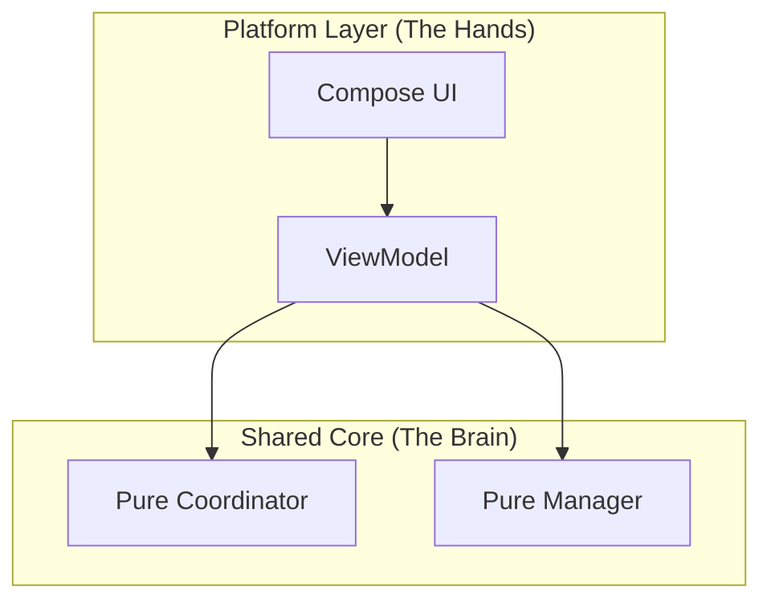

# Architecture Evolution Guide

> **Purpose**: North Star for Smart Sales architecture evolution  
> **Target**: Cross-Platform (Android/iOS/HarmonyOS) Ready  
> **Spec Alignment**: Orchestrator-V1.md (v1.2.0)  
> **Status**: Phase 3 (God ViewModel Liquidation)  
> **Last Audit**: 2026-01-06

---

## 1. Vision: "Hybrid Feature-Based + Portable Core"

We are transforming from a **legacy compiled monolith** into a **modern cross-platform architecture**. The goal is transferability without full rewrite costs.

### Core Principles
1.  **Vertical Features**: Each feature (`chat`, `history`, `transcription`) owns its full stack.
2.  **Portable "Brain"**: All state logic lives in pure Kotlin Coordinators (no Android imports).
3.  **Platform "Hands"**: Android layers only handle UI rendering and lifecycle glue.
4.  **Quality Over Quantity**: Responsibility limits, not line limits.

---

## 2. Current State (Audited 2026-01-06)

### Wired Portable Components

| Coordinator | Lines | Wired Into | Job |
|-------------|-------|------------|-----|
| `SessionsManager` | 169 | HSVM | Session CRUD, history operations |
| `ExportCoordinator` | ~150 | HSVM | Export gate, PDF/CSV, share |
| `TranscriptionCoordinator` | 196 | HSVM | Batch gate, window filter, Tingwu trace |
| `ConversationViewModel` | 352 | HSVM | Streaming, SmartAnalysis, message state |

### Dead Code Deleted (This Session)

| File | Lines | Reason |
|------|-------|--------|
| `SessionsViewModel.kt` | 166 | Duplicate of `SessionsManager` |
| `ExportViewModel.kt` | 164 | Duplicate of `ExportCoordinator` |
| NAV system (header + index) | ~35 | Broken/stale anchors |

### The God Object

`HomeScreenViewModel.kt` is **2398 lines** (after cleanup). It still:
- Orchestrates all coordinators
- Manages UI state aggregation
- Handles lifecycle observers
- Contains session bootstrap logic

---

## 3. The Constraint: Single Responsibility

> ⚠️ **NO GOD VIEWMODELS.** We enforce separation by **responsibility**, not metrics.

Each component has **ONE job**. If you're writing a second `when` branch for unrelated intents, you've crossed the line—extract it.

### 3.1 The "Portable Core" Pattern

| Component | Responsibility | Dependencies | Transferable? |
|-----------|----------------|--------------|---------------|
| **UI** | Rendering state | Compose | ❌ No |
| **ViewModel** | Lifecycle, StateFlow holder | Android SDK | ❌ No |
| **Coordinator/Manager** | Async flows, state logic | Pure Kotlin | ✅ **YES** |

---

## 4. Phase 3 Roadmap: "The Great Split"

### M4: Portable Core ✅ COMPLETE
- [x] `SessionsManager`: Session CRUD (wired)
- [x] `ExportCoordinator`: Export logic (wired)
- [x] `TranscriptionCoordinator`: Tingwu batch logic (wired)
- [x] `ConversationViewModel`: Streaming + SmartAnalysis (wired)

### M5: God ViewModel Liquidation (Current)

**Goal**: Split HSVM by responsibility into focused ViewModels/Coordinators.

| Step | Action | Verification |
|------|--------|--------------|
| **M5.1** | Audit HSVM responsibility breakdown | Map 118 methods to responsibility areas |
| **M5.2** | Delete dead code | Build passes, no functionality lost |
| **M5.3** | Extract Transcription responsibility | Create `TranscriptionSessionManager` for `onTranscriptionRequested` |
| **M5.4** | Extract Debug responsibility | Move debug methods to `DebugCoordinator` |
| **M5.5** | Extract Streaming callbacks | Consolidate `handleStreamCompleted/Error` into streaming layer |
| **M5.6** | Final evaluation | HSVM has ONE responsibility: wiring coordinators |

> [!IMPORTANT]
> **M5 DONE Criteria:**
> 1. `HomeScreenViewModel` has **ONE clear responsibility**: lifecycle + coordinator wiring.
> 2. Each extracted component has **ONE responsibility** with its own tests.
> 3. All existing tests pass.
> 4. No `android.*` imports in any `:feature/*/domain/` directory.

### M6: Multiplatform Prep (Deferred)

> [!CAUTION]
> Not scheduled. KMP migration is 2+ sprints. This section exists for direction only.

- [ ] Move Coordinators to `:shared` Gradle module.
- [ ] Implement `expect`/`actual` for platform bridges.

---

## 5. Migration Guide (Rewrite First)

**Rule: Do not patch the God Object. Rewrite into coordinators first.**

1. **Audit**: Verify what logic already exists in coordinators.
2. **Delete Duplicates**: Remove duplicated logic from HSVM.
3. **Evaluate**: See what remains in HSVM.
4. **Decide**: Rename to ShellVM or delete entirely.

---

## 6. Quality Guardrails

| Guardrail | Enforcement |
|-----------|-------------|
| **Single Responsibility** | Code review: "Does this component have ONE job?" |
| **Import Test** | CI: `grep -R "import android." :feature/*/domain/` must return empty |
| **Audit Before Assume** | Verify claims about code state with grep/view before acting |
| **No Premature Abstraction** | Don't create wrappers unless they add logic beyond delegation |
