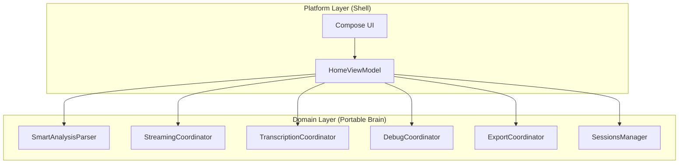

# Realize The Archi (RTA)

> **Purpose**: Blueprint for Smart Sales architecture REALIZATION  
> **Paradigm**: Reference existing code + Orchestrator-V1 → write toward target state  
> **Target**: Cross-Platform (Android/iOS/HarmonyOS) Ready  
> **Spec Alignment**: Orchestrator-V1.md (v1.2.0)  
> **Status**: M6 Phase 1 & Phase 2 Wave 1 Complete  
> **Last Audit**: 2026-01-07

> [!IMPORTANT]
> **Architecture Realization Principle**:  
> This doc is *aspirational*, not *prescriptive*.  
> - **Reality may differ** from the target tree — that's expected  
> - **Differences are work items**, not failures  
> - **The doc shows the corrective path**: what to rewrite, move, or create  
> - **Use the right tool**: rewrite > extract > surgical fix  
> - **Always verify** with `grep`/`find` before assuming state matches doc

---

## 1. Vision: Portable Core + Platform Shell



### Core Principles
1. **Single Responsibility**: Each component has ONE job
2. **Portable Domain**: `domain/` has zero Android imports
3. **Platform Shell**: ViewModel only wires coordinators to UI state
4. **V1 Spec Alignment**: Every module maps to Orchestrator-V1.md section

---

## 2. Target Architecture Tree

```
smart-sales/
├── core/metahub/                    # Metadata Hub (V1 §4)
│   ├── ConversationDerivedState.kt     # M2
│   ├── TranscriptMetadata.kt           # M2B
│   └── SessionMetadata.kt              # M3
│
├── data/ai-core/                    # Provider Layer
│   ├── DashscopeAiChatService.kt       # AI Chatter (V1 §3.1.1)
│   ├── TingwuRunner.kt                 # Impl of TingwuCoordinator (V1 §3.2.2) ✅
│   └── tingwu/
│       └── TranscriptPublisher.kt      # V1 §3.2.4 ✅
│
├── feature/chat/domain/             # Portable Brain (Pure Kotlin)
│   ├── analysis/
│   │   └── SmartAnalysisParser.kt      # LLM Parser (V1 §3.1.3) ✅
│   ├── chat/
│   │   ├── ChatPublisher.kt            # ChatPublisher (V1 §3.2.4)
│   │   └── ChatMessageBuilder.kt
│   ├── transcription/
│   │   ├── Disector.kt                 # V1 §3.2.1 ✅
│   │   ├── Sanitizer.kt                # V1 §3.2.3 ✅
│   │   └── TranscriptionCoordinator.kt
│   ├── debug/DebugCoordinator.kt       # HUD (V1 §9)
│   ├── export/ExportCoordinator.kt
│   ├── stream/StreamingCoordinator.kt  # ✅
│   └── sessions/SessionsManager.kt
│

│
└── feature/chat/presentation/
    └── HomeViewModel.kt                # Shell ✅
```

---

## 3. V1 Module Mapping

| V1 Module | V1 Section | File | Status |
|-----------|------------|------|--------|
| AI Chatter | §3.1.1 | `DashscopeAiChatService.kt` | ✅ |
| SmartAnalysis | §3.1.2 | `SmartAnalysisParser.kt` | ✅ |
| LLM Parser | §3.1.3 | `SmartAnalysisParser.kt` | ✅ |
| Disector | §3.2.1 | `Disector.kt` | ✅ |
| Tingwu Runner | §3.2.2 | `TingwuRunner.kt` (impl TingwuCoordinator) | ✅ |
| Sanitizer | §3.2.3 | `Sanitizer.kt` | ✅ |
| ChatPublisher | §3.2.4 | `ChatPublisher.kt` | ✅ |
| TranscriptPublisher | §3.2.4 | `TranscriptPublisher.kt` | ✅ |
| M2/M2B/M3 | §4 | `core/metahub/` | ✅ |

---

## 4. M5 Status: ✅ COMPLETE

**Completed 2026-01-07**

### Renames (6 total) ✅

| Before | After | Status |
|--------|-------|--------|
| `HomeScreenViewModel.kt` | `HomeViewModel.kt` | ✅ |
| `DisectorUseCase.kt` | `Disector.kt` | ✅ |
| `SanitizerUseCase.kt` | `Sanitizer.kt` | ✅ |
| `RealTingwuCoordinator.kt` | `TingwuRunner.kt` | ✅ (already impl TingwuCoordinator) |
| `TranscriptPublisherUseCase.kt` | `TranscriptPublisher.kt` | ✅ (already renamed) |
| `ChatStreamCoordinator.kt` | `StreamingCoordinator.kt` | ✅ |

### HSVM → HomeViewModel Shell ✅

**Result**: 2179 → 2126 lines (-53)

HomeViewModel delegates to coordinators:
- `SmartAnalysisParser` → L3 parsing ✅
- `StreamingCoordinator` → streaming callbacks ✅
- `TranscriptionCoordinator` → batch orchestration ✅
- `MediaInputCoordinator` → audio/image file handling (NEW) ✅
- `DebugCoordinator` → HUD/debug ✅
- `ExportCoordinator` → export gate ✅
- `SessionsManager` → session CRUD ✅

---

## 5. M6 KMP Prep: ✅ Phase 1 & Phase 2 Wave 1 COMPLETE

**Completed 2026-01-07**

### Phase 1: Remove Android Imports ✅
- `domain/` — 0 Android imports ✅
- `core/metahub/` — 0 Android imports ✅
- Moved `MediaInputCoordinator` to platform layer
- Removed `android.util.Log` from `TranscriptionCoordinator`

### Phase 2 Wave 1: Interface Extraction ✅
- `Disector` / `DisectorImpl` — interface extracted ✅
- `Sanitizer` / `SanitizerImpl` — interface extracted ✅
- Created `DomainModule` for Hilt bindings ✅

### Deferred Work

**Wave 2** (4 complex coordinators): ExportCoordinator, DebugCoordinator, TranscriptionCoordinator, SessionsManager
- Defer until actual KMP module creation

**Phase 3** (`:shared` module):
- `data/ai-core/` — OkHttp/Android networking
- Hilt DI → Koin for multiplatform
- Only when iOS development starts

### KMP Target Structure
```
├── shared/                  # NEW Gradle module
│   ├── domain/              # Move from feature/chat/domain
│   ├── metahub/             # Move from core/metahub
│   └── network/             # expect/actual for HTTP
├── androidApp/
└── iosApp/
```

---

## 6. Quality Guardrails

| Guardrail | Enforcement |
|-----------|-------------|
| **Single Responsibility** | "Does this component have ONE job?" |
| **Import Test** | `grep "import android." domain/` = 0 |
| **Audit Before Assume** | Verify with grep/find, no guessing |
| **V1 Alignment** | Every module maps to spec section |
| **Doc Verification** | Before marking "[ADD X]", run `grep -rn "X" .` to check if X already exists |

---

## 7. Success Criteria

> Does each component have ONE responsibility?

- If YES → done
- If NO → extract

No line metrics. Responsibility is the only measure.
