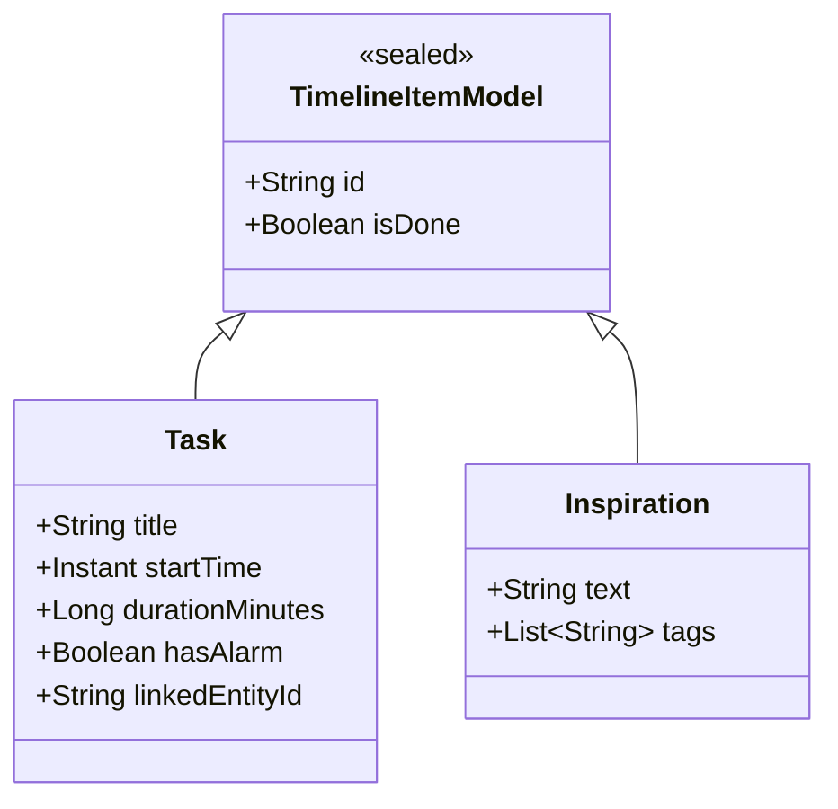

# Scheduler Dashboard (Skin Modernization)

> **State**: SPEC_ONLY
> **OS Model Layer**: Application (Layer 4)
> **UI Layer**: Pure Compose Client (observing `ISchedulerViewModel`)

## Overview

A complete rewrite of the `SchedulerViewModel` and its associated Compose UI to decouple raw Pipeline Execution logic from Presentation logic, and formally institute the "Reactive Unification" of Actionable Timeline Tasks with Factual Memory Entries.

This fulfills Phase 2 (Parallel Proving Ground) of the `tracker.md` UI Skin Epic, and Phase 3 (Cross-Off Lifecycle) of the Actionable/Factual Unification wave.

## 🧠 Intricacies & Organic UX Constraints
- **Organic UX (The Cross-Off)**: Users derive psychological satisfaction from crossing items off a list. If we blindly follow the "Tasks are deleted and moved to Memory" data rule, the check-marked item instantly vanishes from the screen. 
- **The Reactive Solution**: The UI `TimelineItems` stream must dynamically combine active tasks from `ScheduledTaskRepository` with completed `SCHEDULE_ITEM` entries from `MemoryRepository` mapped into a unified list. 
- **Conflict Anxiety**: When a user's new request conflicts with existing tasks, they freeze if they don't know *what* they are overwriting. The UI must aggressively highlight (amber/red glow) the conflicting items BEFORE asking them how to proceed.

## Domain Models (Mapped for UI)

The UI consumes a sealed class stream from the ViewModel:

> **Crucial Distinction**: The UI `isDone` property on a `Task` means it actually originates from the backend `MemoryRepository` as a locked factual record, not the Actionable feed.

## Interaction States

| User Action | UI Feedback | ViewModel Action | Backend Reality |
|-------------|-------------|------------------|-----------------|
| Check task  | Checkmark fills, text strikethrough (immediate) | `onToggleDone(id)` | Task deleted from `ScheduledTask`, `MemoryEntry(SCHEDULE_ITEM)` created. |
| Uncheck task| Checkmark clears, text normalizes | `onToggleDone(id)` | `MemoryEntry` deleted, `ScheduledTask` recreated. |
| Hold Mic    | Loading state, waveform animation | (Handled by Audio Pipeline) | Audio → ASR → IntentOrchestrator| 
| Speaks conflicting task | Amber glow on conflicting tasks, warning text | `conflictWarning` set | Pipeline yields `PendingIntent`, awaits user routing |
| Long Press Task | Selection Mode opens (Trash/Edit icons) | `onLongPress(id)` | Local UI selection state |

## Wave Plan: UI Skin Modernization

| Wave | Title | Status | Goal |
|------|-------|--------|------|
| 1 | **The Parallel Fake** | ✅ SHIPPED | Build the pure Compose UI driven exclusively by `FakeSchedulerViewModel`. Prove all states (loading, multi-select, conflict glow, disabled tasks) work visually without a database. |
| 2 | **ViewModel Ejection** | ✅ SHIPPED | Gut the 860-line `SchedulerViewModel`. Extract conflict logic to `SchedulerCoordinator`, AST simulation to `IntentOrchestrator`, and routing logic out of the UI. |
| 3 | **Reactive Unification** | ✅ SHIPPED | Implement `Flow.combine` mapping in the new, slim `SchedulerViewModel` to stitch Actionable and Memory backends into the `timelineItems` stream. |
| 4 | **The Integration** | 🔲 | Swap the `FakeSchedulerViewModel` for the real one in the parent `NavHost`. Ensure the old UI behaves correctly under the new architecture. |
