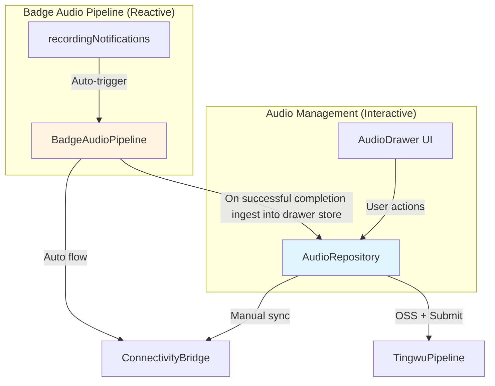

# Audio Management

> **Cerb-compliant spec** — Audio file management: sync, transcription, UI interaction.
> **Status**: SHIPPED
> **Last Updated**: 2026-04-28
> **Behavioral UX Authority Above This Doc**: [`docs/core-flow/base-runtime-ux-surface-governance-flow.md`](../../core-flow/base-runtime-ux-surface-governance-flow.md) (`UX.AUDIO.*`)

---

> **OS Layer**: SSD Storage

## Overview

Audio Management owns the drawer-visible audio inventory, manual sync/download/delete/transcription behavior, and persisted artifact access for badge recordings and phone/test audio.

Users manually trigger drawer-side sync and deletion through the Audio Drawer UI.

Current SIM manual badge sync is list-first:

- `/list` creates new SmartBadge cards immediately
- large WAV downloads continue in one repository-owned background queue
- placeholder cards stay visible and deletable while waiting for local WAV readiness
- transcribe/chat-pending actions remain blocked until the local WAV exists
- when badge WAV download work is queued, Android may hold a low-priority foreground-service keepalive notification so the queue can survive app backgrounding or recents-task removal without changing the manual-sync ownership model

Completed badge-pipeline recordings must also appear in the same drawer inventory without requiring the user to reopen the drawer or run manual sync. The delivered implementation does this by ingesting successful `BadgeAudioPipeline` completions directly into the SIM audio namespace before badge cleanup.

**Key Distinction**: drawer sync remains **UI-driven and manual**, but is now supplemented by two automatic paths:

1. **`rec#` push-based auto-download** (`SimBadgeAudioAutoDownloader`): badge sends `rec#YYYYMMDD_HHMMSS` over BLE when a recording finishes → app immediately creates QUEUED placeholder and downloads in background. No transcription or scheduling.
   - Android may start the same low-priority foreground-service keepalive notification used by manual queue downloads so the file can finish after the app is backgrounded or swiped from recents.

2. **`/list` reconnection fallback** (`SimAudioDrawerViewModel`): when badge reconnects (managerStatus transitions to Ready), app auto-runs `/list` with a 3s debounce to catch files recorded while disconnected.

These paths are parallel and independent. `log#` / `BadgeAudioPipeline` remains the scheduler path unchanged.

Deprecated-shard rule:

- the retired SIM audio/chat shard is now historical redirect material only
- active non-Mono audio truth lives in this spec, this interface, `docs/core-flow/sim-audio-artifact-chat-flow.md`, and `docs/cerb/tingwu-pipeline/*`
- opening the drawer must **not** trigger browse-open auto-sync as active product behavior

---

## Related Cerb Specs

| Spec | Responsibility |
|------|----------------|
| [Connectivity Bridge](../connectivity-bridge/interface.md) | Downloads WAV files from badge |
| [Tingwu Pipeline](../tingwu-pipeline/interface.md) | Long-form audio processing via Aliyun |
| [Badge Audio Pipeline](../badge-audio-pipeline/interface.md) | Automatic badge → scheduler pipeline that now feeds completed items back into drawer storage |

---

## Architecture Relationship

**Two Layers**:
- **AudioRepository** — UI-driven (user taps "Sync", "Transcribe", "Delete")
- **BadgeAudioPipeline** — Event-driven (badge sends `log#YYYYMMDD_HHMMSS` → auto-process)

**Delivered Integration**:
- drawer-side `sync from badge` remains user-triggered
- pipeline-complete recordings are auto-ingested into the same drawer store
- badge-side delete happens only after drawer ingest succeeds so failed ingest does not lose recovery path

## Active Inventory Sync Rule

There is one active inventory rule for current non-Mono work:

- drawer-visible badge sync is an explicit UI/manual action, **plus** two automatic paths (see below)
- successful badge-pipeline completions may appear in the drawer automatically because they are ingested into the same repository namespace after pipeline completion
- automatic pipeline ingest does **not** redefine the drawer-side sync contract
- browse-open auto-sync is retired migration history, not current truth
- fresh install inventory may include one built-in phone demo recording for product demonstration, but it must not ship a long list of seeded pending test recordings by default
- startup reconciliation should prune the retired built-in pending sample IDs so old multi-seed debug inventory does not linger after upgrade

**Auto-sync on reconnection rule**:
- when `BadgeManagerStatus` transitions from any non-Ready state to `Ready`, the app automatically fires `/list` sync after a 3s debounce
- reconnection auto-sync failures are silent (no toast, no spinner) — only affects Dynamic Island
- the 3s debounce prevents collision with the CONNECTIVITY "Badge 已连接" transient Dynamic Island item
- when the same active badge moves from `Ready` to `Disconnected` or `Connecting` while manual queue downloads or `rec#` auto-downloads are active, audio cancels the active HTTP work immediately, preserves interrupted placeholder availability for HOLD rendering, and records only those interrupted filenames for targeted resume
- when that same badge returns to `Ready`, audio drains the targeted resume set before the drawer debounce path runs and requeues only those filenames from byte 0; this is not HTTP Range resume
- `BlePairedNetworkUnknown`, `BlePairedNetworkOffline`, and `BleDetected` are partial transport/diagnostic states and must not cancel active badge downloads by themselves

**`rec#` push-based auto-download rule**:
- badge sends `rec#YYYYMMDD_HHMMSS` when a recording finishes and the file is ready
- app creates QUEUED placeholder immediately, downloads in background
- active `rec#` jobs are tracked by `(badgeMac, filename)` so same-badge disconnect can cancel and target-resume them, and duplicate active notifications for the same badge/file do not launch a second download
- sub-1KB files are discarded silently (same as `/list` sync)
- no transcription or scheduling is triggered by the `rec#` path
- Dynamic Island shows transient "已同步：rec_filename" for 3s on success

Manual sync outcome rule:

- `徽章当前没有录音` means the badge list was actually empty
- `录音已在列表中，无需重复同步` means the badge reported recordings, but they were already present locally or currently suppressed by pending badge-delete protection
- `已发现 X 条徽章录音，正在后台同步` means `/list` discovered new badge files and created immediate placeholder cards while the background queue downloads WAVs
- `录音已在列表中，后台同步继续进行` means the current sync mostly resumed retryable placeholder downloads instead of discovering brand-new filenames
- when empty recordings are skipped, the sync surface should append the suffix `（跳过 N 条空录音）` only after that empty-file evidence is actually observed

Browse header contract:

- SIM browse mode keeps one top header family: dual-purpose grip, title plus count badge, and one two-part smart capsule: left section shows connection icon + "徽章管理" (taps → connectivity manager), right section shows sync icon + relative time label (taps → manual sync; hidden when disconnected)
- browse grip keeps dismiss semantics on tap or downward pull, but reserves upward pull for manual sync only when the badge-sync gate is ready
- blocked or disconnected upward pull must stay in-place and communicate denial locally instead of inventing auto-sync behavior
- browse smart capsule is the only browse-header connectivity affordance in this slice; connected right-side sync taps trigger manual sync, left-side connection tap hands off to connectivity
- relative sync time labels: "未同步" (never synced this session), "已同步 (Xs)" / "已同步 (Xmin)" / "已同步 (Xh)" (after first sync)
- browse-only helper rows are legal only while the built-in demo seed is the lone visible inventory item; they teach sync/delete mechanics and must not mutate real repository items
- select mode remains the narrower rebinding picker and must not surface browse smart-capsule chrome or browse helper teaching rows

Empty recording filter rule:

- badge recordings smaller than 1 KB (1024 bytes) are silently skipped during sync
- WAV header alone is 44 bytes; anything below 1 KB cannot contain meaningful audio
- skipped files are deleted from local temp storage but remain on the badge
- the skip count is logged and shown in the sync outcome message when nonzero
- constant: `MIN_BADGE_WAV_SIZE_BYTES = 1024L` in `SimAudioRepositorySyncSupport.kt`

---

## Domain Models

See [interface.md](./interface.md) for:
- `AudioFile` — Core audio metadata + status
- `AudioLocalAvailability` — QUEUED, DOWNLOADING, READY, FAILED
- `AudioSource` — SMARTBADGE vs PHONE
- `TranscriptionStatus` — PENDING, TRANSCRIBING, TRANSCRIBED

---

## Wave Plan

| Wave | Focus | Status | Deliverables |
|------|-------|--------|--------------|
| **1** | Interface + Fake | ✅ SHIPPED | `AudioRepository` interface, `FakeAudioRepository`, domain models |
| **2** | Real Repository | ✅ SHIPPED | storage-backed repositories, manual sync, delete tombstones |
| **3** | Pipeline Integration | ✅ SHIPPED | completed badge pipeline recordings auto-ingest into drawer inventory |
| **4** | Ask AI Flow | ✅ SHIPPED | Session binding, Context injection, zero-latency rendering |

---

## Wave 1 Ship Criteria

**Goal**: Interface + Fake for UI development.

**Implementation**:
- [x] `AudioRepository` interface (8 methods)
- [x] `FakeAudioRepository` with sample data
- [x] Domain models: `AudioFile`, `AudioLocalAvailability`, `AudioSource`, `TranscriptionStatus`
- [x] DI binding for fake

**Testing**:
- [x] `AudioDrawer` UI renders sample data
- [x] Fake methods callable from UI
- [x] No compile errors in domain layer

---

## Wave 2 Ship Criteria

**Goal**: Real storage-backed repository with spec-owned manual sync/delete behavior.

> [!IMPORTANT]
> **Wave 2 Actual**: the shipped path uses file-backed JSON storage (`StateFlow` + guarded writes) instead of Room.

**Implementation**:
- [x] storage-backed audio repositories ship in `app-core/src/main/java/com/smartsales/prism/data/audio/`
- [x] current SIM path is list-first: `/list` creates placeholder cards immediately and one background queue downloads badge WAVs sequentially
- [x] transcription uses `TingwuPipeline.submit()` plus job observation
- [x] visible transcript presentation prefers Tingwu diarization/identity data when available, rendering speaker-prefixed transcript lines from `diarizedSegments + speakerLabels` before falling back to the raw `transcriptMarkdown`
- [x] drawer delete requires one-time per drawer-open confirmation before the first `SMARTBADGE` delete
- [x] persisted legacy badge-like filenames (`log_YYYYMMDD_HHMMSS.wav`) are normalized back to `SMARTBADGE` on load, and delete-confirm/delete-sync fallback also treats them as badge-origin before reload normalization finishes
- [x] SmartBadge delete persists tombstones keyed by exact badge filename before remote cleanup finishes
- [x] later manual sync suppresses tombstoned badge filenames until remote cleanup succeeds or the badge no longer reports them
- [x] placeholder SmartBadge cards may exist before the local WAV exists; they stay deletable but block transcribe/chat-pending actions until `localAvailability == READY`
- [x] SIM keeps its own namespaced storage (`sim_audio_metadata.json`, `sim_<audioId>.*`, `sim_<audioId>_artifacts.json`)

**Testing**:
- [x] manual badge sync creates immediate drawer-visible placeholder cards for new filenames before background download completes
- [x] transcription progress and artifact persistence update drawer state
- [x] SmartBadge delete confirms once per drawer-open session, removes local data, and suppresses reimport on remote-delete failure
- [x] legacy persisted badge-like entries with drifted `PHONE` source still trigger the same delete-confirm/delete-sync contract
- [x] deleting a queued/downloading SmartBadge placeholder removes it locally, writes the same badge tombstone, and suppresses reappearance until remote cleanup succeeds
- [x] star / session-binding persistence survives reload

---

## Wave 3 Ship Criteria

**Goal**: keep drawer-visible inventory aligned with successful badge pipeline completions.

**Implementation**:
- [x] `RealBadgeAudioPipeline` writes successful badge recordings into the SIM drawer namespace through `SimBadgeAudioPipelineIngestSupport`
- [x] auto-ingested entries are marked `SMARTBADGE` + `TRANSCRIBED` and write minimal persisted artifacts from the completed transcript
- [x] exact badge filenames dedupe repeated ingest, including upgrade-in-place when a pipeline completion matches an existing placeholder card
- [x] badge remote delete runs only after ingest succeeds; failed ingest preserves the badge file for recovery/manual sync

**Testing**:
- [x] badge pipeline success produces a drawer-visible transcribed item without drawer-open auto-sync
- [x] duplicate filename ingest updates the existing drawer item instead of creating a second one

---

## Wave 4 Ship Criteria

**Goal**: Ask AI Dataflow Integration.

**Implementation**:
- [x] Zero-latency ASCII overview card generation (`AudioViewModel.buildOverviewCard`).
- [x] Database-direct payload injection acting as standard chat entrance.
- [x] Session binding via `historyRepository` / `audioRepository`.
- [x] `documentContext` injection into invisible `SessionWorkingSet` RAM.

**Testing**:
- [x] Bind audio → Overview card renders instantly.
- [x] Ask LLM → LLM answers using invisibly wired context.
- [x] Auto-renames session to accurate audio title.

**Testing**:
- [ ] Bind audio → Ask AI in chat → summary referenced
- [ ] Unbind → no longer referenced

---

## File Map

| Layer | File | Purpose |
|-------|------|---------|
| **Domain** | `AudioRepository.kt` | Interface contract |
| **Domain** | `AudioFile.kt`, `AudioSource.kt`, `TranscriptionStatus.kt` | Domain models |
| **Data/Fakes** | `FakeAudioRepository.kt` | Wave 1 (shipped) |
| **Data/Real** | `RealAudioRepository.kt` | Shared audio repository |
| **Data/Real** | `SimAudioRepository.kt`, `SimAudioRepositoryRuntime.kt` | SIM namespaced drawer repository |
| **Data/Real** | `SimAudioRepositoryStoreSupport.kt`, `SimAudioRepositorySyncSupport.kt`, `SimAudioRepositoryArtifactSupport.kt`, `SimAudioRepositoryTranscriptionSupport.kt` | SIM storage / sync / artifact / transcription seams |
| **Data/Real** | `SimBadgeAudioPipelineIngestSupport.kt` | Pipeline-complete ingest into SIM drawer namespace |
| **Pipeline** | `RealBadgeAudioPipeline.kt` | Badge completion triggers drawer ingest before remote cleanup |
| **UI** | `AudioDrawer.kt`, `AudioViewModel.kt` | UI layer |
| **App** | `PrismApplication.kt` | Prewarms badge pipeline and SIM audio repository on app start |

---

## UX Reference

> **Spec**: See the UX Reference section below for layouts, interactions, gestures, and card states.

**Audio Drawer UI Strategy ("Dumb Data, Smart UI")**
- [x] **Arrangement**: Transcription section MUST be at the top as the primary raw source of truth.
- [x] **Async Illusion (Fake Streaming)**: Data is fetched entirely and synchronously from `RealTingwuPipeline`. To guarantee Markdown stability while maintaining a premium "AI is thinking" experience, the UI will use **Fake Streaming** (Typewriter effect looping characters with `delay(10)`) to visually render the pre-loaded text.
- [x] **Buffer Animation**: When waiting for the network/Tingwu job (`TRANSCRIBING` state), the UI will show a `ShimmerLine` component to indicate buffering.
- [x] **Auto-Folding**: Accordions (Chapters, Highlights) should auto-collapse based on state to keep the UI clean, hide visual clutter, and improve usability.
- [ ] **Header Spectrum**: Replace static placeholder waves with the real `outputSpectrumPath` image given by the Tingwu response.
