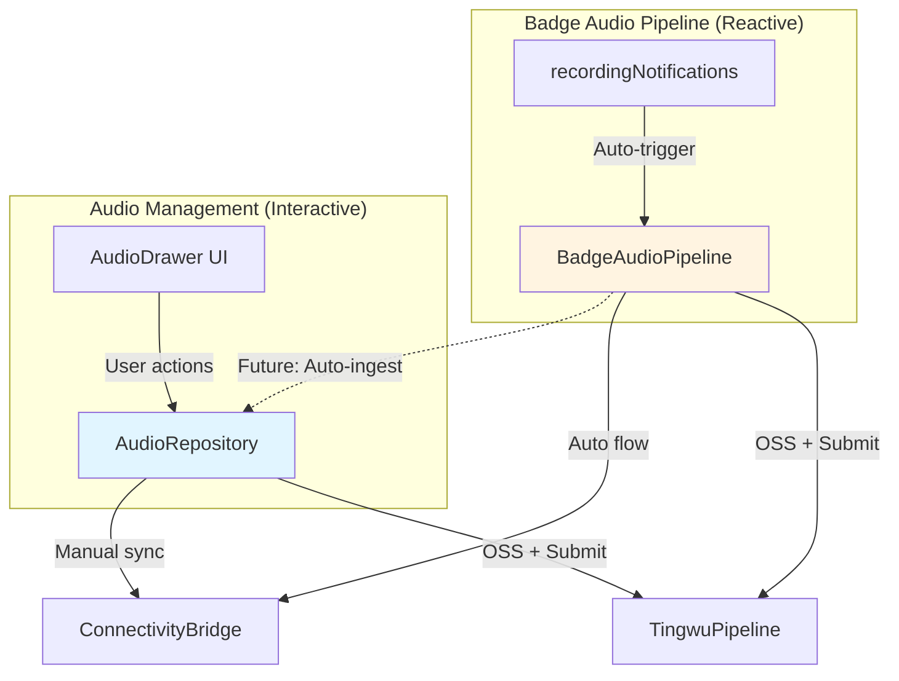

# Audio Management

> **Cerb-compliant spec** — Audio file management: sync, transcription, UI interaction.
> **State**: SPEC_ONLY

---

> **OS Layer**: SSD Storage

## Overview

Audio Management provides interactive file management for badge recordings and phone audio. Users manually trigger sync, transcription, and organization through the Audio Drawer UI.

**Key Distinction**: This is **UI-driven, interactive** management. For automatic pipeline (badge records → auto-download → auto-transcribe → scheduler), see [Badge Audio Pipeline](../badge-audio-pipeline/interface.md).

---

## Related Cerb Specs

| Spec | Responsibility |
|------|----------------|
| [Connectivity Bridge](../connectivity-bridge/interface.md) | Downloads WAV files from badge |
| [Tingwu Pipeline](../tingwu-pipeline/interface.md) | Long-form audio processing via Aliyun |
| [Badge Audio Pipeline](../badge-audio-pipeline/interface.md) | Auto-pipeline (independent use case) |

---

## Architecture Relationship

**Two Layers**:
- **AudioRepository** — UI-driven (user taps "Sync", "Transcribe", "Delete")
- **BadgeAudioPipeline** — Event-driven (badge sends `log#YYYYMMDD_HHMMSS` → auto-process)

**Future Integration** (Wave 3): Pipeline emits `PipelineEvent.Completed` → Repository auto-ingests the file.

---

## Domain Models

See [interface.md](./interface.md) for:
- `AudioFile` — Core audio metadata + status
- `AudioSource` — SMARTBADGE vs PHONE
- `TranscriptionStatus` — PENDING, TRANSCRIBING, TRANSCRIBED, ERROR

---

## Wave Plan

| Wave | Focus | Status | Deliverables |
|------|-------|--------|--------------|
| **1** | Interface + Fake | ✅ SHIPPED | `AudioRepository` interface, `FakeAudioRepository`, domain models |
| **2** | Real Repository | 🔲 | `RealAudioRepository` with persistence |
| **3** | Pipeline Integration | 🔲 | Auto-ingest from `BadgeAudioPipeline` events |
| **4** | Ask AI Flow | ✅ SHIPPED | Session binding, Context injection, zero-latency rendering |

---

## Wave 1 Ship Criteria

**Goal**: Interface + Fake for UI development.

**Implementation**:
- [x] `AudioRepository` interface (8 methods)
- [x] `FakeAudioRepository` with sample data
- [x] Domain models: `AudioFile`, `AudioSource`, `TranscriptionStatus`
- [x] DI binding for fake

**Testing**:
- [x] `AudioDrawer` UI renders sample data
- [x] Fake methods callable from UI
- [x] No compile errors in domain layer

---

## Wave 2 Ship Criteria

**Goal**: Real storage-backed repository.

> [!IMPORTANT]
> **Storage Decision**: Room is NOT currently in `app-core/build.gradle.kts`. Wave 2 implementation must either add Room dependency or use simpler file-based/SharedPreferences storage.
> **Wave 2 Actual**: Use file-backed JSON storage (`StateFlow` + atomic active write) to satisfy persistence without introducing Room dependencies.

**Implementation**:
- [x] `RealAudioRepository` in `app-core/src/main/java/com/smartsales/prism/data/audio/` with JSON file storage
- [x] Calls `ConnectivityBridge.downloadRecording()` for SMARTBADGE files
- [x] Calls `TingwuPipeline.submit()` and `observeJob()` for transcription and intelligence extraction
- [x] Progress tracking via StateFlow mapped from `TingwuJobState`, `AudioViewModel` intercepts Tingwu failures and surfaces via one-shot Toast (leaving domain state as PENDING)
- [x] Update `AudioModule.kt` DI binding for real implementation

**Testing**:
- [ ] Add file → syncs from badge
- [ ] Start transcription → progress updates → summary appears
- [ ] Delete file → local + badge cleanup
- [ ] Toggle star → persists

---

## Wave 3 Ship Criteria

**Goal**: Auto-ingest from Badge Audio Pipeline.

**Dependencies**: Badge Audio Pipeline Wave 3 must ship first.

**Implementation**:
- [ ] Listen to `BadgeAudioPipeline.events`
- [ ] On `PipelineEvent.Completed` → auto-add to repository
- [ ] Mark as transcribed, populate summary
- [ ] Avoid duplicates (check by filename)

**Testing**:
- [ ] Badge records → pipeline processes → file appears in Audio Drawer
- [ ] No user action required

---

## Wave 4 Ship Criteria

**Goal**: Ask AI Dataflow Integration.

**Implementation**:
- [x] Zero-latency ASCII overview card generation (`AudioViewModel.buildOverviewCard`).
- [x] Database-direct payload injection acting as standard chat entrance.
- [x] Session binding via `historyRepository` / `audioRepository`.
- [x] `documentContext` injection into invisible `SessionWorkingSet` RAM.

**Testing**:
- [x] Bind audio → Overview card renders instantly.
- [x] Ask LLM → LLM answers using invisibly wired context.
- [x] Auto-renames session to accurate audio title.

**Testing**:
- [ ] Bind audio → Ask AI in chat → summary referenced
- [ ] Unbind → no longer referenced

---

## File Map

| Layer | File | Purpose |
|-------|------|---------|
| **Domain** | `AudioRepository.kt` | Interface contract |
| **Domain** | `AudioFile.kt`, `AudioSource.kt`, `TranscriptionStatus.kt` | Domain models |
| **Data/Fakes** | `FakeAudioRepository.kt` | Wave 1 (shipped) |
| **Data/Real** | `RealAudioRepository.kt` | Wave 2 (planned) |
| **UI** | `AudioDrawer.kt`, `AudioViewModel.kt` | UI layer |
| **DI** | `AudioModule.kt` | Dependency injection |

---

## UX Reference

> **Spec**: See [AudioDrawer.md](../../specs/modules/AudioDrawer.md) for layouts, interactions, gestures, card states.

**Audio Drawer UI Strategy ("Dumb Data, Smart UI")**
- [x] **Arrangement**: Transcription section MUST be at the top as the primary raw source of truth.
- [x] **Async Illusion (Fake Streaming)**: Data is fetched entirely and synchronously from `RealTingwuPipeline`. To guarantee Markdown stability while maintaining a premium "AI is thinking" experience, the UI will use **Fake Streaming** (Typewriter effect looping characters with `delay(10)`) to visually render the pre-loaded text.
- [x] **Buffer Animation**: When waiting for the network/Tingwu job (`TRANSCRIBING` state), the UI will show a `ShimmerLine` component to indicate buffering.
- [x] **Auto-Folding**: Accordions (Chapters, Highlights) should auto-collapse based on state to keep the UI clean, hide visual clutter, and improve usability.
- [ ] **Header Spectrum**: Replace static placeholder waves with the real `outputSpectrumPath` image given by the Tingwu response.
