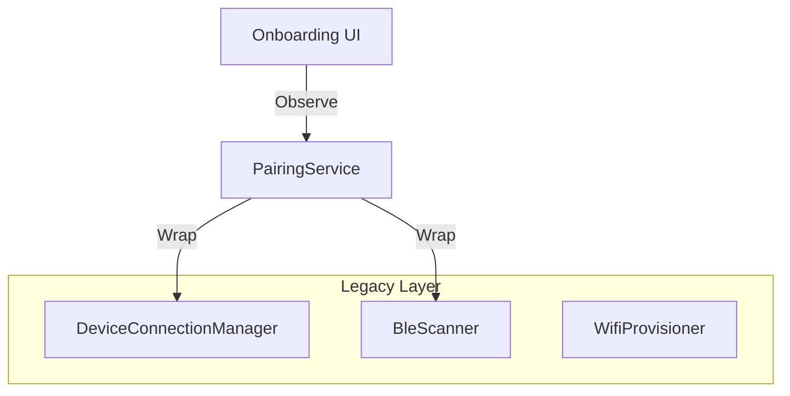

# Device Pairing Spec (Internal)

## Architecture Overview

`RealPairingService` acts as a facade over the complex legacy connectivity stack. It simplifies the 9-stage legacy state machine into a linear 6-stage consumer flow.

---

## Wave Plan

| Wave | Focus | Status | Deliverables |
|------|-------|--------|--------------|
| **1** | Core Service | ✅ SHIPPED | `RealPairingService` implementation wrapping legacy components. Support Scan -> Pair -> Success happy path. |
| **1.5** | Wiring | 🔧 IN PROGRESS | Wire `OnboardingViewModel` to `RealPairingService`. Replace fake service. |
| **2** | Robustness | 🔲 PLANNED | implementations for timeouts, retries, and error mapping from legacy 9-states. |
| **3** | Polish | 🔲 PLANNED | UX refinements, progress granularity, cancellation handling. |

---

## Permission Prerequisites

BLE scanning requires runtime permissions on Android 12+. Permissions are requested **inline at the ScanStep** (not as a separate step) — following Android best practices for permission-at-point-of-use.

| Permission | API Level | Purpose |
|------------|-----------|--------|
| `BLUETOOTH_SCAN` | 31+ | Discover nearby BLE devices |
| `BLUETOOTH_CONNECT` | 31+ | Connect to discovered devices |

**Implementation**: `ScanStep` uses `rememberLauncherForActivityResult(RequestMultiplePermissions())`. If permissions are not granted, the system dialog appears immediately when entering the scan page.

---

## Implementation Details

### Wave 1: Core Service

**Class**: `com.smartsales.prism.data.pairing.RealPairingService`

**Dependencies**:
- `BleScanner` (Legacy)
- `DeviceConnectionManager` (Legacy)
- `WifiProvisioner` (Legacy) or direct via Manager
- `CoroutineScope` (Process-scoped)

**State Mapping Strategy (Legacy → Prism)**

| Legacy State | Prism State | Notes |
|--------------|-------------|-------|
| `Idle`, `Scanning` | `Scanning` | Auto-start scan on logical start |
| `Found` | `DeviceFound` | Wait for user selection |
| `CheckingNetwork` | `Pairing(10%)` | Transient state |
| `WifiInput` | `DeviceFound` | Part of flow after selection |
| `WifiProvisioning` | `Pairing(40%)` | Sending creds |
| `WaitingForDeviceOnline` | `Pairing(70%)` | Polling for IP |
| `Ready` | `Success` | Final state |
| `NeedsSetup` | `Error(NEED_INITIAL_PAIRING)` | No stored session — triggers pairing flow |
| `Error` | `Error` | Map error reason |

**Key Logic**:
- **Scanning**: Call `bleScanner.start()`. Collect `bleScanner.devices`.
- **Pairing**:
  1. Call `connectionManager.selectPeripheral(badge.peripheral)`
  2. Emit `Pairing(10%)`
  3. Call `connectionManager.startPairing(...)`
  4. Emit `Pairing(50%)`
  5. Wait for result.
  6. On Success -> Emit `Success`.

### Wave 2: Error Handling

**Timeout Logic**:
- **Scan Timeout**: 12s. If no devices found -> `Error(SCAN_TIMEOUT)`.
- **Network Check**: Retry 3 times with 1.5s delay. If fail -> `Error(NETWORK_CHECK_FAILED)`.

**Error Mapping**:
- `ConnectivityError.Timeout` -> `ErrorReason.SCAN_TIMEOUT`
- `ConnectivityError.ProvisioningFailed` -> `ErrorReason.WIFI_PROVISIONING_FAILED`
- etc.

---

## Verified Assumptions

- [x] Legacy `DeviceSetupViewModel` exists and works (Reference implementation)
- [x] `DeviceConnectionManager` supports `forceReconnectNow` and `startPairing`
- [x] Onboarding UI skeleton exists (`OnboardingScreen.kt`)

## Risks & Mitigations

- **Risk**: Legacy LiveData/StateFlow mismatch.
  - **Mitigation**: `RealPairingService` will collect legacy flows and emit to its own `MutableStateFlow`.
- **Risk**: State conflation.
  - **Mitigation**: Prism state model is strictly simpler. We drop intermediate legacy states that don't need UI representation.
