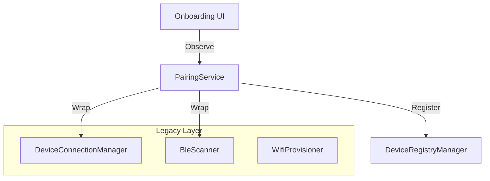

# Device Pairing Spec (Internal)

> **Cerb-compliant spec** — BLE device pairing flow wrapping legacy connectivity stack.
> **State**: PARTIAL

## Architecture Overview

`RealPairingService` acts as a facade over the complex legacy connectivity stack. It simplifies the 9-stage legacy state machine into a linear 6-stage consumer flow.

---

## Wave Plan

| Wave | Focus | Status | Deliverables |
|------|-------|--------|--------------|
| **1** | Core Service | ✅ SHIPPED | `RealPairingService` implementation wrapping legacy components. Support Scan -> Pair -> Success happy path. Post-pairing device registration via `DeviceRegistryManager.registerDevice()` (first device becomes default). |
| **1.5** | Wiring | Shipped | `PairingFlowViewModel` now owns the shared pairing seam used by the host-driven onboarding coordinator. |
| **2** | Robustness | 🔲 PLANNED | implementations for timeouts, retries, and error mapping from legacy 9-states. |
| **3** | Polish | 🔲 PLANNED | UX refinements, progress granularity, cancellation handling. |

---

## Permission Prerequisites

BLE scanning requires runtime permissions on Android 12+. Permissions are requested **inline at the ScanStep** (not as a separate step) — following Android best practices for permission-at-point-of-use.

| Permission | API Level | Purpose |
|------------|-----------|--------|
| `BLUETOOTH_SCAN` | 31+ | Discover nearby BLE devices |
| `BLUETOOTH_CONNECT` | 31+ | Connect to discovered devices |

**Implementation**: the onboarding `PERMISSIONS_PRIMER` explains the requirement first, but `ScanStep` still uses `rememberLauncherForActivityResult(RequestMultiplePermissions())` at point-of-use. If permissions are not granted, the system dialog appears when entering the scan page.

---

## Implementation Details

### Wave 1: Core Service

**Class**: `com.smartsales.prism.data.pairing.RealPairingService`

**Dependencies**:
- `BleScanner` (Legacy)
- `DeviceConnectionManager` (Legacy)
- `WifiProvisioner` (Legacy) or direct via Manager
- `DeviceRegistryManager` (post-pairing registration)
- `CoroutineScope` (Process-scoped)

**State Mapping Strategy (Legacy → Prism)**

| Legacy State | Prism State | Notes |
|--------------|-------------|-------|
| `Idle`, `Scanning` | `Scanning` | Auto-start scan on logical start |
| `Found` | `DeviceFound` | Wait for user selection |
| `CheckingNetwork` | `Pairing(10%)` | Transient state |
| `WifiInput` | `DeviceFound` | Part of flow after selection |
| `WifiProvisioning` | `Pairing(40%)` | Sending creds |
| `WaitingForDeviceOnline` | `Pairing(70%)` | Polling for IP |
| `Ready` | `Success` | Final state |
| `NeedsSetup` | `Error(NEED_INITIAL_PAIRING)` | No stored session — triggers pairing flow |
| `Error` | `Error` | Map error reason |

**Key Logic**:
- **Scanning**: Call `bleScanner.start()`. Collect `bleScanner.devices`.
- **Scan admission**:
  - onboarding pairing only surfaces trusted production badge names from the current CHLE family
  - the accepted scan-name family is `CHLE_Intelligent` plus spacing/case variants such as `CHLE Intelligent`
  - generic UART/NUS service UUID presence alone is not enough to surface a pairable device
  - unrelated BLE devices must be ignored and scanning continues until a trusted badge appears or the scan times out
- **Pairing**:
  1. Resolve the latest matching `BlePeripheral` from the scanner-owned snapshot using the selected `DiscoveredBadge.id`
  2. Call `connectionManager.selectPeripheral(...)`
  3. Emit `Pairing(10%)`
  4. Call `connectionManager.startPairing(...)`
  5. Treat `startPairing(...)` success as credential-dispatch success only
  6. Move into the later network-status phase and poll/query for the badge IP
  7. On network success -> emit `Success`
  8. On network failure/timeout -> emit `Error(NETWORK_CHECK_FAILED)`
- **WiFi Connect Protocol**:
  - send `SD#<ssid>`
  - wait the command gap
  - send `PD#<password>`
  - do not require an immediate BLE provisioning ack before moving to network-status validation
  - firmware stores one last-working Wi‑Fi credential after reconnect/power recovery; the app must still persist its own multi-network credential list and replay an exact phone-SSID match later when reconnect logic proves the badge is offline or on the wrong SSID

### Wave 2: Error Handling

**Timeout Logic**:
- **Scan Timeout**: 12s. If no devices found -> `Error(SCAN_TIMEOUT)`.
- **Network Check**: Retry 3 times with 1.5s delay. If fail -> `Error(NETWORK_CHECK_FAILED)`.

**Error Mapping**:
- `ConnectivityError.Timeout` -> `ErrorReason.SCAN_TIMEOUT`
- `ConnectivityError.ProvisioningFailed` -> `ErrorReason.WIFI_PROVISIONING_FAILED`
- etc.

---

## Verified Assumptions

- [x] Legacy `DeviceSetupViewModel` exists and works (Reference implementation)
- [x] `DeviceConnectionManager` supports `forceReconnectNow` and `startPairing`
- [x] Onboarding UI skeleton exists (`OnboardingScreen.kt`)

## Risks & Mitigations

- **Risk**: Legacy LiveData/StateFlow mismatch.
  - **Mitigation**: `RealPairingService` will collect legacy flows and emit to its own `MutableStateFlow`.
- **Risk**: State conflation.
  - **Mitigation**: Prism state model is strictly simpler. We drop intermediate legacy states that don't need UI representation.
