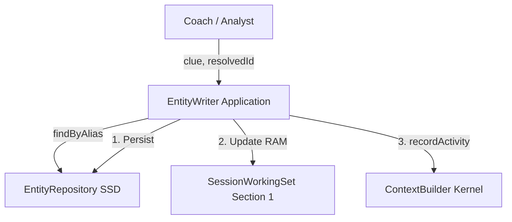

# Entity Writer Spec

> **Cerb-compliant spec** — Internal implementation of centralized entity writes.  
> **OS Layer**: RAM Application
> **State**: Wave 5 IN PROGRESS

---

## Overview

EntityWriter is an **Application** that runs on the SessionWorkingSet (RAM). It is the centralized write path for entity mutations.

**OS Model Role**:
- **Searcher**: Queries full SSD catalog for dedup/resolution (allowed per OS Model boundary rules).
- **Writer**: Mutations write-through — update RAM Section 1 AND persist to SSD.
- **Kernel Invoker**: `updateProfile()` calls `ContextBuilder.recordActivity()` (App → Kernel) to emit history events.
- **Constraint**: Callers must NOT call `EntityRepository.save()` directly. All mutations go through EntityWriter.

Ensures consistent:
1. Alias registration (dedup)
2. Field update policies (append vs replace)
3. Source tracking (provenance)
4. **Change tracking** — profile changes (name, title, company) trigger history events

---

## Related Cerb Specs

| Spec | Responsibility |
|------|----------------|
| [Entity Registry](../entity-registry/spec.md) | **SSD Storage** — The full entity catalog |
| [Session Context](../session-context/spec.md) | **RAM** — Section 1 holds active entity context |
| [Client Profile Hub](../client-profile-hub/spec.md) | **File Explorer** — Reads entity data for dashboards |

---

## OS Layer & Data Flow

### The Transformation

| Old Model (Silo) | New OS Model (RAM Application) |
|------------------|--------------------------------|
| EntityWriter calls `EntityRepository.save()` directly | Mutations write-through: RAM Section 1 + SSD |
| Callers don't know if entity is session-active | Mutations update the active session context |
| `updateProfile()` only persists to SSD | `updateProfile()` updates RAM + SSD + emits Kernel history event |
| New entities invisible until next session | New entities immediately available in current session RAM |

### 1. Search & Dedup (SSD Allowed)

**Why SSD?** Entity dedup requires the **full catalog** — not just session-active entities. The OS Model explicitly allows this (see `os-model-architecture.md` L103: "Full entity search hits SSD").

- `findByAlias()` → SSD (EntityRepository)
- `getById()` for read-modify-write → SSD (EntityRepository)

### 2. Mutations (Write-Through)

**Trigger**: Any `save()` or `delete()` call.
**Action**: Write-Through (Atomic).

1. **Persist to SSD**: Write to `EntityRepository` (Room).
2. **Update RAM**: If entity is in Session Section 1, update the in-memory reference.



> [!NOTE]
> **Scheduler does NOT call EntityWriter.** Scheduler stores raw person names (`keyPerson`) as sticky-note intentions. Entity creation is deferred to Coach/Analyst modes where the agent can seek user clarity ("你说要见王老板，见了吗？他是哪位？"). See [Scheduler spec §Sticky Notes Principle](../scheduler/spec.md).

### 3. App → Kernel Callback

`updateProfile()` detects field changes and calls `ContextBuilder.recordActivity()` — this is an **Application invoking a Kernel service** to emit `UnifiedActivity` history events. The Kernel persists these to Memory Center (SSD).

---

## Architecture

```
Caller (Coach/Analyst)
       │
       ▼
[EntityWriter.upsertFromClue()]
       │
       ├─ 1. Resolve ID (if null)
       │   └─ Resolution Cascade: resolvedId → findByAlias → findByDisplayName
       │
       ├─ 2. Load Existing (read-modify-write)
       │   └─ getById() → merge fields → save()
       │
       ├─ 3. Apply Field Policies
       │   ├─ displayName: Immutable (Canonical)
       │   ├─ aliasesJson: Immutable (Curated only)
       │   ├─ attributesJson: Upsert key
       │   ├─ _sourceJson: Track provenance
       │   └─ _last_seen: Update timestamp
       │
       └─ 4. Persist
           └─ EntityRepository.save()
```

> [!IMPORTANT]
> `EntityRepository.save()` uses `@Insert(onConflict=REPLACE)` — **full row overwrite**.
> EntityWriter MUST do `getById()` first to preserve existing fields before calling `save()`.
> This read-modify-write is the core reason EntityWriter exists.

---

## Prerequisites (Wave 1 Blockers)

Before implementing EntityWriter, add to existing infrastructure:

| Component | Missing | Change |
|-----------|---------|--------|
| `EntityRepository` | `delete()` method | Add `suspend fun delete(entityId: String)` |
| `EntityDao` | `delete(entityId)` query | Add `@Query("DELETE FROM entity_entries WHERE entityId = :entityId")` |
| `RoomEntityRepository` | `delete()` impl | Delegate to `dao.delete(entityId)` |
| `FakeEntityRepository` | `delete()` impl | `entries.remove(entityId)` |

---

## Implementation Details

### 1. Resolution & Dedup Logic (`upsertFromClue`)

**The Resolution Cascade** (Strict Order):

1. **Resolved ID** (High Confidence): If caller provides `resolvedId`, use it.
   - If ID not found (stale), fall back to step 2.
2. **Alias Match** (Curated): `EntityRepository.findByAlias(clue)`.
   - Exact match against pre-installed aliases (e.g., "孙工").
3. **Canonical Name Match** (Homophone Resolution): `EntityRepository.findByDisplayName(clue)`.
   - Exact match against `displayName` (e.g., "孙扬浩").
   - **Purpose**: Resolves ASR homophones (e.g., "孙阳浩") at runtime without polluting data.
4. **Miss**: Create NEW entity with `clue` as `displayName`.

**Action on Hit**:
- Load existing entity.
- Update source tracking (`_last_seen`).
- **DO NOT** overwrite `displayName` or auto-add `clue` to `aliasesJson`.

When `resolvedId` is PROVIDED:

1. **Load**: `getById(resolvedId)`.
2. **If found**: Update source tracking → `save()`.
3. **If NOT found (stale ID)**: Fall back to resolution cascade (treat as null resolvedId).

### 2. Read-Modify-Write Pattern (Critical)

```kotlin
// CORRECT — EntityWriter internals
suspend fun upsertFromClue(...): UpsertResult {
    val existingId = resolvedId ?: findExistingByAlias(clue)
    
    return if (existingId != null) {
        val existing = entityRepository.getById(existingId)
            ?: return createNew(clue, type, source)  // Stale ID fallback
        
        val merged = existing.copy(
            aliasesJson = existing.aliasesJson, // Immutable: Do NOT auto-add clue to aliases
            lastUpdatedAt = now()
            // displayName: Immutable (keep existing)
            // demeanorJson: KEEP existing (not touched by upsert)
            // metricsHistoryJson: KEEP existing (not touched by upsert)
        )
        entityRepository.save(merged)
        UpsertResult(existingId, isNew = false, displayName = existing.displayName)
    } else {
        val newEntry = createNew(clue, type, source)
        newEntry
    }
}
```

### 3. Field Update Policies

| Field | Policy | Implementation | Via |
|-------|--------|----------------|-----|
| `displayName` | **Immutable / Canonical** | `upsertFromClue` NEVER overwrites. Only explicit `updateProfile` changes it. | `upsertFromClue` |
| `aliasesJson` | **Curated Only** | `upsertFromClue` NEVER adds aliases. Only `registerAlias` adds them. | `registerAlias` |
| `demeanorJson` | Upsert per key | `oldMap + newMap` | `updateAttribute` |
| `attributesJson` | Upsert per key | `oldMap + newMap` | `updateAttribute` |
| `metricsHistoryJson` | Append per key | `oldTimeSeries + newEntry` | `updateAttribute` |
| `relatedEntitiesJson` | Append (dedupe) | `(oldList + newId).distinct()` | Future wave |
| `decisionLogJson` | ~~Append-only~~ **Deprecated** | Superseded by `UnifiedActivity` timeline | — |

#### Tracked Profile Fields (Change-Aware)

These fields trigger a `UnifiedActivity` history event when changed:

| Field | ActivityType | Example |
|-------|-------------|----------|
| `displayName` | `NAME_CHANGE` | 索尼娱乐集团 → SONY |
| `jobTitle` | `TITLE_CHANGE` | 销售经理 → 销售VP |
| `accountId` | `COMPANY_CHANGE` | 承时利和 → 华为 |
| `buyingRole` | `ROLE_CHANGE` | champion → economic_buyer |
| `dealStage` | `DEAL_STAGE_CHANGE` | proposal → negotiation |

**Change-Tracking Pattern:**

```kotlin
// Inside EntityWriter.updateProfile()
if (newJobTitle != null && newJobTitle != existing.jobTitle) {
    // 1. Record history BEFORE overwrite
    contextBuilder.recordActivity(
        entityId = entityId,
        type = ActivityType.TITLE_CHANGE,
        summary = "${existing.jobTitle} → $newJobTitle"
    )
    // 2. Update the field
    merged = merged.copy(jobTitle = newJobTitle)
}
```

**Display Format (UI):**
```
SONY (Former 索尼娱乐集团)
孙扬浩 at 华为 (Former 承时利和)
```
Former names are always in `aliasesJson`. UI reads aliases to show history context.

### 4. Source Tracking

Tracked via dedicated `_source` key in `attributesJson` to avoid collision with business attributes:

```json
{
  "budget": "2M",
  "_source": "scheduler",
  "_first_seen": 1709238492000,
  "_last_seen": 1709238492000
}
```

Convention: Keys prefixed with `_` are metadata, not business attributes.
`updateAttribute()` ignores keys starting with `_` from external callers.

---

## Wave Plan

| Wave | Focus | Status | Deliverables |
|------|-------|--------|--------------|
| **0** | Prerequisites (delete infra) | ✅ SHIPPED | `EntityRepository.delete()` + DAO + impls |
| **1** | Core Writer | ✅ SHIPPED | `EntityWriter` interface + `RealEntityWriter` + tests |
| **1.5** | Wiring | ✅ SHIPPED → ⚠️ UNWINDING | Wire into `PrismOrchestrator` Scheduler path (to be removed in Scheduler Wave 10: Sticky Notes Boundary) |
| **2** | Change-Aware Profile Management | ✅ SHIPPED | `updateProfile()`, `ProfileUpdateResult`, `ProfileChange`, history emission via `recordActivity()` |
| ~~3~~ | ~~Conflict Merge~~ | ❌ KILLED | See architectural decision below |
| **4** | **OS Model Upgrade** (RAM Application) | ✅ SHIPPED | Write-through to RAM Section 1 on all 4 mutation methods + `recordActivity()` App→Kernel callback |
| **5** | **Alignment & Disambiguation** | 🚧 IN PROGRESS | Curated Alias Model, Resolution Cascade, Entity Confirmation Flow |

### ~~Wave 3~~ Architectural Decision: No Merge UI Needed

**Killed 2026-02-11.** Deterministic latest-write-wins is sufficient. Rationale:

1. **Every write is grounded** — User input → LLM → RelevancyLib (entity resolution) → EntityWriter. The agent never presumes; `resolvedId` comes from RelevancyLib.
2. **User corrections are self-resolving** — If user said something wrong and it was recorded, they make an explicit correction statement. This is another deterministic override through the same pipeline.
3. **History is preserved** — `recordActivity()` tracks every change (`承时利和 → 华为 → 承时利和`), so corrections are auditable.
4. **True duplicates are a dedup problem** — If two `entityId`s exist for the same person because alias matching failed, the fix is better RelevancyLib matching, not a merge UI.

### Wave 4 Scope (OS Model) — ✅ SHIPPED
- ✅ `upsertFromClue` / `registerAlias` / `updateAttribute` / `delete` write-through to RAM Section 1
- ✅ `updateProfile()` calls `ContextBuilder.recordActivity()` (App → Kernel)
- SSD reads for dedup remain (full catalog search requires SSD, per os-model-architecture.md)

---

## Ship Criteria

### 🔬 Wave 0: Prerequisites
Add `delete()` to EntityRepository infrastructure.

- **Ship Criteria**: `EntityRepository.delete(entityId)` available in Room + Fake
- **Deliverables**: 4 file changes (EntityRepository, EntityDao, RoomEntityRepository, FakeEntityRepository)

### 🔬 Wave 1: Core Writer
Centralized entity creation and updates with read-modify-write.

- **Ship Criteria**:
    - `upsertFromClue` correctly handles both "new" and "existing" cases
    - Existing entity fields preserved during update (read-modify-write verified)
    - `aliasesJson` unchanged by upsert (curated only via `registerAlias`)
    - `EntityRepository.save()` called exactly once per write
    - Zero regressions in existing read paths

- **Test Cases**:
    - [x] **New Entity**: `upsert("张总", null)` → `UpsertResult(isNew=true, displayName="张总")`
    - [x] **Existing (Resolved)**: `upsert("张总", "z-001")` → Updates z-001 alias, `isNew=false`
    - [x] **Existing (Alias Match)**: `upsert("张总", null)` → Finds via alias, updates, `isNew=false`
    - [x] **Field Preservation**: Upsert preserves existing `demeanorJson`, `metricsHistoryJson`
    - [x] **Alias Cap**: Add 9th alias → Oldest alias dropped (FIFO tail), cap at 8
    - [x] **Missing Entity**: `upsert("X", "nonexistent-id")` → Falls back to alias dedup
    - [x] **Blank Clue**: `upsert("", null)` → Throws `IllegalArgumentException`
    - [x] **Delete**: `delete("z-001")` → Entity removed, `getById` returns null
    - [x] **Delete Missing**: `delete("nonexistent")` → No-op

- **Deliverables**:
    - `EntityWriter.kt` (Interface + `ProfileUpdateResult`, `ProfileChange`)
    - `RealEntityWriter.kt` (Implementation — rewritten from spec)
    - `FakeEntityWriter.kt` (Test double)
    - `RealEntityWriterTest.kt` (18 tests — Wave 1 + Wave 2)

---

## Constants & Limits

```kotlin
const val MAX_ALIASES = 8
const val MAX_ATTRIBUTES = 20
```
