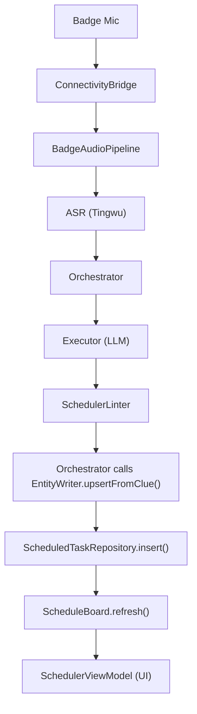

# Interface Map

> **System**: Smart Sales is an AI-powered sales assistant. A BLE badge records conversations, the app transcribes them, creates scheduled tasks, and provides sales coaching — all coordinated through an LLM pipeline.
>
> **Purpose**: Module ownership + data flow. Read this BEFORE any cross-module change.
> **Rule**: If data belongs to Module B, query B's interface at runtime. Don't store B's data on A's model.
> **Last Updated**: 2026-02-10

---

## Layer 1: Infrastructure

Leaf services with no upstream dependencies. They don't call other modules.

| Module | Owns (Writes) | Reads From | Key Interface |
|--------|--------------|------------|---------------|
| **ConnectivityBridge** | BLE + HTTP device state | — | `ConnectivityService` |
| **OSS** | File upload/download | — | `OssUploader.upload()` |
| **ASR** | Transcription results | OSS (downloads audio files to transcribe) | `TingwuRunner.transcribe()` |

---

## Layer 2: Data Services

Store and query domain data. Other modules use their interfaces but never each other's storage.

| Module | Owns (Writes) | Reads From | Key Interface |
|--------|--------------|------------|---------------|
| **EntityWriter** | Entity mutations (create/update/merge aliases) | — | `EntityWriter.upsertFromClue()` |
| **EntityRegistry** | Entity queries (read-only view of entities) | — | `EntityRepository.findByAlias()` |
| **MemoryCenter** | Conversation memory entries | — | `MemoryRepository.search()` |
| **UserHabit** | Behavioral pattern observations | — | `UserHabitRepository.observe()` |
| **SessionContext** | Per-session entity cache (ephemeral) | EntityRegistry (populates cache) | `SessionContext.getCachedEntities()` |

> **EntityWriter vs EntityRegistry**: Writer handles mutations (dedup, merge, alias registration). Registry handles queries. Callers MUST use Writer for writes, Registry for reads. Never call `EntityRepository.save()` directly.

---

## Layer 3: Core Pipeline

Orchestrates LLM-powered processing. Reads from Layer 2 data services.

| Module | Owns (Writes) | Reads From | Key Interface |
|--------|--------------|------------|---------------|
| **ContextBuilder** | `EnhancedContext` (assembled prompt context) | EntityRegistry, MemoryCenter, SessionContext | `ContextBuilder.build()` |
| **Executor** | Raw LLM output (stateless — no storage) | — | `Executor.execute()` |
| **Orchestrator** | Mode routing + pipeline coordination | ContextBuilder, Executor, all Linters, EntityWriter | `Orchestrator.process()` |

> **Orchestrator is the only module that calls EntityWriter during task creation.** Feature modules (Scheduler, Coach) receive results from Orchestrator; they don't call EntityWriter themselves.

---

## Layer 4: Features

User-facing features. Each receives processed results from Orchestrator (Layer 3) and reads from Data Services (Layer 2).

| Module | Owns (Writes) | Reads From (directly) | Receives From (via Orchestrator) |
|--------|--------------|----------------------|----------------------------------|
| **Scheduler** | ScheduledTask, InspirationEntry | EntityRegistry (alias lookup), ScheduleBoard (conflicts) | `UiState.SchedulerTaskCreated` |
| **ScheduleBoard** | Conflict index (in-memory cache) | ScheduledTaskRepository (populates index) | — |
| **Coach** | Chat message responses | MemoryCenter, UserHabit, EntityRegistry | `UiState.Response` |
| **Analyst** | Analysis reports | MemoryCenter, EntityRegistry | `UiState.Response` |
| **BadgeAudioPipeline** | Audio recording lifecycle | ASR, OSS, ConnectivityBridge | Triggers Orchestrator on transcription complete |

> **"Reads From" vs "Receives From"**: "Reads From" = the feature calls the interface directly. "Receives From" = Orchestrator pushes results into the feature's ViewModel. This distinction prevents confusion about who initiates the call.

---

## Layer 5: Intelligence

Cross-cutting services that aggregate data from multiple Layer 2 sources.

| Module | Owns (Writes) | Reads From | Key Interface |
|--------|--------------|------------|---------------|
| **ClientProfileHub** | Aggregated client context for tips | EntityRegistry, MemoryCenter, UserHabit | `ClientProfileHub.getFocusedContext()` |
| **RLModule** | Prompt tuning parameters | UserHabit | `ReinforcementLearner.adjustPrompt()` |

---

## Data Flow: Voice → Task

---

## Ownership Rules

| Rule | Rationale |
|------|-----------|
| **Entity resolution** belongs to EntityRegistry (`findByAlias`). Consumers store display names, not IDs. | IDs can change when entities merge. Display names are the stable key for consumers. |
| **Entity mutations** go through EntityWriter only. Never call `EntityRepository.save()`. | EntityWriter handles dedup, alias registration, and merge policies. Bypassing it creates orphaned entities. |
| **Memory queries** go through MemoryRepository. Never cache memory entries long-term. | Memory entries are hot storage — they can be updated or deleted by any pipeline run. Caching creates stale reads. |
| **Conflict detection** belongs to ScheduleBoard. ViewModel observes results, doesn't compute. | ScheduleBoard maintains a time-indexed cache. Recomputing in ViewModel would miss concurrent inserts. |
| **LLM calls** go through Executor. No module calls Dashscope directly. | Executor handles retry, timeout, and model selection policies. Direct calls bypass rate limiting. |

---

## Anti-Patterns This Map Prevents

| ❌ Wrong | ✅ Right | Why |
|----------|---------|-----|
| Store `entityId` on Task model | Query `EntityRepository.findByAlias()` at use time | EntityRegistry owns resolution; stored IDs go stale on merge |
| Call `EntityRepository.save()` | Call `EntityWriter.upsertFromClue()` | EntityWriter owns dedup/merge/alias logic |
| Import ASR types in Scheduler | Go through Orchestrator | Layer 1 → Layer 4 skip violates dependency direction |
| Cache MemoryEntry on ViewModel | Query MemoryRepository per request | Memory entries are mutable hot storage |
| Feature module calls EntityWriter | Orchestrator calls EntityWriter | Only Layer 3 writes entities; Layer 4 receives results |
