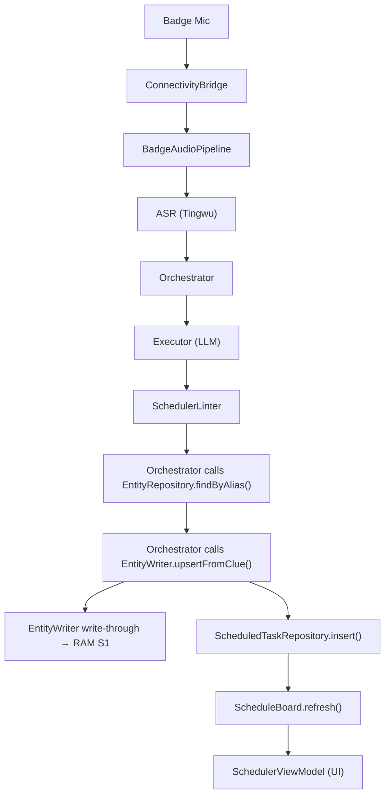

# Interface Map

> **System**: Smart Sales is an AI-powered sales assistant. A BLE badge records conversations, the app transcribes them, creates scheduled tasks, and provides sales coaching — all coordinated through an LLM pipeline.
>
> **Purpose**: Module ownership + data flow. Read this BEFORE any cross-module change.
> **Rule**: If data belongs to Module B, query B's interface at runtime. Don't store B's data on A's model.
> **Last Updated**: 2026-02-10 (OS Model Upgrade sync)
>
> **Status Legend**: ✅ = Shipped (Real impl) · 📐 = Interface only (Fake impl) · 🔲 = Not yet coded

---

## Layer 1: Infrastructure

Leaf services with no upstream dependencies. They don't call other modules.

| Module | Owns (Writes) | Reads From | Key Interface | OS Layer | Status |
|--------|--------------|------------|---------------|----------|--------|
| **[ConnectivityBridge](./connectivity-bridge/spec.md)** | BLE + HTTP device state | — | `ConnectivityService` | — | ✅ |
| **[NotificationService](./notifications/spec.md)** | System notification display | — | `NotificationService.show()` | — | ✅ |
| **[OSS](./oss-service/spec.md)** | File upload/download | — | `OssUploader.upload()` | — | 📐 |
| **[ASR](./asr-service/spec.md)** | Transcription results | OSS (downloads audio files to transcribe) | `TingwuRunner.transcribe()` | — | 📐 |
| **[TingwuPipeline](./tingwu-pipeline/spec.md)** | Transcription & Audio Intelligence | OSS (reads `fileUrl`) | `TingwuPipeline.submit()` | SSD | ✅ |
| **[PipelineTelemetry](./pipeline-telemetry/spec.md)** | Pipeline logs (to Logcat) | — | `PipelineTelemetry.recordEvent()` | RAM | 🔲 |

---

## Layer 2: Data Services

Store and query domain data. Other modules use their interfaces but never each other's storage.

| Module | Owns (Writes) | Reads From | Key Interface | OS Layer | Status |
|--------|--------------|------------|---------------|----------|--------|
| **[EntityWriter](./entity-writer/spec.md)** | Entity mutations (create/update/merge aliases) | SessionContext (write-through to RAM S1) | `EntityWriter.upsertFromClue()` | RAM Application | ✅ |
| **[EntityRegistry](./entity-registry/spec.md)** | Entity queries (read-only view of entities) | — | `EntityRepository.findByAlias()` | SSD | ✅ |
| **[MemoryCenter](./memory-center/spec.md)** | Conversation memory entries | — | `MemoryRepository.search()` | SSD | ✅ |
| **[UserHabit](./user-habit/spec.md)** | Behavioral pattern observations | — | `UserHabitRepository.observe()` | SSD | ✅ |
| **[SessionHistory](./session-history/spec.md)** | Session metadata (list, pin, rename, delete) | — | `HistoryRepository.getGroupedSessions()` | SSD | 🚧 |
| **[SessionContext](./session-context/spec.md)** | Per-session workspace (3 sections) | EntityWriter (S1 via write-through), RLModule (S2/S3) | `SessionContext.entityContext` | Kernel (RAM) | ✅ |

> **EntityWriter vs EntityRegistry**: Writer handles mutations (dedup, merge, alias registration) AND write-through to RAM S1. Registry handles queries. Callers MUST use Writer for writes, Registry for reads. Never call `EntityRepository.save()` directly.
>
> **EntityWriter → SessionContext (write-through)**: After persisting to SSD, EntityWriter calls `RealContextBuilder.updateEntityInSession()` to keep RAM Section 1 in sync. This is an App→Kernel internal edge (concrete injection, not on ContextBuilder interface).

---

## Layer 3: Core Pipeline

Orchestrates LLM-powered processing. Reads from Layer 2 data services.

| Module | Owns (Writes) | Reads From | Key Interface | OS Layer | Status |
|--------|--------------|------------|---------------|----------|--------|
| **ContextBuilder** | `EnhancedContext` (assembled prompt context) | EntityRegistry, MemoryCenter, SessionContext | `ContextBuilder.build()` | Kernel | ✅ |
| **[InputParser](./input-parser/spec.md)** | Semantic intent and EntityID resolution | AliasIndex (internal) | `InputParserService.parseIntent()` | RAM Application | ✅ |
| **[EntityDisambiguator](./entity-disambiguation/spec.md)** | `PendingIntent` interruption state | EntityWriter (to write cures) | `EntityDisambiguationService.process()` | RAM Application | ✅ |
| **[LightningRouter](./lightning-router/spec.md)** | Intent evaluation (Phase 0) | ContextBuilder | `LightningRouter.evaluateIntent()` | RAM Application | ✅ |
| **EntityResolver** | Entity disambiguation matching | EntityRegistry | `EntityResolverService.resolve()` | RAM Application | ✅ |
| **ModelRegistry** | Static LLM Profiles (models, temps, skills) | — | `ModelRegistry` | Config Hub | ✅ |
| **[Executor](./model-routing/spec.md)** | Raw LLM output (stateless — no storage) | ModelRouter | `Executor.execute()` | — | ✅ |
| **[PluginRegistry](./plugin-registry/spec.md)** | Executable pure-Kotlin workflows (Tools) | — | `ToolRegistry.executeTool()` | App Infra | ✅ |
| **[PrismOrchestrator](./prism-orchestrator/spec.md)** | Top-level routing + pipeline coordination | LightningRouter, MascotService, ContextBuilder, Executor, EntityResolver, PluginRegistry | `PrismOrchestrator.processInput()` | RAM Application | ✅ |

> **PrismOrchestrator is the only module that calls EntityWriter during task creation.** Feature modules (Scheduler, Mascot) receive results from Orchestrator; they don't call EntityWriter themselves. (Exception: debug seed code in SchedulerViewModel, guarded by `DEBUG` build type.)
>
> **ContextBuilder reads EntityRegistry for Entity Knowledge Context.** `ContextBuilder.buildEntityKnowledge()` calls `EntityRepository.getAll()` at session start to load the structured entity graph into the LLM prompt (RAM Section 1). This is a Kernel → SSD read.

---

## Layer 4: Features

User-facing features. Each receives processed results from Orchestrator (Layer 3) and reads from Data Services (Layer 2).

| Module | Owns (Writes) | Reads From (directly) | Receives From (via Orchestrator) | OS Layer | Status |
|--------|--------------|----------------------|----------------------------------|----------|--------|
| **[Mascot (System I)](./mascot-service/spec.md)** | Ephemeral interactions, greetings | EventBus (Idle, Error) | `MascotState` | RAM App (Out-of-band) | ✅ |
| **[Scheduler](./scheduler/spec.md)** | ScheduledTask, InspirationEntry | EntityRegistry (alias lookup), ScheduleBoard (conflicts) | `UiState.SchedulerTaskCreated` | Consumer of RAM | ✅ |
| **[ScheduleBoard](./scheduler/spec.md)** | Conflict index (in-memory cache) | ScheduledTaskRepository (populates index) | — | SSD | ✅ |
| **[Prism Orchestrator](./prism-orchestrator/spec.md)** | Chat State Machine (System II delegator) | ContextBuilder, ClientProfileHub | `PrismState` | RAM Application | ✅ |
| **[BadgeAudioPipeline](./badge-audio-pipeline/spec.md)** | Audio recording lifecycle | ASR, OSS, ConnectivityBridge | Triggers Orchestrator on transcription complete | — | ✅ |
| **[AudioManagement](./audio-management/spec.md)** | Manual sync/transcribe states | ConnectivityBridge, TingwuPipeline | `AudioRepository` | App | 🚧 |
| **[ConflictResolver](./conflict-resolver/spec.md)** | Conflict resolution actions | ScheduleBoard | `ConflictResolver` | RAM App | ✅ |
| **[DevicePairing](./device-pairing/spec.md)** | BLE pairing session states | Legacy BLE stack | `PairingService` | App | ✅ |

> **"Reads From" vs "Receives From"**: "Reads From" = the feature calls the interface directly. "Receives From" = Orchestrator pushes results into the feature's ViewModel. This distinction prevents confusion about who initiates the call.

---

## Delivery Workflow Registry (The TaskBoard Vault)

The backend maintains a list of pure-Kotlin actionable workflows (The "Hands"). The LLM never executes these—it only recommends them by returning their `workflowId`.

Current recognized Vault IDs:
- `GENERATE_PDF`
- `EXPORT_CSV`
- `DRAFT_EMAIL`
- `TALK_SIMULATOR` (Plugin Workflow)
- `ANALYZER_META` (Ambient Meta-Analysis Tool)

---

## Layer 5: Intelligence

Cross-cutting services that aggregate data from multiple Layer 2 sources.

| Module | Owns (Writes) | Reads From | Key Interface | OS Layer | Status |
|--------|--------------|------------|---------------|----------|--------|
| **[ClientProfileHub](./client-profile-hub/spec.md)** | Aggregated client context for tips | EntityRegistry, MemoryCenter, UserHabit | `ClientProfileHub.getFocusedContext()` | File Explorer | 📐 |
| **[RLModule](./rl-module/spec.md)** | Habit context for prompts (S2/S3 population) | UserHabit | `ReinforcementLearner.loadUserHabits()`, `loadClientHabits()` | RAM Application | ✅ |

---

## Data Flow: Voice → Task

---

## Ownership Rules

| Rule | Rationale |
|------|-----------|
| **Entity resolution** belongs to EntityRegistry (`findByAlias`). Consumers store display names, not IDs. | IDs can change when entities merge. Display names are the stable key for consumers. |
| **Entity mutations** go through EntityWriter only. Never call `EntityRepository.save()`. | EntityWriter handles dedup, alias registration, and merge policies. Bypassing it creates orphaned entities. |
| **Memory queries** go through MemoryRepository. Never cache memory entries long-term. | Memory entries are hot storage — they can be updated or deleted by any pipeline run. Caching creates stale reads. |
| **Conflict detection** belongs to ScheduleBoard. ViewModel observes results, doesn't compute. | ScheduleBoard maintains a time-indexed cache. Recomputing in ViewModel would miss concurrent inserts. |
| **LLM calls** go through Executor. No module calls Dashscope directly. | Executor handles retry, timeout, and model selection policies. Direct calls bypass rate limiting. |

---

## Anti-Patterns This Map Prevents

| ❌ Wrong | ✅ Right | Why |
|----------|---------|-----|
| Store `entityId` on Task model | Query `EntityRepository.findByAlias()` at use time | EntityRegistry owns resolution; stored IDs go stale on merge |
| Call `EntityRepository.save()` | Call `EntityWriter.upsertFromClue()` | EntityWriter owns dedup/merge/alias logic |
| Import ASR types in Scheduler | Go through Orchestrator | Layer 1 → Layer 4 skip violates dependency direction |
| Cache MemoryEntry on ViewModel | Query MemoryRepository per request | Memory entries are mutable hot storage |
| Feature module calls EntityWriter (production) | Orchestrator calls EntityWriter | Only Layer 3 writes entities; Layer 4 receives results |
| Bypass ContextBuilder for RAM writes | EntityWriter calls `RealContextBuilder.updateEntityInSession()` | Write-through keeps SSD and RAM in sync automatically |

