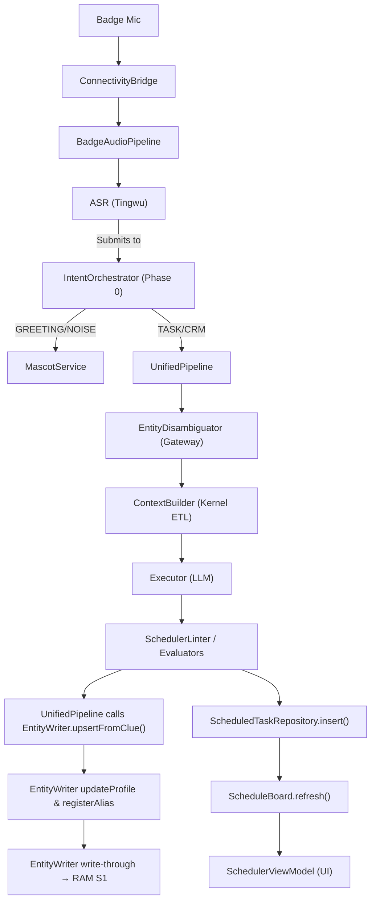

# Interface Map

> **System**: Smart Sales is an AI-powered sales assistant. A BLE badge records conversations, the app transcribes them, creates scheduled tasks, and provides proactive insights — all coordinated through an LLM pipeline.
>
> **Purpose**: Module ownership + data flow. Read this BEFORE any cross-module change.
> **Rule**: If data belongs to Module B, query B's interface at runtime. Don't store B's data on A's model.
> **Last Updated**: 2026-02-10 (OS Model Upgrade sync)
>
> **Status Legend**: ✅ = Shipped (Real impl) · 📐 = Interface only (Fake impl) · 🔲 = Not yet coded

---

## Layer 1: Infrastructure

Leaf services with no upstream dependencies. They don't call other modules.
**Architectural Rule**: Layer 1 modules are fully self-contained Android libraries. They define their own interfaces and domain models within their respective modules (e.g., `data/oss/`). They do **NOT** place definitions in the central `app-core/domain/` layer.

| Module | Track | Owns (Writes) | Reads From | Key Interface | OS Layer | Status |
|--------|-------|--------------|------------|---------------|----------|--------|
| **[ConnectivityBridge](./connectivity-bridge/spec.md)** | Hardware & Audio | BLE + HTTP device state | — | `connectionState: StateFlow`, `isReady()` | — | ✅ |
| **[NotificationService](./notifications/spec.md)** | System I & Ambient | System notification display | — | `show(id, title, body, channel...) -> Unit` | — | ✅ |
| **[OSS](./oss-service/spec.md)** | Hardware & Audio | File upload/download | — | `upload(File, objectKey) -> OssUploadResult` | — | ✅ |
| **[ASR](./asr-service/spec.md)** | Hardware & Audio | Transcription results | OSS (downloads audio files to transcribe) | `transcribe(File) -> AsrResult` | — | ✅ |
| **[TingwuPipeline](./tingwu-pipeline/spec.md)** | Hardware & Audio | Transcription & Audio Intelligence | OSS (reads `fileUrl`) | `submit(TingwuRequest) -> Result<String>` | OS: SSD | ✅ |
| **[PipelineTelemetry](./pipeline-telemetry/spec.md)** | System II & Routing | Pipeline logs (to Logcat) | — | `recordEvent(PipelinePhase, String) -> Unit` | OS: RAM | ✅ |
| **[TestInfrastructure](./test-infrastructure/spec.md)** | Testing | Standardized State-Backed Fakes | All Domain Interfaces | `PrismTestRig.setup()` | — | 📐 |

---

## Layer 2: Data Services

Store and query domain data. Other modules use their interfaces but never each other's storage.
**Architectural Rule**: The domain contracts for these services are physically extracted into isolated Gradle library modules (`:domain:crm`, `:domain:memory`, `:domain:habit`, `:domain:session`). The Gradle graph strictly enforces that LTM/SSD modules (`crm`, `memory`, `habit`) do **NOT** depend on STM/RAM (`session`). Additionally, their physical Room storage implementations are isolated into `:data:*` feature modules backed by a strictly decoupled `:core:database` persistence engine.

| Module | Track | Owns (Writes) | Reads From | Key Interface | OS Layer | Status |
|--------|-------|--------------|------------|---------------|----------|--------|
| **[CoreContracts](./core-contracts/spec.md)** | Foundation | Strict JSON-to-Kotlin Models (`UnifiedMutation`) | — | `UnifiedMutation` (The "One Currency" contract driving Prompt Schema & Linter Deserialization) | OS: App | ✅ |
| **[EntityWriter](./entity-writer/spec.md)** (LTM) | Entity Resolution | Entity mutations (create/update/merge aliases) | SessionContext (write-through to RAM S1) | `upsertFromClue(String, ...) -> UpsertResult` | OS: App | ✅ |
| **[EntityRegistry](./entity-registry/spec.md)** (LTM) | Entity Resolution | Entity queries (read-only view of entities) | — | `findByAlias(String) -> List<EntityEntry>` | OS: SSD | ✅ |
| **[MemoryCenter](./memory-center/spec.md)** (LTM) | Memory & OS | Conversation memory entries | — | `search(String) -> List<MemoryEntry>` | OS: SSD | ✅ |
| **[UserHabit](./user-habit/spec.md)** (RL) | Memory & OS | Behavioral pattern observations | — | `observe(key, value, source...) -> Unit` | OS: SSD | ✅ |
| **[SessionHistory](./session-history/spec.md)** (STM) | Memory & OS | Session navigation metadata (list, pin, rename) | — | `getGroupedSessionsFlow() -> Flow<Map>` | OS: SSD | ✅ |
| **[SessionContext](./session-context/spec.md)** (STM) | Memory & OS | Per-session workspace (3 sections) | EntityWriter (S1 via write-through), RLModule (S2/S3) | *(Merged into ContextBuilder)* | OS: Kernel | ✅ |

> **EntityWriter vs EntityRegistry**: Writer handles mutations (dedup, merge, alias registration) AND write-through to RAM S1. Registry handles queries. Callers MUST use Writer for writes, Registry for reads. Never call `EntityRepository.save()` directly.
>
> **EntityWriter → SessionContext (write-through)**: After persisting to SSD, EntityWriter calls `RealContextBuilder.updateEntityInSession()` to keep RAM Section 1 in sync. This is an App→Kernel internal edge (concrete injection, not on ContextBuilder interface).

---

## Layer 3: Core Pipeline

Orchestrates LLM-powered processing. Reads from Layer 2 data services.

| Module | Track | Owns (Writes) | Reads From | Key Interface | OS Layer | Status |
|--------|-------|--------------|------------|---------------|----------|--------|
| **ContextBuilder** | System II & Routing | `EnhancedContext` (assembled prompt context) | EntityRegistry, MemoryCenter, ScheduledTaskRepository, HistoryRepository | `build(String, Mode, ...) -> EnhancedContext` | OS: Kernel | ✅ |
| **[InputParser](./input-parser/spec.md)** | System II & Routing | Semantic intent and EntityID resolution | AliasIndex (internal) | `parseIntent(String) -> ParseResult` | OS: App | ✅ |
| **[EntityDisambiguator](./entity-disambiguation/spec.md)** | Entity Resolution | `PendingIntent` interruption state | InputParser | `process(String) -> DisambiguationResult` | OS: App | ✅ |
| **[LightningRouter](./lightning-router/spec.md)** | System II & Routing | Intent evaluation (Phase 0) | ContextBuilder | `evaluateIntent(EnhancedContext) -> RouterResult?` | OS: App | ✅ |
| **EntityResolverService** | Entity Resolution | Entity disambiguation matching | EntityRegistry | `resolve(String, List<EntityEntry>) -> EntityEntry?` | OS: App | ✅ |
| **ModelRegistry** | System II & Routing | Static LLM Profiles (models, temps, skills) | — | `ModelRegistry` | OS: App | ✅ |
| **[Executor](./model-routing/spec.md)** | System II & Routing | Raw LLM output (stateless — no storage) | ModelRouter | `execute(LlmProfile, EnhancedContext) -> ExecutorResult` | — | ✅ |
| **[PluginRegistry](./plugin-registry/spec.md)** | System II & Routing | Executable pure-Kotlin workflows (Tools) | — | `executeTool(ToolId, PluginRequest) -> Flow<UiState>` | OS: App | ✅ |
| **[UnifiedPipeline](./unified-pipeline/spec.md)** | System II & Routing | System II context ETL & execution | ContextBuilder, InputParser, EntityDisambiguator | `processInput(PipelineInput) -> Flow<PipelineResult>` | OS: App | ✅ |
| **IntentOrchestrator** | System II & Routing | High-level intent routing (Phase 0) | AgentViewModel, LightningRouter, UnifiedPipeline | `processInput(String) -> Flow<UiState>` | OS: App | 🚧 |

> **UnifiedPipeline is the only module that calls EntityWriter during task creation.** Feature modules (Scheduler, Mascot) receive results from UnifiedPipeline; they don't call EntityWriter themselves. (Exception: debug seed code in SchedulerViewModel, guarded by `DEBUG` build type.)
>
> **ContextBuilder reads EntityRegistry for Entity Knowledge Context.** `ContextBuilder.buildEntityKnowledge()` calls `EntityRepository.getAll()` at session start to load the structured entity graph into the LLM prompt (RAM Section 1). This is a Kernel → SSD read.

---

## Layer 4: Features

User-facing features. Each receives processed results from Orchestrator (Layer 3) and reads from Data Services (Layer 2).

| Module | Track | Owns (Writes) | Reads From (directly) | Receives From (via Orchestrator) | OS Layer | Status |
|--------|-------|--------------|----------------------|----------------------------------|----------|--------|
| **[Mascot (System I)](./mascot-service/spec.md)** | System I & Ambient | Ephemeral interactions, greetings | EventBus (Idle, Error) | `StateFlow<MascotState>` | OS: App | ✅ |
| **[Scheduler](./scheduler/spec.md)** | Intelligent Scheduler | ScheduledTask, InspirationEntry | EntityRegistry (alias lookup), ScheduleBoard (conflicts) | *VM Internal Pipeline Mapping* | OS: App | ✅ |
| **[ScheduleBoard](./scheduler/spec.md)** | Intelligent Scheduler | Conflict index (in-memory cache) | ScheduledTaskRepository (populates index) | — | OS: SSD | ✅ |
| **[BadgeAudioPipeline](./badge-audio-pipeline/spec.md)** | Hardware & Audio | Audio recording lifecycle | ASR, OSS, ConnectivityBridge | Triggers UnifiedPipeline on transcription complete | — | ✅ |
| **[AudioManagement](./audio-management/spec.md)** | Hardware & Audio | Manual sync/transcribe states | ConnectivityBridge, TingwuPipeline | *Observes DB State* | OS: App | 🚧 |
| **[ConflictResolver](./conflict-resolver/spec.md)** | Intelligent Scheduler | Conflict resolution actions | ScheduleBoard | `resolve(...) -> ConflictResolution` | OS: App | ✅ |
| **[AgentIntelligenceUI](../cerb-ui/agent-intelligence/spec.md)** | System II & Routing | Wait-state UI components | — | `StateFlow<UiState>` | OS: App | 📐 |
| **[DevicePairing](./device-pairing/spec.md)** | Hardware & Audio | BLE pairing session states | Legacy BLE stack | `StateFlow<PairingState>` | OS: App | ✅ |

> **"Reads From" vs "Receives From"**: "Reads From" = the feature calls the interface directly. "Receives From" = UnifiedPipeline pushes results into the feature's ViewModel. This distinction prevents confusion about who initiates the call.

---

## Delivery Workflow Registry (The TaskBoard Vault)

The backend maintains a list of pure-Kotlin actionable workflows (The "Hands"). The LLM never executes these—it only recommends them by returning their `workflowId`.

Current recognized Vault IDs:
- `GENERATE_PDF`
- `EXPORT_CSV`
- `DRAFT_EMAIL`
- `TALK_SIMULATOR` (Plugin Workflow)

---

## Layer 5: Intelligence

Cross-cutting services that aggregate data from multiple Layer 2 sources.

| Module | Track | Owns (Writes) | Reads From | Key Interface | OS Layer | Status |
|--------|-------|--------------|------------|---------------|----------|--------|
| **[ClientProfileHub](./client-profile-hub/spec.md)** | Memory & OS | Aggregated client context for tips | EntityRegistry, MemoryCenter, UserHabit | `getFocusedContext(String) -> FocusedContext` | OS: App | 📐 |
| **[RLModule](./rl-module/spec.md)** | Memory & OS | Habit context for prompts (S2/S3 population) | UserHabit | `loadUserHabits() -> HabitContext` | OS: App | ✅ |

---

## Data Flow: Voice → Task

---

## Ownership Rules

| Rule | Rationale |
|------|-----------|
| **Entity resolution** belongs to EntityRegistry (`findByAlias`). Consumers store display names, not IDs. | IDs can change when entities merge. Display names are the stable key for consumers. |
| **Entity mutations** go through EntityWriter only. Never call `EntityRepository.save()`. | EntityWriter handles dedup, alias registration, and merge policies. Bypassing it creates orphaned entities. |
| **Memory queries** go through MemoryRepository. Never cache memory entries long-term. | Memory entries are hot storage — they can be updated or deleted by any pipeline run. Caching creates stale reads. |
| **Conflict detection** belongs to ScheduleBoard. ViewModel observes results, doesn't compute. | ScheduleBoard maintains a time-indexed cache. Recomputing in ViewModel would miss concurrent inserts. |
| **LLM calls** go through Executor. No module calls Dashscope directly. | Executor handles retry, timeout, and model selection policies. Direct calls bypass rate limiting. |
| **STM vs LTM constraint** | LTM (Memory/CRM) must not depend on STM (Session). STM is ephemeral and session-scoped. LTM is persistent and cross-session. Inverse dependency creates memory leaks and architectural breaks. |

---

## Anti-Patterns This Map Prevents

| ❌ Wrong | ✅ Right | Why |
|----------|---------|-----|
| Store `entityId` on Task model | Query `EntityRepository.findByAlias()` at use time | EntityRegistry owns resolution; stored IDs go stale on merge |
| Call `EntityRepository.save()` | Call `EntityWriter.upsertFromClue()` | EntityWriter owns dedup/merge/alias logic |
| Import ASR types in Scheduler | Go through Orchestrator | Layer 1 → Layer 4 skip violates dependency direction |
| Cache MemoryEntry on ViewModel | Query MemoryRepository per request | Memory entries are mutable hot storage |
| Feature module calls EntityWriter (production) | UnifiedPipeline calls EntityWriter | Only Layer 3 writes entities; Layer 4 receives results |
| Bypass ContextBuilder for RAM writes | EntityWriter calls `RealContextBuilder.updateEntityInSession()` | Write-through keeps SSD and RAM in sync automatically |

