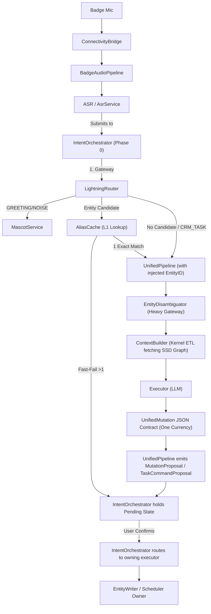

# Interface Map

> **System**: Smart Sales is an AI-powered sales assistant. A BLE badge records conversations, the app transcribes them, creates scheduled tasks, and provides proactive insights — all coordinated through an LLM pipeline.
>
> **Purpose**: Module ownership + data flow. Read this BEFORE any cross-module change.
> **Rule**: If data belongs to Module B, query B's interface at runtime. Don't store B's data on A's model.
> **Last Updated**: 2026-04-29 (Audio Pipeline BAKE contract is now the implementation record; scoped audio Cerb docs remain supporting/reference docs beneath it)
>
> **Status Legend**: ✅ = Shipped (Real impl) · 📐 = Interface only (Fake impl) · 🔲 = Not yet coded
> **Platform Ownership Legend**: `shared` = same product contract across platforms · `android-only` = owned by the current Android lineage · `harmony-only` = owned by the future native Harmony root · `platform-adapter` = shared product contract, platform-specific delivery layer · `legacy-android-on-harmony` = Android app compatibility behavior on Huawei/Honor/Harmony devices

---

## Cross-Platform Ownership Overlay (2026-04-04)

This overlay classifies the current repo's cross-platform-sensitive surfaces without duplicating the full module tables below.

| Surface | Platform Ownership | Current Repo Path / Owner | Rule |
|--------|--------------------|---------------------------|------|
| Shared product flows and Cerb contracts | `shared` | `docs/core-flow/**`, `docs/cerb/**`, `docs/cerb-ui/**`, `docs/specs/**` | Shared product truth stays single-source unless user-visible behavior diverges heavily enough to require a platform companion spec. |
| Pure domain contracts and platform-neutral scheduler semantics | `shared` | `domain/**`, approved platform-neutral portions of `core/**` | Sharing is allowed only while the code stays runtime-neutral and does not absorb OS delivery assumptions. |
| Reminder / notification delivery mechanics | `platform-adapter` | shared truth in `docs/cerb/notifications/spec.md`; overlays in `docs/platforms/android/**` and `docs/platforms/harmony/**` | Shared reminder semantics stay single-source; permissions, lifecycle, FSI, OEM branches, and native reminder APIs are platform-owned. |
| `ConnectivityBridge`, `BadgeAudioPipeline`, `DevicePairing` | `android-only` | current Android lineage | Current hardware path is Android-owned and must not be treated as the default native Harmony implementation. |
| Transient Harmony Tingwu container | `harmony-only` | `platforms/harmony/tingwu-container/**`, `docs/platforms/harmony/tingwu-container.md` | This transient app may consume shared Tingwu/audio contracts, but it must stay local-audio-only and must hide scheduler, reminder, chat, onboarding handoff, and badge-hardware capability instead of redefining shared truth. The Harmony root now owns its ArkTS config seam, hvigor-generated Harmony local config artifact, document-picker ingress, Harmony namespaced file store, Harmony HTTP/OSS client, Tingwu polling client, and container UI. |
| `OnboardingInteraction` delivery mechanics | `platform-adapter` | shared flow/spec plus platform overlays | User journey and scheduler intent stay shared; permission, lifecycle, hardware, and OS-entry details are platform-owned. |
| Android app on Huawei/Honor/Harmony devices | `legacy-android-on-harmony` | `docs/reference/harmonyos-platform-guide.md`, Android overlays, Android code lineage | This path remains the Android app running on Harmony-family devices. It is not the native Harmony product owner, and it should reuse the canonical Android app artifact rather than fork a second Android package by default. |
| Broader future native Harmony implementation root | `harmony-only` | reserved future platform root beyond the transient Tingwu container | Native Harmony code must not land under `app/**`, `app-core/**`, `core/**`, `data/**`, or `domain/**`. |

### Cross-platform split rule

- shared docs answer what the product does
- platform overlays answer how Android or Harmony delivers it
- native Harmony artifacts are forbidden in the current Android tree

### BAKE implementation contract overlay (2026-04-29)

- `docs/bake-contracts/connectivity-badge-session.md` is the verified BAKE
  implementation contract for the ConnectivityBridge plus badge-session corridor.
- `docs/core-flow/badge-connectivity-lifecycle.md` and
  `docs/core-flow/badge-session-lifecycle.md` remain the behavioral north-star
  docs above the BAKE contract.
- `docs/cerb/connectivity-bridge/spec.md` and
  `docs/cerb/connectivity-bridge/interface.md` remain supporting/reference docs
  beneath the BAKE contract until a later archival sprint moves historical Cerb
  material.
- `docs/bake-contracts/scheduler-path-a.md` is the verified BAKE
  implementation contract for Scheduler Path A.
- `docs/core-flow/scheduler-fast-track-flow.md` and
  `docs/core-flow/sim-scheduler-path-a-flow.md` remain the behavioral
  north-star docs above the Scheduler Path A BAKE contract.
- `docs/cerb/scheduler-path-a-spine/spec.md`,
  `docs/cerb/scheduler-path-a-spine/interface.md`, and the
  `docs/cerb/scheduler-path-a-uni-*` docs remain supporting/reference docs
  beneath the Scheduler Path A BAKE contract until a later archival sprint moves
  historical Cerb material.
- `docs/bake-contracts/shell-routing.md` is the verified BAKE implementation
  contract for Shell Routing.
- `docs/core-flow/sim-shell-routing-flow.md` and
  `docs/core-flow/base-runtime-ux-surface-governance-flow.md` remain the
  behavioral north-star docs above the Shell Routing BAKE contract.
- `docs/cerb-ui/home-shell/spec.md`,
  `docs/cerb-ui/dynamic-island/spec.md`,
  `docs/cerb/sim-shell/spec.md`, and
  `docs/cerb/sim-shell/interface.md` remain supporting/reference docs beneath
  the Shell Routing BAKE contract until a later archival sprint moves
  historical Cerb material.
- `docs/bake-contracts/audio-pipeline.md` is the verified BAKE implementation
  contract for the audio-pipeline corridor.
- `docs/core-flow/sim-audio-artifact-chat-flow.md` remains the behavioral
  north-star doc above the Audio Pipeline BAKE contract.
- `docs/cerb/audio-management/spec.md`,
  `docs/cerb/audio-management/interface.md`,
  `docs/cerb/tingwu-pipeline/spec.md`,
  `docs/cerb/tingwu-pipeline/interface.md`,
  `docs/cerb/badge-audio-pipeline/spec.md`,
  `docs/cerb/badge-audio-pipeline/interface.md`, and
  `docs/cerb/pipeline-telemetry/spec.md` remain supporting/reference docs
  beneath the Audio Pipeline BAKE contract until a later archival sprint moves
  historical Cerb material.

---

## Layer 1: Infrastructure

Leaf services with no upstream dependencies. They don't call other modules.
**Architectural Rule**: Layer 1 modules are fully self-contained Android libraries. They define their own interfaces and domain models within their respective modules (e.g., `data/oss/`). They do **NOT** place definitions in the central `app-core/domain/` layer.

| Module | Track | Owns (Writes) | Reads From | Key Interface | OS Layer | Status |
|--------|-------|--------------|------------|---------------|----------|--------|
| **[ConnectivityBridge](./connectivity-bridge/spec.md)** | Hardware & Audio | BLE + HTTP device state, manager-only BLE/Wi‑Fi diagnostic state; BAKE implementation record: [`connectivity-badge-session`](../bake-contracts/connectivity-badge-session.md) | — | `connectionState: StateFlow`, `managerStatus: StateFlow`, `isReady()`, notification and repair streams | — | ✅ |
| **[NotificationService](./notifications/spec.md)** | System I & Ambient | System notification display | — | `show(id, title, body, channel...) -> Unit` | — | ✅ |
| **[OSS](./oss-service/spec.md)** | Hardware & Audio | File upload/download | — | `upload(File, objectKey) -> OssUploadResult` | — | ✅ |
| **[ASR](./asr-service/spec.md)** | Hardware & Audio | Transcription results | OSS (downloads audio files to transcribe) | `transcribe(File) -> AsrResult` | — | ✅ |
| **[TingwuPipeline](./tingwu-pipeline/spec.md)** | Hardware & Audio | Transcription & Audio Intelligence; audio-pipeline BAKE implementation record: [`audio-pipeline`](../bake-contracts/audio-pipeline.md) | OSS (reads `fileUrl`) | `submit(TingwuRequest) -> Result<String>` | OS: SSD | ✅ |
| **[PipelineTelemetry](./pipeline-telemetry/spec.md)** | System II & Routing | Pipeline logs (to Logcat); audio canonical-valve target remains supporting reference under [`audio-pipeline`](../bake-contracts/audio-pipeline.md) | — | `recordEvent(PipelinePhase, String) -> Unit` | OS: RAM | ✅ |
| **[TestFakesDomain](./test-infrastructure/spec.md)** | Testing | Pure JVM Domain Fakes | All Pure Domain Interfaces | `FakeMemoryRepository`, `FakeEntityRepository` | OS: JVM | ✅ |
| **[TestFakesPlatform](./test-infrastructure/spec.md)** | Testing | Android/Platform State | test-fakes-domain, App-Core | `FakeExecutor`, `FakeContextBuilder`, `FakeToolRegistry` | OS: Android | ✅ |

---

## Layer 2: Data Services

Store and query domain data. Other modules use their interfaces but never each other's storage.
**Architectural Rule**: The domain contracts for these services are physically extracted into isolated Gradle library modules (`:domain:crm`, `:domain:memory`, `:domain:habit`, `:domain:session`). The Gradle graph strictly enforces that LTM/SSD modules (`crm`, `memory`, `habit`) do **NOT** depend on STM/RAM (`session`). Additionally, their physical Room storage implementations are isolated into `:data:*` feature modules backed by a strictly decoupled `:core:database` persistence engine.

| Module | Track | Owns (Writes) | Reads From | Key Interface | OS Layer | Status |
|--------|-------|--------------|------------|---------------|----------|--------|
| **[CoreContracts](./core-contracts/spec.md)** | Foundation | Strict JSON-to-Kotlin Models (`UnifiedMutation`) | — | `UnifiedMutation` (The "One Currency" contract driving Prompt Schema & Linter Deserialization) | OS: App | ✅ |
| **[EntityWriter](./entity-writer/spec.md)** (LTM) | Entity Resolution | Entity mutations (create/update/merge aliases) | SessionContext (write-through to RAM S1) | `upsertFromClue(String, ...) -> UpsertResult` | OS: App | ✅ |
| **[EntityRegistry](./entity-registry/spec.md)** (LTM) | Entity Resolution | Entity queries (read-only view of entities) | — | `findByAlias(String) -> List<EntityEntry>` | OS: SSD | ✅ |
| **[MemoryCenter](./memory-center/spec.md)** (LTM) | Memory & OS | Conversation memory entries | — | `suspend search(String) -> List<MemoryEntry>` | OS: SSD | ✅ |
| **[UserHabit](./user-habit/spec.md)** (RL) | Memory & OS | Behavioral pattern observations | — | `RlPayload` (Secondary Currency for HabitListener) | OS: SSD | ✅ |
| **[SessionHistory](./session-history/spec.md)** (STM) | Memory & OS | Session navigation metadata (list, pin, rename) | — | `getGroupedSessionsFlow() -> Flow<Map>` | OS: SSD | ✅ |
| **[SessionContext](./session-context/spec.md)** (STM) | Memory & OS | Per-session workspace (3 sections), sticky notes, scheduler pattern signal transport | EntityWriter (S1 via write-through), RLModule (S2/S3) | *(Merged into ContextBuilder)* | OS: Kernel | ✅ |
| **AliasCache** (L1 Cache) | Entity Resolution | Fast-lookup mapping for EntityCandidates | EntityRegistry (Hydration) | `suspend match(List<String>) -> CacheResult` | OS: RAM | ✅ |
| **[Mutation Module](./scheduler-domain/spec.md)** | Intelligent Scheduler | Atomic Operations, Lexical Conflict Checks, Delete->Insert Reschedule | ScheduleBoard | `suspend rescheduleTask(...)`, `insertTask(...)` | OS: RAM | ✅ |
| **[SchedulerDomain](./scheduler-domain/spec.md)** (LTM) | Intelligent Scheduler | ScheduledTask, InspirationEntry | — | `ScheduledTaskRepository` | OS: SSD | ✅ |
| **DeviceRegistry** | Hardware & Audio | Registered device list (MAC, name, default flag, timestamps) | — | `DeviceRegistry` (`loadAll`, `register`, `rename`, `setDefault`, `remove`) | OS: SSD | ✅ |

> **EntityWriter vs EntityRegistry**: Writer handles mutations (dedup, merge, alias registration) AND write-through to RAM S1. Registry handles queries. Callers MUST use Writer for writes, Registry for reads. Never call `EntityRepository.save()` directly.
>
> **EntityWriter → SessionContext (CQRS write-through)**: EntityWriter synchronously updates RAM Section 1 via `RealContextBuilder.updateEntityInSession()` to keep memory instantly consistent. It defers SSD persistence to an asynchronous `AppScope`. Callers experience zero SSD transit latency.

---

## Layer 3: Core Pipeline

Orchestrates LLM-powered processing. Reads from Layer 2 data services.

| Module | Track | Owns (Writes) | Reads From | Key Interface | OS Layer | Status |
|--------|-------|--------------|------------|---------------|----------|--------|
| **ContextBuilder** | System II & Routing | `EnhancedContext` (assembled prompt context incl. `scheduleContext` and `schedulerPatternContext`) | EntityRegistry, MemoryCenter, ScheduledTaskRepository, HistoryRepository | `suspend build(String, Mode, ...) -> EnhancedContext` | OS: Kernel | ✅ |
| **[InputParser](./input-parser/spec.md)** | System II & Routing | Semantic intent and EntityID resolution | AliasIndex (internal) | `suspend parseIntent(String) -> ParseResult` | OS: App | ✅ |
| **[EntityDisambiguator](./entity-disambiguation/spec.md)** | Entity Resolution | `PendingIntent` interruption state | InputParser | `suspend process(String) -> DisambiguationResult` | OS: App | ✅ |
| **[LightningRouter](./lightning-router/spec.md)** | System II & Routing | Intent evaluation & Fast-fail alias check (Phase 0) | ContextBuilder, AliasCache | `suspend evaluateIntent(EnhancedContext) -> RouterResult?` | OS: App | ✅ |
| **EntityResolverService** | Entity Resolution | Entity disambiguation matching | EntityRegistry | `suspend resolve(String, List<EntityEntry>) -> EntityEntry?` | OS: App | ✅ |
| **ModelRegistry** | System II & Routing | Static LLM Profiles (models, temps, skills) | — | `ModelRegistry` | OS: App | ✅ |
| **[Executor](./model-routing/spec.md)** | System II & Routing | Raw LLM output (stateless — no storage) | ModelRouter | `suspend execute(LlmProfile, String) -> ExecutorResult` | — | ✅ |
| **[PluginRegistry](./plugin-registry/spec.md)** | System II & Routing | Executable pure-Kotlin workflows (Tools), semantic plugin entry-lane dispatch, runtime capability-gateway routing | SessionContext / Kernel (read-only via PluginGateway), future bounded OS capabilities | `executeTool(ToolId, PluginRequest, PluginGateway) -> Flow<UiState>` | OS: App | ✅ |
| **[SchedulerLinter](./scheduler-path-a-spine/spec.md)** | Intelligent Scheduler | Intent parsing to DTOs; Scheduler Path A BAKE implementation record: [`scheduler-path-a`](../bake-contracts/scheduler-path-a.md) | — | `suspend parseFastTrackIntent(String) -> FastTrackResult` | OS: App | ✅ |
| **[UnifiedPipeline](./unified-pipeline/spec.md)** | System II & Routing | System II context ETL, typed profile proposals, typed scheduler task-command proposals | ContextBuilder, InputParser, EntityDisambiguator | `suspend processInput(PipelineInput) -> Flow<PipelineResult>` | OS: App | ✅ |
| **[IntentOrchestrator](./scheduler-path-a-spine/spec.md)** | System II & Routing | High-level intent routing (Phase 0) and shared Path A scheduler spine; Scheduler Path A BAKE implementation record: [`scheduler-path-a`](../bake-contracts/scheduler-path-a.md) | AgentViewModel, LightningRouter, UnifiedPipeline, PluginRegistry | `suspend processInput(String, isVoice) -> Flow<PipelineResult>` | OS: App | ✅ |
| **SchedulerIntelligenceRouter** | Intelligent Scheduler | Shared scheduler intent routing across voice, Path B text, drawer, follow-up, and onboarding surfaces | `SchedulerPathACreateInterpreter`, `RealGlobalRescheduleExtractionService`, `RealFollowUpRescheduleExtractionService`, `TimeProvider` | `suspend routeGeneral(...)`, `suspend routeFollowUp(...)` | OS: App | ✅ |

> **UnifiedPipeline emits typed proposals; IntentOrchestrator owns commit handoff.** Profile/entity proposals commit through `EntityWriter`. Scheduler create/delete/reschedule proposals commit through scheduler-owned paths (`FastTrackMutationEngine`, `ScheduledTaskRepository`, `ScheduleBoard`). Feature modules still receive results; they do not own these writes.
>
> **Shared scheduler routing is now core-owned.** `IntentOrchestrator` voice routing and `UnifiedPipeline` `PATH_B_TEXT` routing both delegate to `SchedulerIntelligenceRouter` first; the legacy JSON mutation scheduler path remains a compatibility fallback only when the shared router is unavailable or does not match.
>
> **Later-lane scheduler suppression is now explicit.** After an early Path A scheduler commit, `IntentOrchestrator` records a terminal scheduler guard and suppresses later scheduler task-command / reschedule tool emissions for the same `unifiedId`.
>
> **ContextBuilder reads EntityRegistry for Entity Knowledge Context.** `ContextBuilder.buildEntityKnowledge()` calls `EntityRepository.getAll()` at session start to load the structured entity graph into the LLM prompt (RAM Section 1). This is a Kernel → SSD read.
>
> **PluginRegistry runtime boundary (Wave 21 / T4 direction)**: the outer loop routes by semantic plugin entry IDs such as `artifact.generate`, `audio.analyze`, `crm.sheet.generate`, and `simulation.talk`. Runtime plugins may currently read bounded session history and emit bounded progress through `PluginGateway`; richer capability bundles and plugin-caused writes remain owned by the later typed mutation / artifact re-entry contract.

> **SchedulerLinter doc set**: structural cleanup and future audits should treat `scheduler-path-a-spine`, `scheduler-path-a-uni-a`, `scheduler-path-a-uni-b`, `scheduler-path-a-uni-c`, `scheduler-path-a-uni-d`, `scheduler-fast-track-flow`, and `sim-scheduler-path-a-flow` as the current governing doc family. Deprecated SIM scheduler shards remain migration memory only.

---

## Layer 4: Features

User-facing features. Each receives processed results from Orchestrator (Layer 3) and reads from Data Services (Layer 2).

| Module | Track | Owns (Writes) | Reads From (directly) | Receives From (via Orchestrator) | OS Layer | Status |
|--------|-------|--------------|----------------------|----------------------------------|----------|--------|
| **[Mascot (System I)](./mascot-service/spec.md)** | System I & Ambient | Ephemeral interactions, greetings | EventBus (Idle, Error) | `StateFlow<MascotState>` | OS: App | ✅ |
| **[DynamicIsland](../cerb-ui/dynamic-island/spec.md)** | Intelligent Scheduler | Sticky one-line shell summary presentation | Scheduler summary projection, session title projection | — | OS: App | ✅ |
| **[SchedulerDrawer](./scheduler/spec.md)** | Intelligent Scheduler | Visual UI states | Scheduler, ScheduleBoard | `ISchedulerViewModel` | OS: App | ✅ |
| **[ScheduleBoard](./scheduler/spec.md)** | Intelligent Scheduler | Conflict index (in-memory cache) | ScheduledTaskRepository (populates index) | — | OS: SSD | ✅ |
| **ActiveTaskRetrievalIndex** | Intelligent Scheduler | Global follow-up active-task shortlist + final target gate | ScheduledTaskRepository (all non-done tasks) | `buildShortlist(...)`, `resolveTarget(...)` | OS: App | ✅ |
| **[BadgeAudioPipeline](./badge-audio-pipeline/spec.md)** | Hardware & Audio | Audio recording lifecycle; `log#` boundary recorded by [`audio-pipeline`](../bake-contracts/audio-pipeline.md) | ASR, OSS, ConnectivityBridge | Uses `AsrService` for the scheduler fast path; automatic `log#` ingress executes inside `SchedulerPipelineForegroundService` via `SchedulerPipelineOrchestrator`; on successful completion also ingests the recording into SIM audio storage before badge cleanup | — | ✅ |
| **[AudioManagement](./audio-management/spec.md)** | Hardware & Audio | Drawer-visible audio inventory, manual sync/transcribe/delete states, persisted artifacts; audio-pipeline BAKE implementation record: [`audio-pipeline`](../bake-contracts/audio-pipeline.md) | ConnectivityBridge, TingwuPipeline | Receives completed badge recordings through the shared SIM audio namespace owned by `SimAudioRepository` | OS: App | ✅ |
| **[SIM Audio Chat Lane](../core-flow/sim-audio-artifact-chat-flow.md)** | Hardware & Audio | SIM-local chat composer draft state, audio-grounded discussion continuity, FunASR realtime draft bridge; behavioral north star above [`audio-pipeline`](../bake-contracts/audio-pipeline.md) | SimAudioRepository, SimSessionRepository, SimRealtimeSpeechRecognizer, UserProfileRepository | `SimAgentViewModel`, durable chat/session projections; implementation authority routes through the audio-pipeline BAKE record while scoped audio Cerb docs remain supporting reference | OS: App | 🚧 |
| **[OnboardingInteraction](./onboarding-interaction/spec.md)** | Hardware & Audio | Pre-pairing phone-mic onboarding interaction state, consultation reply, typed profile draft, scheduler quick-start sandbox, CTA-gated profile save, post-completion shell handoff request | DeviceSpeechRecognizer, UserProfileRepository, scheduler Path A extraction services, FastTrackMutationEngine, ExactAlarmPermissionGate, Calendar provider/permission bridge, `RuntimeOnboardingHandoffGate` | `OnboardingInteractionService`, `OnboardingQuickStartService`, `OnboardingSchedulerQuickStartCommitter`, `OnboardingQuickStartCalendarExporter`, `OnboardingInteractionViewModel` | OS: App | 🚧 |
| **[ConflictResolver](./conflict-resolver/spec.md)** | Intelligent Scheduler | Conflict resolution actions | ScheduleBoard | `resolve(...) -> ConflictResolution` | OS: App | ✅ |
| **[AgentIntelligenceUI](../cerb-ui/agent-intelligence/spec.md)** | System II & Routing | Wait-state UI components | — | `StateFlow<UiState>` | OS: App | 📐 |
| **[DevicePairing](./device-pairing/spec.md)** | Hardware & Audio | BLE pairing session states | Legacy BLE stack, DeviceRegistryManager (post-pairing registration) | `StateFlow<PairingState>` | OS: App | ✅ |
| **DeviceRegistryManager** | Hardware & Audio | Multi-device orchestration (active device, switch, register, remove, rename, legacy migration) | DeviceRegistry, SessionStore, DeviceConnectionManager | `registeredDevices: StateFlow`, `activeDevice: StateFlow`, `switchToDevice()` | OS: App | ✅ |

> **"Reads From" vs "Receives From"**: "Reads From" = the feature calls the interface directly. "Receives From" = UnifiedPipeline pushes results into the feature's ViewModel. This distinction prevents confusion about who initiates the call.

> **Domain vs UI Decoupling Rule (Wave 13)**: Features in Layer 4 (e.g., Scheduler, CRM) MUST define their own internal UI State projections (e.g., `SchedulerUiState`). They MUST NOT leak `app-core` ViewModels or UI State flags directly into Layer 2 Domain contracts. The Domain contract (`ScheduledTask`) is the SSD truth; the UI translates it.

> **Dynamic Island ownership rule**: the island owns only shell-level presentation and the shell entrypoint. Scheduler remains the owner of task truth, prioritization, and drawer behavior, while connectivity transport truth remains outside the island renderer.

### RuntimeShell dynamic-island arbitration edge (2026-04-02)

The current base-runtime/SIM shell introduces one narrow shell-owned arbitration edge:

- `RuntimeShell` owns visible-lane arbitration for the center-slot Dynamic Island
- scheduler content still arrives from scheduler-owned `buildSimDynamicIslandItems(...)` projection
- connectivity takeover uses `ConnectivityViewModel.connectionState`, which is the shell-visible transport truth fed by `ConnectivityBridge`
- tap routing follows the visible lane back into shell-owned entry handlers, while downstream scheduler drawer and connectivity manager behavior remain owned by their existing modules
- the connected battery badge now uses `ConnectivityViewModel.batteryLevel: StateFlow<Int?>`; live updates come from the shipped `ConnectivityBridge.batteryNotifications()` listener wired to unsolicited `Bat#<0..100>` BLE pushes, and `null` means no push has arrived yet (see `docs/specs/esp32-protocol.md` §9)
- UserCenter now also reads `ConnectivityViewModel.firmwareVersion: StateFlow<String?>`; values come from the shipped `ConnectivityBridge.firmwareVersionNotifications()` query/reply path (`Ver#get` -> `Ver#...`), auto-refresh once per fresh connect, and clear back to `null` on disconnect (see `docs/specs/esp32-protocol.md` §10)
- UserCenter also owns `ConnectivityViewModel.sdCardSpace: StateFlow<String?>`; values come from the user-initiated `ConnectivityBridge.requestSdCardSpace()` / `ConnectivityBridge.sdCardSpaceNotifications()` query/reply path (`SD#space` -> `SD#space#<size>`), render the firmware-formatted string verbatim, and clear back to `null` on disconnect (see `docs/specs/esp32-protocol.md` §12)

### RuntimeShell foreground reminder-banner edge (2026-04-03)

The shared reminder lane now introduces one additional narrow shell-owned presentation edge for foreground reminder surfacing:

- `TaskReminderReceiver` may emit lossy process-local `EARLY` reminder events through `SchedulerReminderSurfaceBus` after it posts the normal reminder notification
- badge pipeline terminal states may emit one best-effort completion signal through `ConnectivityBridge.notifyCommandEnd()`; Android delegates to `DeviceConnectionManager.notifyCommandEnd()` and sends BLE payload `Command#end` per `docs/specs/esp32-protocol.md` §11
- `TaskCreationBadgeSignal` remains a scheduler/onboarding seam only; it no longer owns or emits badge BLE signals
- `SimSchedulerViewModel` owns banner-entry merge/de-duplication plus scheduler-target derivation from canonical task rows
- `RuntimeShell` / `RuntimeShellContent` own banner visibility gating, auto-clear timing, and tap routing back into the existing scheduler drawer seam
- `AlarmActivity` remains the owner of `DEADLINE` full-screen reminder presentation, including concurrent stacked alarm cards

### Onboarding-to-shell scheduler handoff edge (2026-04-03)

The unified production onboarding quick-start completion now introduces one narrow shell-owned handoff edge:

- `OnboardingInteractionViewModel` may arm `RuntimeOnboardingHandoffGate` only after successful onboarding completion finalization
- `RuntimeShell` may consume that one-shot gate only when the shell is clear enough to use the real scheduler drawer animation path
- the handoff opens the scheduler through the same shell-owned drawer seam used by normal island entry; onboarding does not become a second scheduler host
- the same handoff also consumes the first-launch scheduler discoverability teaser so users are not taught twice

### SIM T8.0 follow-up ownership edge

The SIM post-closeout scheduler follow-up mini-wave introduces one explicit SIM-only cross-lane edge:

- `BadgeAudioPipeline` scheduler completion may create a shell-owned follow-up binding
- `RuntimeShell` / `SimAgentViewModel` may host the follow-up session and task selection UI
- actual task mutation truth still routes through scheduler-owned collaborators (`ScheduledTaskRepository`, conflict check, reminder stack)
- global follow-up candidate-space truth may route through `ActiveTaskRetrievalIndex`, which remains scheduler-owned and derived from canonical tasks rather than chat/session memory
- multi-task follow-up reschedule must attempt global target routing before it requires a selected task; if the target stays unresolved, it fails safely inside scheduler-owned copy rather than mutating by UI selection accident

Rule:

- SIM chat may host the follow-up conversation surface
- SIM chat must not become the owner of generic scheduler storage or a second memory lane

### Base runtime vs Mono rule (2026-03-31)

The repo now treats current SIM-led shell/scheduler/audio delivery as the best available **base-runtime baseline** for non-Mono work.

Interpretation:

- shared shell/UI/UX, Tingwu/audio flow, Path A scheduler flow, and bounded local/session continuity belong to the base runtime
- Kernel-owned session memory, CRM/entity loading, Path B scheduler enrichment, and plugin/tool runtime remain Mono-only
- the current canonical base-runtime owners under `RuntimeShell` are `SimAgentViewModel` for chat/session/audio/follow-up and `SimSchedulerViewModel` for scheduler/reminder-banner/top-summary behavior
- legacy full-side hosts may remain temporarily, but they are wrapper debt rather than product-truth owners
- SIM-owned entry roots, namespaced persistence, or isolated runtime assembly may remain real implementation boundaries, but they do not create a second non-Mono product truth

Current wrapper-debt hosts tracked in code/docs:

- `AgentViewModel.kt`
- `SchedulerViewModel.kt`

The former split-era shell hosts were retired on 2026-04-01 when production moved to `MainActivity -> RuntimeShell`.
Remaining wrapper debt may remain as compatibility hosts, but current shell/scheduler/audio truth routes through shared docs rather than through those host files.
Shared composables such as `AgentIntelligenceScreen` and `SchedulerDrawer` must now receive explicit shared contracts from the shell path rather than defaulting to those wrapper-debt hosts.

### Connectivity debug host rule (2026-03-31)

A separate debug-only APK now exists for the active connectivity lane:

- `:connectivity-debug-app` is a wrapper host, not a second product-truth owner
- it reuses shared `app-core` source/res/assets so connectivity, onboarding, and badge sync/delete behavior stay single-source
- it may host the real connectivity modal, connectivity manager, `SIM_CONNECTIVITY` onboarding, and SIM audio drawer sync/delete UX for fast debug iteration
- the main app is the frozen consumer for this lane until shared fixes are proven in the debug host
- wrapper-local code may add operator controls or logcat helpers, but must not fork connectivity business logic

### Multi-device registry and ConnectivityModal management edge (2026-04-15)

The connectivity surface now supports multi-device management through `DeviceRegistryManager`:

- `DeviceRegistryManager` orchestrates "which device" while `DeviceConnectionManager` continues to handle "how to connect"
- `DeviceRegistry` (SharedPrefs-backed, Layer 2) persists the registered device list; `DeviceRegistryManager` (Layer 4) owns active device selection, switching, and legacy single-device migration
- `RealPairingService` calls `registryManager.registerDevice()` after successful pairing; the first registered device automatically becomes the default
- post-onboarding add-device discovery filters out `DeviceRegistryManager.registeredDevices`, so already registered badges remain managed only in `ConnectivityModal` and do not appear as pairable scan results
- `ConnectivityModal` now displays active device + device list with inline rename, switch, remove, and set-default actions; frosted glass styling follows `SimHomeHeroTokens`
- `ConnectivityModal` may expose a connected-only badge voice-volume quick entry that persists the desired slider value locally and sends one best-effort BLE `volume#<0..100>` command only on finger-up
- `ConnectivityModal` now splits first-time setup from later add-device entry: `NEEDS_SETUP` continues to the full `SIM_CONNECTIVITY` onboarding route, while the manager `添加设备` action opens the shell-owned `ADD_DEVICE` surface backed by `OnboardingHost.SIM_ADD_DEVICE`
- `ConnectivityViewModel` now depends on `DeviceRegistryManager` for `registeredDevices`, `activeDevice`, and device management actions
- `ConnectivityViewModel` and `UserCenterViewModel` may both edit the shared badge voice-volume preference, but duplicate BLE writes must be skipped only after the same value is confirmed as previously applied to the badge
- `SimShellDynamicIslandCoordinator` now receives `activeDeviceName` and shows device-specific connectivity text (e.g., "Pro 已连接" vs "Badge 已连接")
- device switch is mutex-protected: soft-disconnect current → seed session for target → force reconnect
- legacy single-device users are auto-migrated from `SessionStore` on first launch

Rule:

- `DeviceRegistryManager` owns multi-device orchestration; `DeviceConnectionManager` must not become multi-device-aware
- `ConnectivityModal` may display and manage the device list but must not own device persistence or connection logic
- `RuntimeShell` owns connectivity-surface routing between `MODAL`, `SETUP`, `MANAGER`, and `ADD_DEVICE`; pairing runtime truth remains with onboarding/device-pairing collaborators
- Dynamic Island may display the active device name but must not own device selection

---

## Delivery Workflow Registry (The TaskBoard Vault)

The backend maintains a list of pure-Kotlin actionable workflows (The "Hands"). The LLM never executes these—it only recommends them by returning their `workflowId`.

Current preferred semantic plugin entry IDs:
- `artifact.generate`
- `audio.analyze`
- `crm.sheet.generate`
- `simulation.talk`

---

## Layer 5: Intelligence

Cross-cutting services that aggregate data from multiple Layer 2 sources.

| Module | Track | Owns (Writes) | Reads From | Key Interface | OS Layer | Status |
|--------|-------|--------------|------------|---------------|----------|--------|
| **[ClientProfileHub](./client-profile-hub/spec.md)** | Memory & OS | Aggregated client context for tips | EntityRegistry, MemoryCenter, UserHabit | `observeProfileActivityState(String) -> Flow<ProfileActivityState>` | OS: App | 📐 |
| **[RLModule](./rl-module/spec.md)** | Memory & OS | Habit context for prompts (S2/S3 population) | UserHabit | `loadUserHabits() -> HabitContext` | OS: App | ✅ |

---

## Data Flow: Voice → Task

---

## Ownership Rules

| Rule | Rationale |
|------|-----------|
| **Entity resolution** belongs to EntityRegistry (`findByAlias`). Consumers store display names, not IDs. | IDs can change when entities merge. Display names are the stable key for consumers. |
| **Entity mutations** go through EntityWriter only. Never call `EntityRepository.save()`. | EntityWriter handles dedup, alias registration, and merge policies. Bypassing it creates orphaned entities. |
| **Memory queries** go through MemoryRepository. Never cache memory entries long-term. | Memory entries are hot storage — they can be updated or deleted by any pipeline run. Caching creates stale reads. |
| **Conflict detection** belongs to ScheduleBoard. ViewModel observes results, doesn't compute. | ScheduleBoard maintains a time-indexed cache. Recomputing in ViewModel would miss concurrent inserts. |
| **LLM calls** go through Executor. No module calls Dashscope directly. | Executor handles retry, timeout, and model selection policies. Direct calls bypass rate limiting. |
| **STM vs LTM constraint** | LTM (Memory/CRM) must not depend on STM (Session). STM is ephemeral and session-scoped. LTM is persistent and cross-session. Inverse dependency creates memory leaks and architectural breaks. |

---

## Anti-Patterns This Map Prevents

| ❌ Wrong | ✅ Right | Why |
|----------|---------|-----|
| Store `entityId` on Task model | Query `EntityRepository.findByAlias()` at use time | EntityRegistry owns resolution; stored IDs go stale on merge |
| Call `EntityRepository.save()` | Call `EntityWriter.upsertFromClue()` | EntityWriter owns dedup/merge/alias logic |
| Import ASR types in Scheduler | Go through Orchestrator | Layer 1 → Layer 4 skip violates dependency direction |
| Cache MemoryEntry on ViewModel | Query MemoryRepository per request | Memory entries are mutable hot storage |
| Feature module calls EntityWriter (production) | UnifiedPipeline calls EntityWriter | Only Layer 3 writes entities; Layer 4 receives results |
| Bypass ContextBuilder for RAM writes | EntityWriter calls `RealContextBuilder.updateEntityInSession()` | Write-through keeps SSD and RAM in sync automatically |
