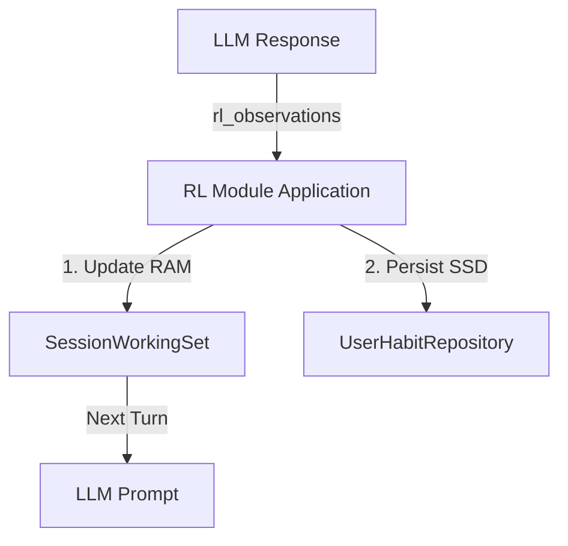

# RL Module

> **Cerb-compliant spec** — Reinforcement learning from structured LLM output.  
> **OS Layer**: RAM Application

---

## Overview

RL Module is an **Application** that runs on the SessionWorkingSet (RAM). It learns user and client preferences from structured output in LLM responses.

**OS Model Role**:
- **Reader**: Reads active habits from RAM Sections 2 (User) & 3 (Client).
- **Writer**: Writes new observations to RAM *and* persists them to SSD (write-through).
- **Constraint**: Never reads/writes `UserHabitRepository` directly. Always operates through the Kernel or RAM.

---

## Related Cerb Specs

| Spec | Responsibility |
|------|----------------|
| [User Habit](../user-habit/spec.md) | **SSD Storage** — The permanent record |
| [Session Context](../session-context/spec.md) | **RAM** — The workspace where habits are loaded |

---

## OS Layer & Data Flow

### The Transformation

| Old Model (Silo) | New OS Model (RAM Application) |
|------------------|--------------------------------|
| RL Module asks: "Who is the client?" | RL Module asks: "What's on the RAM?" |
| Caller must pass `entityIds` list | Caller passes nothing; RAM has the context |
| Reads `UserHabitRepo` on every turn | Reads RAM (in-memory, pre-loaded by Kernel) |
| Writes to Repo, maybe updates cache | Writes to RAM & SSD simultaneously (write-through) |
| **Buggy**: Context often missing | **Robust**: If entity is active, habits are there |

### 1. Reading Habits (The "Get" Path)

**Source**: `SessionWorkingSet` (RAM).
- **Section 2 (User Habits)**: Loaded by Kernel at session start.
- **Section 3 (Client Habits)**: Auto-populated by Kernel when entities become ACTIVE.

> **Input**: None. The RAM *is* the input.  
> **Output**: `HabitContext` (merged User + Client habits).

### 2. Writing Observations (The "Learn" Path)

**Trigger**: LLM response contains `rl_observations`.  
**Action**: Write-Through (Atomic).

1. **Update RAM**: Immediately update the in-memory `HabitContext` in `SessionWorkingSet`.
2. **Persist to SSD**: Async write to `UserHabitRepository` (Room).



---

## Learning Sources

| Source | entityId | Example |
|--------|----------|---------|
| User's own actions | `null` (global) | User schedules at 10am |
| User describes client | Contact/Account ID | "张总喜欢早上开会" |
| LLM infers from context | Contact/Account ID | 3 meetings all in morning |

---

## Confidence Model: 4 Weighting Rules

### Rule 1: Observation Count (Frequency)
Each time a pattern is observed, increment count. Higher frequency = stronger signal.

### Rule 2: Explicit Positive Statement
User explicitly confirms preference. Weighted 3x higher than inference.
> "是的，我喜欢早上开会" → `explicitPositive++`

### Rule 3: Explicit Negative Statement
User explicitly rejects preference. Applies negative weight.
> "不要早上，我讨厌早起" → `explicitNegative++`

### Rule 4: Time Decay (Recency)
Preferences fade if not reinforced. Half-life ~30 days.

---

## Structured Output Integration

LLM includes `rl_observations` when it detects learnable preferences:

```json
{
  "displayContent": "好的，已安排明天10点...",
  "schedulerJson": { ... },
  "rl_observations": [
    {
      "entityId": "c-001",
      "key": "preferred_meeting_time",
      "value": "morning",
      "source": "USER_POSITIVE",
      "evidence": "用户说'我喜欢早上开会'"
    }
  ]
}
```

---

## Domain Models

### RlObservation

```kotlin
data class RlObservation(
    val entityId: String?,          // null = user global, else client ID
    val key: String,                // Habit key
    val value: String,              // Observed value
    val source: ObservationSource,  // Signal type
    val evidence: String?           // Original text (debugging)
)

enum class ObservationSource {
    INFERRED,       // LLM inferred from context (weight: 1x)
    USER_POSITIVE,  // User explicitly confirmed (weight: 3x)
    USER_NEGATIVE   // User explicitly rejected (weight: -2x)
}
```

### UserHabit (Storage)

```kotlin
data class UserHabit(
    val key: String,
    val value: String,
    val entityId: String?,          // null = global user habit
    
    // Rule 1: Frequency count
    val inferredCount: Int = 0,
    
    // Rule 2: Explicit positive
    val explicitPositive: Int = 0,
    
    // Rule 3: Explicit negative
    val explicitNegative: Int = 0,
    
    // Rule 4: Recency tracking
    val lastObservedAt: Instant,
    val createdAt: Instant
)
```

### HabitContext

```kotlin
data class HabitContext(
    val userHabits: List<Habit>,      // Global preferences
    val clientHabits: List<Habit>,    // Per-entity preferences
    val suggestedDefaults: Map<String, String>
)
```

---

## Interface

```kotlin
interface ReinforcementLearner {
    // Called by Orchestrator after LLM response
    suspend fun processObservations(observations: List<RlObservation>)
    
    // Called by Kernel to populate RAM Section 2
    suspend fun loadUserHabits(): HabitContext
    
    // Called by Kernel to populate RAM Section 3
    suspend fun loadClientHabits(entityIds: List<String>): HabitContext
}
```

---

## Learning Flow

```
LLM Response
    │
    ├── rl_observations present?
    │   ├── YES → RL Module processes
    │   └── NO  → Skip (no-op)
    │
    ▼
For each observation:
    ├── source = INFERRED      → inferredCount++
    ├── source = USER_POSITIVE → explicitPositive++
    └── source = USER_NEGATIVE → explicitNegative++
    │
    ▼
1. Update RAM (SessionWorkingSet)
2. Persist to SSD (UserHabitRepository)
```

---

## Confidence Calculation

```kotlin
fun calculateConfidence(habit: UserHabit, now: Instant): Float {
    // Rule 4: Time decay (half-life ~30 days)
    val daysSince = ChronoUnit.DAYS.between(habit.lastObservedAt, now)
    val decayFactor = 1.0f / (1 + daysSince / 30f)
    
    // Weighted sum of signals
    val rawScore = (habit.inferredCount * 1.0f) +      // Rule 1
                   (habit.explicitPositive * 3.0f) +   // Rule 2: 3x weight
                   (habit.explicitNegative * -2.0f)    // Rule 3: negative
    
    // Normalize to [0, 1] with decay
    val maxPossible = (habit.inferredCount + habit.explicitPositive) * 3.0f
    val normalized = if (maxPossible > 0) rawScore / maxPossible else 0.5f
    
    return (normalized * decayFactor).coerceIn(0f, 1f)
}
```

### Weight Rationale

| Source | Weight | Rationale |
|--------|--------|-----------|
| INFERRED | 1x | Weak signal, LLM guessed |
| USER_POSITIVE | 3x | Strong signal, explicit confirmation |
| USER_NEGATIVE | -2x | Negative weight, dampens confidence |

### Decay Curve

| Days Since | Decay Factor | Effective Confidence |
|------------|--------------|----------------------|
| 0 | 1.00 | 100% |
| 7 | 0.81 | 81% |
| 30 | 0.50 | 50% |
| 60 | 0.33 | 33% |
| 90 | 0.25 | 25% |

### Deletion Threshold

Habits with confidence < 0.1 are **deleted** on next query (garbage collection).

---

## Wave Plan

| Wave | Focus | Status |
|------|-------|--------|
| **1** | Interface + RlObservation Schema | ✅ SHIPPED (2026-02-04) |
| **1.5** | Schema Migration (3-value enum, new fields) | ✅ SHIPPED (2026-02-05) |
| **2** | Orchestrator Integration (Parser) | ✅ SHIPPED (2026-02-05) |
| **3** | Context Builder Integration | ✅ SHIPPED (2026-02-05) |
| **4** | Time Decay + Deletion Cleanup | 🔲 PLANNED |
| **5** | **OS Model Upgrade** (RAM Application) | ✅ SHIPPED (2026-02-10) |

### Wave 5 Scope (OS Model)
- Remove `entityIds` param from `getHabitContext()`
- Wire `FakeReinforcementLearner` to read SessionWorkingSet
- Implement write-through in `processObservations`
- Remove direct SSD access from Learner (except via Kernel/Repository)
