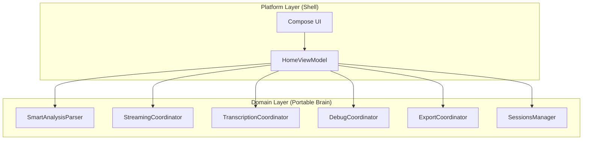

# Smart Sales Architecture Tracker

> **Purpose**: Living tracker for Smart Sales architecture and feature status  
> **AI Agents**: Use the Quick Index below to navigate — don't read irrelevant sections  
> **Last Updated**: 2026-01-14

---

## Quick Index

| Domain | Jump To | Last Updated |
|--------|---------|--------------|
| **Lattice** | [§7.1 Module Extraction](#71-lattice-module-extraction-status) | 2026-01-14 |
| **Architecture** | [§2 Realized Tree](#2-realized-architecture-tree) | 2026-01-10 |
| **Orchestrator** | [§3 V1 Module Mapping](#3-v1-module-mapping) | 2026-01-10 |
| **Connectivity** | [§Feature Tree → connectivity](#feature-tree-connectivity) | 2026-01-10 |
| **UX** | See `plans/ux-experience.md` | 2026-01-10 |
| **Milestones** | [§10 Roadmap](#10-product-milestone-roadmap) | 2026-01-10 |

> [!IMPORTANT]
> **Architecture Realization Principle**:  
> This doc is *aspirational*, not *prescriptive*.  
> - **Reality may differ** from the target tree — that's expected  
> - **Differences are work items**, not failures  
> - **The doc shows the corrective path**: what to rewrite, move, or create  
> - **Use the right tool**: rewrite > extract > surgical fix  
> - **Always verify** with `grep`/`find` before assuming state matches doc

---

## 1. Vision: Portable Core + Platform Shell



### Core Principles
1. **Single Responsibility**: Each component has ONE job
2. **Portable Domain**: `domain/` has zero Android imports
3. **Platform Shell**: ViewModel only wires coordinators to UI state
4. **V1 Spec Alignment**: Every module maps to Orchestrator-V1.md section

---

## 2. Realized Architecture Tree

```
smart-sales/
├── core/util/src/main/java/com/smartsales/core/metahub/  # Metadata Hub (V1 §4)
│   ├── ConversationDerivedState.kt     # M2 ✅
│   ├── TranscriptMetadata.kt           # M2B ✅ (ChapterMeta w/ source pointers 2026-01-11)
│   ├── SessionMetadata.kt              # M3 ✅
│   ├── ExportMetadata.kt               # Export metadata ✅
│   ├── MetaHub.kt                      # Hub interface ✅
│   └── InMemoryMetaHub.kt              # Hub impl ✅
│
├── data/ai-core/                    # Provider Layer
│   ├── DashscopeAiChatService.kt       # AI Chatter (V1 §3.1.1) ✅
│   ├── TingwuRunner.kt                 # TingwuCoordinator (V1 §3.2.2) ✅
│   ├── tingwu/
│   │   ├── api/                        # Network layer ✅
│   │   ├── artifact/                   # I/O utilities ✅
│   │   ├── processor/                  # V1 §3.2.3 Sanitizer ✅
│   │   │   └── TranscriptFormatter.kt
│   │   ├── publisher/                  # V1 §3.2.4 ✅
│   │   │   └── TranscriptPublisher.kt
│   │   ├── polling/                    # Low-level API utilities ✅
│   │   └── store/                      # V1 Appendix D ✅ (2026-01-14)
│   │       ├── TingwuJobManifest.kt    # Data classes
│   │       ├── TingwuJobStore.kt       # Interface
│   │       └── FileBasedTingwuJobStore.kt  # Impl w/ atomic writes
│   ├── metahub/                        # V1 §4 Storage (placeholder)
│   │   ├── storage/
│   │   └── model/
│   └── parser/                         # V1 §3.1.3 LLM Parser (placeholder)
│
│   # NOTE: ai-core/disector/ placeholder DELETED 2026-01-11
│   # Disector is fully implemented in domain/transcription/ (see line 104)
│
├── feature/chat/src/main/java/com/smartsales/
│   ├── domain/                      # Portable Brain (Pure Kotlin, Zero Android)
│   │   ├── analysis/
│   │   │   └── SmartAnalysisParser.kt  # LLM Parser (V1 §3.1.3) ✅
│   │   ├── chat/
│   │   │   ├── ChatPublisher.kt        # ChatPublisher (V1 §3.2.4) ✅
│   │   │   ├── ChatMessageBuilder.kt   # Message assembly ✅
│   │   │   ├── ChatMetadataCoordinator.kt    # Metadata extraction coordinator ✅ (2026-01-11)
│   │   │   ├── ChatMetadataCoordinatorImpl.kt # M2+M3 patches ✅ (2026-01-11)
│   │   │   ├── InputClassifier.kt      # Input type detection ✅
│   │   │   └── MetadataParser.kt       # Metadata extraction ✅
│   │   ├── transcription/
│   │   │   ├── Disector.kt             # V1 §3.2.1 ✅
│   │   │   ├── DisectorImpl.kt         # ✅
│   │   │   ├── TranscriptionCoordinator.kt  # ✅
│   │   │   └── TranscriptionCoordinatorImpl.kt  # ✅
│   │   ├── debug/
│   │   │   ├── DebugCoordinator.kt     # HUD (V1 §9) ✅
│   │   │   └── DebugCoordinatorImpl.kt # ✅
│   │   ├── export/
│   │   │   ├── ExportCoordinator.kt    # ✅
│   │   │   └── ExportCoordinatorImpl.kt # ✅
│   │   ├── sessions/
│   │   │   ├── SessionsManager.kt      # ✅
│   │   │   └── SessionsManagerImpl.kt  # ✅
│   │   ├── error/
│   │   │   └── ChatError.kt            # Domain errors ✅
│   │   └── DomainModule.kt             # Hilt bindings ✅
│   │
│   ├── feature/chat/core/stream/
│   │   └── StreamingCoordinator.kt     # Streaming coordinator ✅
│   │
│   ├── feature/chat/platform/
│   │   └── MediaInputCoordinator.kt    # Platform-specific media ✅
│   │
│   └── feature/chat/home/
│       └── HomeViewModel.kt            # Wiring Shell ✅
│
├── feature/connectivity/               # Device Connectivity
│   ├── DeviceConnectionManager.kt      # BLE/WiFi state machine (368 lines)
│   ├── WifiProvisioner.kt              # WiFi provisioning interface
│   ├── AndroidBleWifiProvisioner.kt    # Android BLE+WiFi impl
│   ├── SimulatedWifiProvisioner.kt     # Fake impl for testing
│   ├── BleProfile.kt                   # BLE profile definitions
│   ├── ConnectionModels.kt             # Connection state types
│   ├── ConnectivityModule.kt           # Hilt DI module
│   ├── ConnectivityLogger.kt           # Logging utilities
│   ├── BadgeHttpClient.kt              # HTTP client for badge API
│   ├── FakeBadgeHttpClient.kt          # Fake impl for testing
│   ├── HttpEndpointChecker.kt          # Endpoint availability check
│   ├── ProvisioningException.kt        # Provisioning error types
│   ├── gateway/
│   │   ├── BleGateway.kt               # Gateway interface
│   │   └── GattBleGateway.kt           # GATT driver (815 lines) ⚠️
│   ├── scan/
│   │   ├── BleScanner.kt               # Scanner interface
│   │   └── AndroidBleScanner.kt        # Android BLE scanning impl
│   └── setup/
│       ├── DeviceSetupModels.kt        # Setup state types
│       ├── DeviceSetupScreen.kt        # Setup wizard UI
│       └── DeviceSetupViewModel.kt     # Setup wizard VM (609 lines)
│
├── feature/media/                       # Media Management
│   ├── MediaSyncCoordinator.kt         # Media sync orchestration
│   ├── audio/                          # UI: Playback/Recording Screen
│   │   ├── AudioFilesScreen.kt         # Main UI
│   │   ├── TranscriptViewerSheet.kt    # Transcript Bottom Sheet (Extracted 2026-01-14) ✅
│   │   ├── SwipeableRecordingCard.kt   # V17 Card UI ✅
│   │   ├── AudioFilesViewModel.kt      # State holder
│   │   └── AudioFilesModels.kt         # UI models
│   │
│   ├── audiofiles/                     # Domain: Audio file management
│   │   ├── AudioPlaybackController.kt
│   │   ├── AudioStorageRepository.kt
│   │   └── AudioTranscriptionCoordinator.kt
│   │
│   └── devicemanager/                  # Device media management
│
└── feature/usercenter/                  # User Settings
    └── (user preferences, account)
```

---

## 3. V1 Module Mapping

| V1 Module | V1 Section | File | Status |
|-----------|------------|------|--------|
| AI Chatter | §3.1.1 | `DashscopeAiChatService.kt` | ✅ |
| SmartAnalysis | §3.1.2 | `SmartAnalysisParser.kt` | ✅ |
| LLM Parser | §3.1.3 | `SmartAnalysisParser.kt` | ✅ |
| Disector | §3.2.1 | `Disector.kt` | ✅ |
| Tingwu Runner | §3.2.2 | `TingwuRunner.kt` (impl TingwuCoordinator) | ✅ |
| Sanitizer | §3.2.3 | `TranscriptFormatter.kt` (data layer) | ⚠️ DEVIATION |
| ChatPublisher | §3.2.4 | `ChatPublisher.kt` | ✅ |
| TranscriptPublisher | §3.2.4 | `TranscriptPublisher.kt` | ✅ |
| Job Persistence | Appendix D.2 | `tingwu/store/` | ✅ (2026-01-14) |
| Targeted Retry | Appendix D.2 | `TingwuRunner.retryJob()` | ✅ (2026-01-14) |
| M2/M2B/M3 | §4 | `core/metahub/` | ✅ |

---

## 5. M5 Status: ✅ COMPLETE

**Completed 2026-01-07**

### Renames (6 total) ✅

| Before | After | Status |
|--------|-------|--------|
| `HomeScreenViewModel.kt` | `HomeViewModel.kt` | ✅ |
| `DisectorUseCase.kt` | `Disector.kt` | ✅ |
| `SanitizerUseCase.kt` | `Sanitizer.kt` | ✅ |
| `RealTingwuCoordinator.kt` | `TingwuRunner.kt` | ✅ (already impl TingwuCoordinator) |
| `TranscriptPublisherUseCase.kt` | `TranscriptPublisher.kt` | ✅ (already renamed) |
| `ChatStreamCoordinator.kt` | `StreamingCoordinator.kt` | ✅ |

### HSVM → HomeViewModel Shell ✅

**Result**: 2179 → 2126 lines (-53)

HomeViewModel delegates to coordinators:
- `SmartAnalysisParser` → L3 parsing ✅
- `StreamingCoordinator` → streaming callbacks ✅
- `TranscriptionCoordinator` → batch orchestration ✅
- `MediaInputCoordinator` → audio/image file handling (NEW) ✅
- `DebugCoordinator` → HUD/debug ✅
- `ExportCoordinator` → export gate ✅
- `SessionsManager` → session CRUD ✅

---

## 5B. M9 ViewModel Refactoring: ✅ EXTRACTION PHASE COMPLETE

**Completed 2026-01-07**

**Strategy**: Extract god object HomeViewModel into single-responsibility ViewModels using event-based decoupling.

### Wave 1: AudioViewModel ✅
- Created `AudioViewModel` (320 lines) for audio/device management
- Removed 15 functions from HomeViewModel (-268 lines)
- Result: 2,126 → 1,858 lines (-12.6%)

### Wave 2: SessionListViewModel ✅
- Created `SessionListViewModel` (152 lines) for session list UI
- Event-based decoupling via `SessionListEvent.SwitchToSession`
- Removed 9 functions from HomeViewModel (-88 lines)
- Result: 1,858 → 1,768 lines (-4.7%)

### Wave 6: Dead Code Cleanup ✅
- Deleted ConversationViewModel subsystem (Redux overhead)
- Removed vestigial streaming infrastructure
- Total: -1,031 lines of dead code

### Wave 7: Transcription Extract ✅
- Moved observation loops to `TranscriptionCoordinator.runTranscription()`
- Callback-based API for UI updates
- Result: -59 lines from HomeViewModel

### Wave 8: Debug HUD ❌ CANCELLED
- Evidence: Already delegating to `DebugCoordinator` (9 calls)
- No extraction needed

### Wave 9: Session Management ❌ DEFERRED
- Evidence: Tightly coupled to ViewModel state
- Trigger: Extract when KMP migration starts or 2nd ViewModel needs session logic

**M9 Final**: 2,126 → 1,654 lines (**-472, -22.2%**)

**Remaining in HomeViewModel**: Legitimate UI orchestration (48 `_uiState.update` calls, 15 coroutine launches)

---

## 5C. M10 HomeScreen UI Decomposition: ✅ COMPLETE

**Completed 2026-01-11**

**Problem**: `HomeScreen.kt` (1425 lines) caused AI comprehension failures during edits.

**Strategy**: Strangler Fig + Rewrite — create new component files, wire in, delete old code.

### Results
- **Lines**: 1425 → **565** (60% reduction)
- **Composables**: 23 → **1** (96% reduction)
- **Build warnings**: 13+ → **0** (100% reduction)

### Files Created

| Location | File | Lines |
|----------|------|-------|
| `home/` | `HomeScreenRoute.kt` | 312 |
| `home/` | `HomeScreenTestTags.kt` | 55 |
| `components/` | `HomeTopBar.kt` | 179 |
| `components/` | `HeroSection.kt` | 70 |
| `components/` | `AudioRecoveryBanner.kt` | 67 |
| `components/` | `ScrollToLatestButton.kt` | 47 |
| `history/` | `HistoryDeviceCard.kt` | 95 |

### Dead Code Deleted (~175 lines)
- `EmptyChatHint`, `EmptySessionHint`, `SessionHeader`, `SessionListSection`, `formatMillis`, `SessionListItem`

### Phases
- [x] Phase 0: Route/Screen split
- [x] Phase 1: Create new component files
- [x] Phase 2: Extract history components
- [x] Phase 3: Refactor HomeScreen (remove unused params)
- [x] Phase 4: Cleanup (extract test tags, fix deprecations)

**Trigger**: Identified during UI Polish V4-V6 session (2026-01-11)

## 6. M6 KMP Prep: ✅ Phase 1 & Phase 2 Wave 1 COMPLETE

**Completed 2026-01-07**

### Phase 1: Remove Android Imports ✅
- `domain/` — 0 Android imports ✅
- `core/metahub/` — 0 Android imports ✅
- Moved `MediaInputCoordinator` to platform layer
- Removed `android.util.Log` from `TranscriptionCoordinator`

### Phase 2 Wave 1: Interface Extraction ✅
- `Disector` / `DisectorImpl` — interface extracted ✅
- `Sanitizer` / `SanitizerImpl` — interface extracted ✅
- Created `DomainModule` for Hilt bindings ✅

### Phase 2 Wave 2: Interface Extraction ✅
- `ExportCoordinator` / `ExportCoordinatorImpl` — interface extracted ✅
- `DebugCoordinator` / `DebugCoordinatorImpl` — interface extracted ✅
- `TranscriptionCoordinator` / `TranscriptionCoordinatorImpl` — interface extracted ✅
- `SessionsManager` / `SessionsManagerImpl` — interface extracted ✅
- Updated `DomainModule` with 4 new bindings ✅
---

## 6. M7 Architecture Alignment: ✅ COMPLETE

**Completed 2026-01-07**

### Files Moved to Domain ✅
- `V1BatchIndexPrefixGate.kt` → `domain/transcription/` ✅
- `V1TingwuWindowedChunkBuilder.kt` → `domain/transcription/` ✅
- `V1TingwuMacroWindowFilter.kt` → `domain/transcription/` ✅
- `StreamingCoordinator.kt` → `domain/stream/` ✅

### Verification ✅
- Zero Android imports in `domain/`
- 23 files in domain layer
- 38 domain tests passing

---

## 7. Deferred Work (Phase 3)

**`:shared` module creation**: Deferred until iOS development starts

**Scope**:
- `data/ai-core/` — OkHttp/Android networking → expect/actual
- Hilt DI → Koin for multiplatform

### KMP Target Structure
```
├── shared/                  # NEW Gradle module
│   ├── domain/              # Move from feature/chat/domain
│   ├── metahub/             # Move from core/metahub
│   └── network/             # expect/actual for HTTP
├── androidApp/
└── iosApp/
```

### Dependency Direction Cleanup (KMP Prerequisite)

**Status:** Deferred until iOS development starts  
**Audit Date:** 2026-01-07  
**Score Impact:** -15 points (0/15 on Dependency Direction in alignment audit)

**5 types to move to domain layer:**

| Type | Current Location | Target Location |
|------|------------------|-----------------|
| `ExportGateState` | `feature/chat/home/export/` | `domain/export/` |
| `ExportUiState` | `feature/chat/home/export/` | `domain/export/` |
| `DebugUiState` | `feature/chat/home/debug/` | `domain/debug/` |
| `DebugSessionMetadata` | `feature/chat/home/debug/` | `domain/debug/` |
| `AiSessionRepository` | `feature/chat/` | `domain/sessions/` (interface) |

**Effort:** 4-6 hours  
**Trigger:** Run when KMP migration starts

### TingwuRunner: Organic Cleanup

**Philosophy**: Purify legacy organically when adding features. No big-bang refactor.

**Current State**: 1252 lines (purified 2026-01-13, -117 lines)
- Implements `TingwuCoordinator` ✅
- Delegates to `TingwuPollingLoop`, `TingwuTranscriptProcessor`, `TingwuMultiBatchOrchestrator` ✅

#### Multi-Batch Stitching ✅ (2026-01-11)

| Component | Status | Tests |
|-----------|--------|-------|
| `TingwuMultiBatchOrchestrator` | ✅ Slice → Upload → Submit loop | 5 |
| `MultiBatchStitcher` | ✅ Timestamp correction, speaker dedup | 9 |
| `AudioSlicer` | ✅ Moved to `:data:ai-core` | 7 |

#### Polling Loop Refactor ✅ (2026-01-12)

| Component | Status | Tests |
|-----------|--------|-------|
| `TingwuPollingLoop` | ✅ Extracted from TingwuRunner | 5 |
| `TingwuRunner` | ✅ Delegates to PollingLoop | 10+ |
| `FakeTingwuApi` | ✅ Extracted for test reuse | N/A |

**Gap Resolved (2026-01-11):** `onComplete` callback added to surface stitched segments to `TingwuJobState.Completed`.

**Known Legacies** (purify when touched):
| Legacy | Lines | Action |
|--------|-------|--------|
| `LegacyTranscription*` classes | ~~870-904~~ | ✅ DELETED 2026-01-13 (-50 lines) |
| 4 parsing paths in `parseDownloadedTranscription` | 729-783 | Audit which are live, delete dead |
| Pure helper functions | various | Consider companion/extension extraction |

**Decision**: Apply **Rewrite Over Extract** if coupling is high.

**Trigger**: When adding PipelineTracer instrumentation

---

## 7.1 Lattice Module Extraction Status

> **Architecture**: Lattice (Box-API pattern)  
> **Spec**: [`Orchestrator-Lattice.md`](../specs/Orchestrator-Lattice.md)  
> **Canonical Pattern**: [`AiChatService.kt`](file:///home/cslh-frank/main_app/data/ai-core/src/main/java/com/smartsales/data/aicore/AiChatService.kt)

### Extraction Phases

| Phase | Scope | Status |
|-------|-------|--------|
| P0 | Documentation foundation | ✅ Complete (2026-01-14) |
| P1 | Pipeline Layer extraction | 🔲 Not started |
| P2 | Memory Layer extraction | 🔲 Not started |
| P3 | Chatter Layer formalization | 🔲 Not started |
| P4 | Connectivity Layer formalization | 🔲 Not started |
| P5 | God object decommission | 🔲 Not started |

### Per-Module Checklist

| Layer | Module | Interface | Impl | Fake | Wired | Tests |
|-------|--------|-----------|------|------|-------|-------|
| **Chatter** | AiChatService | ✅ | ✅ | ✅ | ✅ | ✅ |
| **Pipeline** | AudioPreparerService | 🔲 | 🔲 | 🔲 | 🔲 | 🔲 |
| **Pipeline** | TranscriptionService | 🔲 | 🔲 | 🔲 | 🔲 | 🔲 |
| **Pipeline** | MetadataExtractorService | 🔲 | 🔲 | 🔲 | 🔲 | 🔲 |
| **Pipeline** | PublisherService | 🔲 | 🔲 | 🔲 | 🔲 | 🔲 |
| **Memory** | SessionMemoryService | 🔲 | 🔲 | 🔲 | 🔲 | 🔲 |
| **Memory** | LongTermMemoryService | 🔲 | 🔲 | 🔲 | 🔲 | 🔲 |
| **Memory** | KnowledgeBaseService | 🔲 | 🔲 | 🔲 | 🔲 | 🔲 |
| **Connectivity** | BleService | 🔲 | 🔲 | 🔲 | 🔲 | 🔲 |
| **Connectivity** | WiFiService | 🔲 | 🔲 | 🔲 | 🔲 | 🔲 |
| **Connectivity** | BadgeSyncService | 🔲 | 🔲 | 🔲 | 🔲 | 🔲 |
| **Connectivity** | AudioTransferService | 🔲 | 🔲 | 🔲 | 🔲 | 🔲 |

### Migration Strategy

**Strangler Fig**: Extract one box at a time, god object delegates to new boxes.

**P1 First Target**: `AudioPreparerService` — slice + upload logic from `TingwuRunner`

**Decommission Trigger**: All boxes extracted → `TingwuRunner` is empty shell → delete

---

## 8. Quality Guardrails

| Guardrail | Enforcement |
|-----------|-------------|
| **Single Responsibility** | "Does this component have ONE job?" |
| **Import Test** | `grep "import android." domain/` = 0 |
| **Audit Before Assume** | Verify with grep/find, no guessing |
| **V1 Alignment** | Every module maps to spec section |
| **Doc Verification** | Before marking "[ADD X]", run `grep -rn "X" ."` to check if X already exists |

### Organic Purification Philosophy

> **Purify legacy deviations organically along the way — not big-bang refactor, not ignore.**

When touching a file for feature work:
1. **Clean adjacent legacy** while you're there
2. **No separate refactor ticket** — do it inline
3. **Don't compound debt** by ignoring obvious cleanup

### Rewrite Over Extract

**Prioritize rewrite when:**
- Code is **hard to decouple** (grep shows high coupling)
- Code is **complex to purify** (multiple intertwined concerns)
- Extraction would take longer than rewrite

**Use the fresh-write flow:**
1. Read old code to understand **what** (not how)
2. Write new code following **current architecture**
3. Delete old code entirely
4. Verify behavior

> **Rule**: If extraction feels like archaeology, rewrite from spec.

---

## 9. Success Criteria

> Does each component have ONE responsibility?

- If YES → done
- If NO → extract

No line metrics. Responsibility is the only measure.

---

## 10. Product Milestone Roadmap

```
┌─────────────────────────────────────────────────────────────┐
│  M0: STABILIZE         │  Fix regressions from refactor    │ ✅ COMPLETE
├─────────────────────────────────────────────────────────────┤
│  M1: FEATURE COMPLETE  │  All features work end-to-end     │
├─────────────────────────────────────────────────────────────┤
│  M2: BETA READY        │  Bugs fixed, stable for testers   │
├─────────────────────────────────────────────────────────────┤
│  M3: POLISH            │  UI/UX, performance, edge cases   │
├─────────────────────────────────────────────────────────────┤
│  M4: RELEASE CANDIDATE │  Final QA, store submission       │
└─────────────────────────────────────────────────────────────┘
```

### M0: Stabilize ✅ COMPLETE

> Fix regressions before building new features. Broken code compounds.

**Completed 2026-01-09**

**Fixes Applied:**
- Transcription rendering bug: Disabled V1TingwuMacroWindowFilter (time mismatch stripped 99% content) → **RE-ENABLED 2026-01-13** (root cause: segment normalization, fixed in buildRecordingOriginSegments)
- Debug HUD Tingwu trace: Wired DebugUiState → HomeUiState
- Debug HUD XFyun removal: Removed unused XFyun section (110 lines deleted)

**Exit Criteria:**
- [x] All unit tests passing
- [x] Core flows work (chat, transcription, connectivity)
- [x] No P0 crashes or blockers
- [x] Build passes clean

---

### M1: Feature Complete ← YOU ARE HERE

**Exit Criteria:**
- [ ] All Orchestrator-V1 features implemented
- [ ] Connectivity (BLE/WiFi) pairing flow works
- [ ] Media sync and audio management works
- [x] All happy-path tests passing (verified 2026-01-11)
- [x] Build passes, no blocking errors (verified 2026-01-11)

**NOT required:** Polish, edge cases, performance tuning

---

### M2: Beta Ready

**Exit Criteria:**
- [ ] Crash-free for 3+ consecutive test sessions
- [ ] No P0/P1 bugs open
- [ ] Error states handled (not just happy path)
- [ ] Logging sufficient for remote debugging
- [ ] Internal beta deployed

**Focus:** Stability over features

---

### M3: Polish

**Exit Criteria:**
- [ ] UI/UX feedback from beta addressed
- [ ] Performance acceptable (app start <2s, no jank)
- [ ] Edge cases covered (network loss, BLE disconnect, etc.)
- [ ] Animations and micro-interactions polished
- [ ] Accessibility basics (contrast, font scaling)

**Focus:** User experience

---

### M4: Release Candidate

**Exit Criteria:**
- [ ] Full QA pass (regression + exploratory)
- [ ] Store assets ready (screenshots, description)
- [ ] Privacy/security review complete
- [ ] Analytics/crash-reporting wired
- [ ] Version tagged, signed APK/AAB

**Focus:** Ship it

---

### Post-Release: Architecture Debt

**After v1.0 ships, then:**
- [ ] Spec deviation audit (compare Orchestrator-V1.md vs code)
- [ ] Fix only deviations that hurt (coupling, duplication)
- [ ] KMP prep (if iOS planned)
- [ ] Document remaining tech debt for v1.1

**Rule:** Don't refactor before shipping. Ship, then refine.
